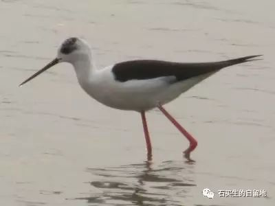

#  微散文

原创  石买生  [ 石买生的自留地 ](javascript:void\(0\);)

__ _ _ _ _

** **

  

  

** 微散文  **

** **

  

** 微散文  **  

** **

** 往事一页  **

多年前，我在都昌中学教书。每天黄昏，我总爱从东校门出来再往南到南山脚下的东湖坝上散步。一路上，要经过水产公司，冷冻厂，水产公司宿舍和一些居民小区，东湖坝是小县城散心的好去处，坝东是青山碧水，坝南是浩淼的鄱阳湖。东湖里密密麻麻泛起许多白色浮漂，那是养殖专业户养的珍珠。天气晴好的日子，碧水蓝天，令人心旷神怡，鄱阳湖里停有许多小渔船，渔船上歇有鱼鹰，黝黑的渔民在船头船尾不停的走动，，有时还可看见做饭升起的缕缕炊烟。鄱阳湖靠近县城码头的水有点浑，渔民看上去很懒散，鱼鹰经常在夕阳的余晖里闭目养神，我在渔船旁走走停停，冬天，枯水季节，沿着湖滩可以走好远，脚在软泥上走，粘粘糊糊，绵软可人，竟有童年的新鲜与惬意，此时，可以上印山看落日，看鄱阳湖点点帆影，看湖心粼粼波光，渔船多的时候，湖面霞光万道，千帆静泊，颇有渔舟唱晚，重回盛唐之感。有时，我坐在松软的湖滩上，望着天边的晚霞，久久不忍离去，任晚风吹过我的面颊，我的心也飞到了天边外。

东湖坝的最南端，有一大水闸。水闸上面是一间四平方左右的闸房，闸房没有门，但可以住人。一回，我真看见里面住进了一个人！那天傍晚，我走到坝南，看见一个年轻女子靠在闸房的门口，头发有点零乱，眼圈有点发黑，脸色有点苍白，眼神有点疲倦，她很漠然地看着过往行人，闸房里的被褥衣服鞋袜之类扔得满房都是，甚至还可看见锅碗茶杯，这女子来自哪里？她住在闸房里干什么呢？她为什么总是倚在闸房门口看过往路人呢？这女子的一切让路人感到无比好奇。

同样的人，同样的地点，同样的情景，天天如此，月月如此，延续了整整一个冬天，县城的东湖坝似乎多了一道特殊的风景。路人经过此处，不光多了一些兴致，甚至有些许兴奋。凡是经过的人，眼睛无不往那年轻女子身上瞟。

忽然有一天，那年轻女子不见了！闸房里只留下破衣破鞋及随风扬起的纸屑，里面空空荡荡，冷冷清清，常从此处经过的人看见里面空空落落，觉得傍晚的风刮在脸上，有点冷，脸上的神情有一丝不易察觉的悒郁。

那年轻女子到哪里去了呢？

有人想。

2008-12-27

**** ** 隐士  **

窗子对面是理工学院，理工学院有一长溜三个连起来的池塘，池塘让偌大一个校园显得清幽灵秀，我看见时常有学生到池塘边看风景写生。没有人时，池塘也不寂寞，水面上时不时会冒出一两只小水鸭，小水鸭自在地凫水，倦了就到岸边小憩，乐了就哼一些舒心的小曲，唱给云儿听，唱给小草听，唱给岸边的木棉树听，小水鸭日子过得满惬意。有时小水鸭可能要作一个短暂的旅行，让你好几天见不到它们的踪影，让你从心底充满惦念，出人意料的是
,  某一天它们又回来了，带给你朋友般的欣喜。

小水鸭来去自如，长得瘦弱，活得随意，有点像古代的隐士。

这样的隐士我  7  年前也见过，那是在冬天，在九江的南湖。

2008-4-22

** 乡村墓园  **

国庆中秋期间，放了八天假。我回了趟老家。因为我老娘病了。

东莞距江西我老家有一千公里之遥，每次回老家，我都要到我父亲坟上烧纸。父亲过世已经六年了，父亲的音容时常在异乡的梦中浮现。到家了，看到娘更加苍老的面容，我心里有丝丝隐痛。我对娘说，我到爷（我老家方言管父亲叫爷）坟上烧烧纸。娘说，你去吧。

我爷的坟在村东野麦岭上。野麦岭是一座不高的山，坐东北朝西南，北面背倚狮子山，南面朝向新鸡垄，新鸡垄有大片村里最好的良田和最肥的土地，越过新鸡垄便是塘下山村和港头村，再远一点便是鄱阳湖，野麦岭视野开阔，光线敞亮，站在山顶，村庄周围的景致尽收眼底，离村庄又不到一里路，加上山上长满了毛栗树，松树和许多不知名的灌木。许多地仙把这野麦岭看作风水宝地，因此村东许多老倌都安葬于此。

野麦岭上的土质是山顶多岩石，山腰和山脚土质较潮湿疏松，所以山顶的坟少，山腰和山脚的坟多，坟于杂草，灌木，松树间呈扇形分布，尽管随意，松散，但很自然的形成了一个规整而美丽的墓园。

我是一个胆小的人。上坟烧纸时我邀了大侄儿作伴。秋天，午后的阳光熙暖而懒散，新鸡垄和野麦岭非常宁静。田垄里只能见到稀疏的庄稼地有点绿意，很少有人在田间劳作。庄稼地的农作物也只有芝麻，红薯，花生等零零散散分布着，长势比较清冷。我和侄儿上得山来，一路于杂草间择路而行。在山腰间，我看见许多新坟，这些坟的主人，我都认得，都是一些长我两辈或三辈的叔公叔婆或太叔公太叔婆，他们都是看着我从小长大的人，看着他们的坟，我心有点惊颤，但一会儿我又想起他们活着时的样子，我不再受惊，反而对他们有点想念。他们昔日对我的关心，爱抚，甚至笑容像放电影一样一幕一幕在我眼前闪现，让我觉得亲切，心安。

我爷的坟在山顶朝南的一个斜坡上。西边两座坟埋的是我祖父和祖母。我开始在三座坟前烧纸。我侄儿放鞭炮和上香。在我爷的坟前，我一边烧纸一边低声说，爷，你要保佑我娘身体康健！保佑家里大大小小都顺顺道道！说完，我看见青黑的纸灰在微风中轻扬，青烟在阳光下散去，墓园一片静寂。

在九江，我曾见过城里的墓园，气派，拥挤，豪华，墓碑一排排漆黑闪亮，死者生前喜爱喧闹，死后也不寂寞。乡下的墓园随意，简朴，松敞，一如死者生前随意而安，一如草木枯荣自便，来自尘土，归于尘土，墓地就是地下安静的家呀，墓园就是一份依靠和企望。活着天天照面，死后比邻而居。乡村墓园既了却凡尘，却也让许多老者小小的愿望成真，倘若有来生，他们仍愿做好邻居，日出而作，日入而息。

2009-10-25

** 遗弃  **

因为工作调动  ,
我搬了两次家了。每次搬家，总有好些旧书，破杂志，报刊，烂衣破鞋之类的什物要丢掉，丢掉之前，先要挑拣，察看，抚摸，有时还要掸掸灰，拿捏拿捏，好像哪一样东西都舍不得，哪一件物品都带着自己或亲人的体温，哪一处物件上的记号都能唤醒沉睡的记忆。总之，丢掉之前的时间相当漫长，在房间里看着自己曾经使用过的熟悉的物品，心里边更是柔肠百结，颇费思量。有些东西刚丢到一边马上又捡回来，生怕这些东西怪罪自己，毕竟一起生活多年，有一种感情濡得你心里湿湿的，叫你不能自已，叫你夜不能寐。

为一堆破烂玩意儿抓狂的人本身就是废物。

我就是。

俗语说，旧的不去，新的不来。我羡慕那些善于吐故纳新的人，那是一些能常听到新生活召唤的人，但我就是做不来那样的人，我很沮丧，我也许天生就是一废物。

我认命。

我甚至觉得，被遗弃是人来到世界上的一个宿命。

你看啊，人刚到世界时，多鲜亮的生命啊，被呵护，被拥抱，被爱怜，被喜欢，旋即一阵秋风，生命变成一片枯黄的树叶，被踩踏，被蹂躏，被打击，被遗弃，这过程就叫新陈代谢。

我亲眼看见我的好几个太婆婆眼瞎耳聋皮皱在村庄的泥地上颤悠悠的走，我不知道她们是哪年哪月哪日被村庄遗弃了。看见她们那些个样子，我麻木，无助，心痛。

这不奇怪。

我们都是被父母随意挥洒的一粒种子，不管是落到荒郊野外，还是飘至喧嚣闹市，我们共同的命运就是被遗弃。

就像路边上的一截朽木，垃圾窖旁的一块破布，臭水沟里的一只缺口瓦罐，它们在明月的清辉下静静的老去，了无声息。

某一日，当你也成为一废物，你一定也会对这些被遗弃的生命充满柔情。

2009-9-3

** 流云  ** ****

是在冬天的时候。

河边上的水浅了。湖汊裸露出小片小片的沙洲。我和菊花扛起虾网，背起竹篓。我们在软泥上走，一个在前，一个在后。

湖水还在退。在一些河湖交汇的汊口，水流声汩汩地响。寻声四望，见不到一处宽阔的水面。在一团一团的水淖里，湖水清澈见底，看不见一只青虾或一条小鱼。湖底偶尔出现一条脉络清晰的水路，那是蚌壳或丁罗留下的。

鱼虾跑到哪去了呢？

到远方大湖里去了吧。

去年这湖汊有好多鱼虾呀！

去年是去年，今年是今年。兴许鱼虾越来越稀少呢？

我们一边抱怨，一边寻找。

快看，水鸟！

还是菊花眼尖。在一处水淖边，两只小鸟在软泥上轻挪细步，长颈一缩一伸。黄脚骨、洁白的羽毛。

真好看！它们也在寻食呢？菊花露出了笑脸。

水鸟仍在湖滩上觅食，神情更加专注。有时，湖面上刮来一股小北风，水鸟身上的羽毛不停地翻动，好像白孔雀开屏。

风刮到我们身上，我们不住地打寒颤。菊花的手冻得通红，我的耳朵被风吹得生疼。当水鸟咯——的一声振翅高飞时，我们还听到远处村子里传来了公鸡的长鸣。

天色将晚。湖滩进入无边的宁静。

我们抬头望天，只见大朵大朵的白云在流动，由北向南，由北向南，宛若奔跑的羊群。

流云的家在哪里呢？

鱼虾没捕着，回到家我们各挨了姆妈一顿训。菊花还被拧了耳朵，我的屁股挨了棍子。

菊花是我堂妹。那一年，她十三，我十五。

2004-12-20

** 吃相  **

低头，半边脸埋在碗里，只听见嚼嚼嚼地响，吃饭生怕别人来抢你的碗，好像监牢里放出来的人一样。这就是我在家里吃饭时的样子，我哥曾说过我吃饭时样子好丑，母亲也说过我的吃相难看，妻子也多次嘲讽我的吃相不雅。每次端起饭碗，好像有几双眼睛在盯着我看，搞得我吃饭时郁闷非常，以致常常不敢在厅堂吃，老躲躲闪闪，蹲在墙根或门槛上，在一不为人知的角落，三下五除二，饿鬼抢斋粑似的把一碗饭解决掉。

吃相如此难看，不能怪我家教不好。我母亲常教我：站要有站相，坐要有坐相，吃要有吃相。无奈每次总是左耳进，右耳出。好像狗改不了吃屎的本性。这德行，只要碰到高雅文明之人，我就倍感羞赧。

细想这难看吃相，恐怕是历史的亏欠。我生于上世纪六十年代初，全国上下都在搞大跃进。家里常常没有像样的饭吃。最好吃的食物，是红薯、麦麸、菜粥，南瓜拌饭，丝瓜汤淘饭。而且，吃饭的时候少，吃稀粥的时候多。牛奶，那时都没有听说过！因为没吃过牛奶，以致我胃壁上缺少一种酶，现在，人到中年，只要一吃牛奶，我就拉肚子。至于鱼肉，那时节，只有到了过年才象征性的有一点。所以，在赣北农村，哪怕是小孩，肚子也常处在饥饿状态，只要见到有好东西吃，什么山枣啦，毛栗啦，苹果啦，毛桃啦，甘蔗啦，货郎担上彩色糖果啦，眼睛就会投射出两束贪婪的光。那清苦年代，大人宁愿自己紧巴，也要把好东西留给孩子吃，那个清苦年代，给一个乡村少年最大奖赏，是让他一生都有一个好胃口。

文革过后，山村日子稍有改善。家里时不时有些荤菜。比如萝卜丝烧肉啦，梅干菜烧肉啦，米粉蒸肉啦，豆参煮鱼啦。不过，这些菜，桌上每次都只有一个，而且，场合是供师傅或接待亲戚时。有一回，我家来了个亲戚，祖母做了碗豆豉烧肉，一闻到香味，我就垂涎欲滴。眼睛贼溜溜地转，盯着豆豉烧肉碗，祖母一不留神，我一双筷子闪电似的梭走一块。祖母一见，看我一副馋相，嗔怪道：“讨债个东西，馋鬼！”

在乡村，吃相不雅不光普遍，而且容易传染。每逢红白喜事，山村都要大摆酒席。大型厅堂里，露天广场上，几十张八仙桌一摆，酒菜飘香，人头攒动，男女老少，大口吃菜，大碗喝酒，满嘴油腻，满面红光，一个个都不亏待自己的嘴，管他娘的什么吃相，好东西吃到肚里便是！吃得过瘾，喝得尽兴，那场面煞是壮观
,  酒足菜饱之后，一个个醉眼蒙眬，走路东摇西晃，进到家里，迎接他们的是自己粗重的鼾声。偶尔，听到几声鸡鸣狗吠，增添了山村的宁静。

在城里，我也参加过一些饭局，一张大圆桌，十来号人围着，面对一桌美味佳肴，大家你谦我让，文明谦恭，此时，我也学着跟他们一样，筷子不胡乱夹菜，眼睛也不乱转，吃起来慢嚼细吞，吃相挺斯文。每逢此时，妻子总是嘲讽我装一副鬼样子，在家在外两个人！她哪知，人都会进化的，在外文明吃饭，也是对客人一种尊重。她哪知道，我在外吃饭时的此种克制和努力，要付出多大的牺牲，每上一道好菜，眼神好像不触碰，手想拿起筷子前往逡巡又停下，此时，肚里咕嘟咕嘟响，眼睛，手，嘴巴蠢蠢欲动，总是跟不上它的节拍。

2015-5-22

  

** 夫卡的笼子  **

卡夫卡名言超级多，其中一句最牛逼：“一只笼子在寻找一只鸟。”

你想，笼子多么寂寞，多么孤独啊。它敞开虚掩的门，岁岁年年，在等。哪怕等来的是一阵清风，它还是等。

只需一只鸟，生命就了无缺憾，趋向完满。

但，所有的鸟，都站在时间之外，面向虚无。没有一只鸟肯进到笼子里来。

笼子暗暗啜泣，没有一只耳朵听见。

它比卡夫卡还绝望。

2016-1-30

  

预览时标签不可点

微信扫一扫  
关注该公众号

****

****

×  分析

__

微信扫一扫可打开此内容，  
使用完整服务

：  ，  ，  ，  ，  ，  ，  ，  ，  ，  ，  ，  ，  。  视频  小程序  赞  ，轻点两下取消赞  在看  ，轻点两下取消在看
分享  留言  收藏  听过

精选留言

柳絮飞扬来自

石买生，你写得好文章。写出了童年，写出了童真。

石买生的自留地来自

谢谢鼓励！握手。

