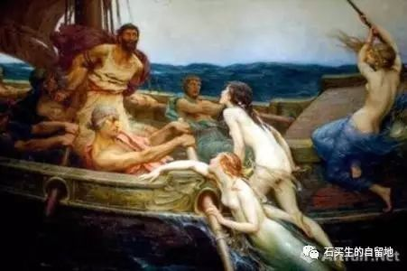

#  原乡

石买生  [ 石买生的自留地 ](javascript:void\(0\);)

__ _ _ _ _

** 原乡  **

**\-----** ** 读《奥德赛》札记  **

** 风格  **

《奥德赛》的风格：反复、朴素、率真、清澈。

其反复吟唱的特点让我想起赣北民间说唱艺术。童年，每逢有人家上梁，我经常到上梁人家听瞎子演唱，瞎子的开场白就是“日出枭阳一点红，薛仁贵跨马去征东”。刚好古希腊的荷马也是一名瞎子，荷马的开场白是：“当那初升的有玫瑰色手指的黎明出现时，奥德修斯的亲爱的儿子就起身离床”。

荷马一腔热血，为他心目中的英雄奥德修斯深情吟唱。我家乡的瞎子，则深情款款，为他心目中的英雄薛仁贵大唱赞歌。他们的唱腔都百转千回，反复咏叹，将听众的心弦拨动。

在吟唱者口里，神样的英雄呼风唤雨，在听者的耳里，则是血脉喷张五体投地。

史诗的风格是致命的，它素朴、裸露的诗句就像一把菜刀，切开你的血管，让你晕眩、如痴如醉。

  

** 人物  **

奥德修斯。宙斯。海伦。塞壬。阿伽门农。雅典娜。基尔克。卡吕普索。阿佛洛狄忒。狄奥尼索斯。奥尔弗斯。波塞冬。阿波罗。独眼巨人。

人神共存，花果同生。古希腊所有有名的男人和女人，《奥德赛》里依次出现，让你目不暇接，顾盼生辉，嘴角留香。

奥德修斯集智慧勇敢仪表堂堂于一身，甚至诡计多端，人神皆爱，能满足不同层次人的幻想，整部史诗都为他一人而吟唱。

每个人都是因子，都是酵母，一发酵就是一个故事，一部史诗。这是世界文学的源头活水，它清澈、透亮、波光闪闪，汩汩而来。

因为奥德修斯，荷马创造了《奥德赛》。因为奥德修斯，乔伊斯创作了《尤利西斯》，因为狄奥尼索斯，欧洲哲学史诞生了疯子尼采。

  

** 食物  **

鱼。牛。羊。猪。五谷。葡萄。美酒。橄榄。无花果。

凡是故土，必长其食物。

** 羊肠弦  **

王后佩涅洛佩，想重温旧梦，她拿出强弓和利箭，再加  12  把斧头，再择夫君。

当佩涅洛佩的强弓难倒所有的求婚者，奥德修斯走上前，给良弓装上羊肠弦，像琴师给琴安上琴弦。羊肠弦在弓上彭彭作响，犹如燕鸣。这美好的声音奏响了复仇之音。善有善报，恶有恶报。所有心怀叵测，居心不良的求婚者
\----  安提诺奥斯、安菲诺摩斯等，都丧命于奥德修斯的强弓之下，犹如猎犬毙于猛虎之口。

当复仇的火焰一一熄灭，羊肠弦  \---  要命弦仍余音袅袅，不绝如缕。

** 梦之门  **

梦有二门：一由牛角组成。一由象牙组成。

由象牙进，你得到的可能是虚幻，甚至欺骗；由牛角进，你将看到残忍，但却是真实的影像。

关于梦，这宛若一个谶语：越为妖惑，越为致命。越为朴拙，越为长青。时间万事万物，往往如此。

** 原乡  **

伊萨卡，也叫伊萨塔。就是原乡。原来的家乡。现指故乡。

伊萨卡的国王奥德修斯，远征特洛伊，历经  20  年漂泊，经历  N
多磨难和诱惑，凭着男人的坚韧勇敢和对故土的眷恋，和对亲人的挂念，打败了妖魔鬼怪，克服了心魔，重回故土，报仇雪恨，亲吻泥土和亲人，一种亲切的气息在将要枯竭的生命之海中升腾。

漂泊远方。征服天下。怀抱美人。荣归故里。代表先民一种朴素的普遍的情感。

当然，与先民相比，现代人的情感也没发生多大改变。

所以，奥德修斯还乡，穿越时空，是一种集体还乡，是一种精神上的寻找与皈依，是一种慰藉和劫后重生。

啊，伊萨塔，久别了！奥德修斯泪光盈盈，啊，故乡！啊，永远的原乡！

人类永恒的故乡！

注：照片来自网络。

预览时标签不可点

微信扫一扫  
关注该公众号

****

****

×  分析

__

微信扫一扫可打开此内容，  
使用完整服务

：  ，  ，  ，  ，  ，  ，  ，  ，  ，  ，  ，  ，  。  视频  小程序  赞  ，轻点两下取消赞  在看  ，轻点两下取消在看
分享  留言  收藏  听过

精选留言

