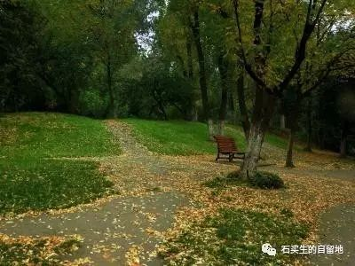

#  中年书

原创  石买生  [ 石买生的自留地 ](javascript:void\(0\);)

__ _ _ _ _

** 中年书  **

** 说说南海以外的事情  **

据说男人只喜欢两样东西

政治

女人

这两样东西有一个共同点

但我不能告诉你

当南海被全世界的口水淹没

我在江西老家度假

教我儿子认喇叭状的金黄的南瓜花

铜钱大的丝瓜花

还有黄昏燃烧的晚霞

2016-7-31

**** ** 又想起王尔德  **

是因为他的又一句名言撩得我心痛，

“人最大的悲哀不是身体衰老而是心还年轻。”

它让我想起老树对新花的念想，

暮云对朝霞的回眸。

来自山间的一滴雨，

它祈求在坠落之前融入一场雪。

我的哀乐中年余音绕梁，

它自始至终在向青春致敬。

****

2015-1-11

** 中年的雪  **

父母离世

妻子身上痛

生命中不打招呼的雪

没说来就来了

2012-12-31

** 偶然想到的墓志铭  **

午后从学校小山坡上班

看到寒风卷起枯草和落叶

突然想给卑微的一生

写一则墓志铭

这里躺着一个其貌不扬贪生怕死的人

他生在他母亲饥饿的年代

长在贫瘠的山村

身子瘦弱驼背罗圈腿

四肢畸形

生性怯懦固执爱幻想

喜好中庸

不作恶亦未行善

教书为稻粱谋

码字为臭美

神往魏晋渴望风流

假装超然物外

实则迷恋红尘

一生平淡无奇波澜不惊

有点呆

有点懒

有点色

2012-12-18

** 洛丽塔  **

一个男人多汗毛的手臂上

歇了一只蝴蝶

春天致命的罂粟花

在梦中摇曳

中年的风暴和漩涡

不知从哪一处海面升起

邪恶的潮汐

哦

洛  \--  丽  \--  塔

2015-9-14

** 哀伤  **

\-----  一个梦

在我钓鱼回家的路上

我和父亲意外相逢

好多年不见了

父亲平庄头笑容满面

嘴里露出一排洁白的牙齿

真像他年轻时帅气的模样

我迎上前

父亲早张开了臂膀

我想抱紧他

可我一抱竟抱了一个虚空

我不知道

父亲和我怎样各自走散

在各自的视线里

无影无踪

2014-11-8

** 这些年  **

\----  和南屿兄

脸上起沟壑，心中少波澜。

头顶降霜雪，人老珠未黄。

作业越来越少，

日子不淡不咸。

看见美，也想折腾。

欲静不静，

遗世不独立，

残梦吊余生。

平静中，父母离世，

星光暗淡。

抱紧一个虚妄，

面死而生。

2014-3-14

** 清明想  **

在异乡，我时常想起远逝的亲人，

他们面容模糊，

在野麦岭与山花野草为邻。

今天，我潦草不堪，

看见纸灰轻飏，想他们比往日更多一点。

2015-4-5

** 致钱  **

也只有在血气方刚的青年时代，才能

蔑称你为身外之物

为此我曾俘虏了一个女子的心

你面容模糊时

世界向我敞开了许多扇门

我对山川草木鸟兽星辰的厌倦

始于哀乐中年，始于对你的过度迷恋

为此我备受女人的打击和嘲讽

这个我认了，我爱上你绝对心甘情愿

哪怕通向世界的路又少又窄

有好些年了，我只关心工资卡和日益虚浮的肉体

此时，我常呼唤你，只有你能拯救我麻木和堕落的灵魂

你能让世界重新变得纯洁而美好

如果生活因你而肮脏而丑陋而糟糕

那一定不是你的错

现在、我准备接受命运的失败

在老去之前，我决定改变初衷向你膜拜

这个简单的真理其实我早该明白

深夜听见你在寂静中歌唱

我等于又重活了一次

2012-10-2

（以上图片皆来自网络）  

预览时标签不可点

微信扫一扫  
关注该公众号

****

****

×  分析

__

微信扫一扫可打开此内容，  
使用完整服务

：  ，  ，  ，  ，  ，  ，  ，  ，  ，  ，  ，  ，  。  视频  小程序  赞  ，轻点两下取消赞  在看  ，轻点两下取消在看
分享  留言  收藏  听过

