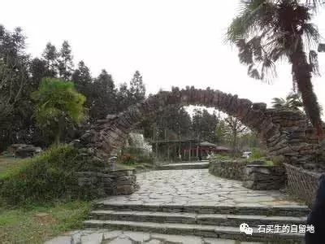

#  2017高考下水作文-----《山坳上的中国》

原创  石买生  [ 石买生的自留地 ](javascript:void\(0\);)

__ _ _ _ _

** 2017  ** ** 高考下水作文  ** ** \----  ** ** 《山坳上的中国》  **

2017  年高考全国卷  1  作文题

据近期一项对来华留学生的调查，他们较为关注的“中国关键词”有：一带一路、大熊猫、广场舞、中华美食、长城、共享单车、京剧、空气污染、美丽乡村、食品安全、高铁、移动支付。

请从中选择两三个关键词来呈现你所认识的中国，写一篇文章帮助外国青年读懂中国。要求选好关键词，使之形成有机的关联；选好角度，明确文体，自拟标题；不要套作，不得抄袭，不少于
800  字。

****

山坳上的中国

前几年，德国青年卢安克在广西义务支教的事迹，曾深深打动了我。山区的贫困，留守儿童孤单的眼神，明净的山水，湛蓝的天空，组成了一幅斑驳的令人难忘的画卷，难道这就是外国学生眼中的美丽乡村？这广阔的乡村背后，还隐藏怎样的不为人知的故事？那里的百姓过着怎样的生活？他们的生活是怎样悄无声息的变化着？他们对明天有着怎样的期待？我想，这些，正是许多如卢安克一样的外国青年想知道的，因为，他们想了解真实的中国，而真实的中国，正藏在许多美丽乡村之中。

那广大的连绵起伏的山峦，那崇山峻岭中散落的古村落，还有那淳朴的民风，在一定意义上，就代表着中国的符号，它们是山坳上的中国。

古老而又年轻的乡村是充满诗意的。陶渊明曾“种豆南山下，草盛豆苗稀”，“采菊东篱下，悠然见南山”，王维在山间生活，感受“明月松间照，清泉石上流”的禅意，人与自然和谐相依，古人一直走在天人合一的路上，
此种生活方式至今仍在警醒世人要对自然充满敬畏，否则，环境一旦破坏，美丽乡村将一去不复回。国际友人不远万里来到中国，也正是看中了中国乡村原生态的美，只要到中国最偏远的山区走一走，你就会觉得，田园牧歌式的生活不仅能存在书本与回忆中，它就在此时，在此地。

时代在变化，乡村的生态美固然令人陶醉，但乡村的生活往往不尽如人意。我每年都到老家生活一段时期，我感觉最突出的是卫生条件差，食品安全问题严重。我常看见乡下娃脏兮兮的手捏一根辣条或辣片往嘴里塞，也有娃拿一根劣质冰棍在嘴里啃，那些红黄相间的小包包更是见多不见。这些垃圾食品毁坏了多少孩子的肠胃，以前说毒奶粉导致一批大头娃娃出现，其实这些垃圾食品一样令人触目惊心，只可惜少有报道，有关部门重视不够，致使这样的现象依然普遍存在。垃圾食品只要存在一天，乡村儿童的健康就得不到保障，美丽的乡村通向文明之路依然相当遥远和漫长。

好在信息时代已经来临，繁华的城市在变，偏僻的乡村也在变。物质的富裕也改变了山里人的生活观念，重视教育在农村很普遍，特别是年轻家长，已经形成一种共识，当他们在城里，在异乡拿起手机，移动支付，网购一本书寄回乡村，他家孩子不光得到了精神的慰藉，一个家庭的明天也露出了曙光。

我深信，不久将来，国外青年，了解中国，肯定不仅仅停留在几个关键词上。他们将通过日新月异的美丽乡村，实打实地了解到别样的  \----  山坳上的中国。

  

预览时标签不可点

微信扫一扫  
关注该公众号

****

****

×  分析

__

微信扫一扫可打开此内容，  
使用完整服务

：  ，  ，  ，  ，  ，  ，  ，  ，  ，  ，  ，  ，  。  视频  小程序  赞  ，轻点两下取消赞  在看  ，轻点两下取消在看
分享  留言  收藏  听过

精选留言

