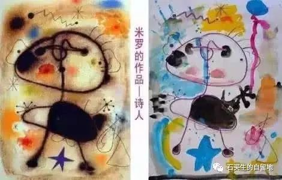

#  你在别人眼中的样子

原创  石买生  [ 石买生的自留地 ](javascript:void\(0\);)

__ _ _ _ _

** **

** **  

** 你在别人眼中的样子  **

每次回乡，正凤姑总是微笑着对我说

你走路的样子真像聋子哥哥

聋子是我死去多年的父亲

他是我们村远近闻名的篾匠

我低头疾走的样子

让他复活了

每次看我，我学生总爱往我头顶瞟

别太辛苦了，老师

你以前的白发没有这么多

错了，以前哪有白发

朝如青丝暮成雪

我青春焕发的样子是怎样模糊了

脸红嫩，手绵软，耳根后的皮打折

妻子看过摸过我之后感情复杂

她欲言又止总不说那个字

最艰难的日子将过去了

儿女也大了生活不断翻开新的一页

这本该就是曾经沧海的样子

一个老者，银发飘飘，目光炯炯，手舞足蹈

在舞台上激情飞扬讲述生命的奇观

那是哲学家罗素的样子

我想走上前向他弯腰致敬同他握手合影留念

在秋风中凋零随老变呆不是我所愿

最真实的样子就在我手中

  

预览时标签不可点

微信扫一扫  
关注该公众号

****

****

×  分析

__

微信扫一扫可打开此内容，  
使用完整服务

：  ，  ，  ，  ，  ，  ，  ，  ，  ，  ，  ，  ，  。  视频  小程序  赞  ，轻点两下取消赞  在看  ，轻点两下取消在看
分享  留言  收藏  听过

