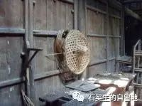
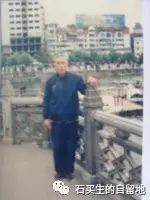

#  我的父亲

原创  石买生  [ 石买生的自留地 ](javascript:void\(0\);)

__ _ _ _ _

** 我的父亲  **

** 沉默的国王  **

在这喧嚣的世间，我长时间怀念一个人。

他是一个篾匠，笸箩、谷箩、晒篮、菜篮、腰子篮、米筛、花筛、土筐、竹扁担，

是他留给这个世界数不尽的作品；

他走村串户，数十年如一日，

凭一张篾刀赢得了乡民由衷的赞美；

他一生没别的能耐，在清贫时代，用一双粗糙变形缠满胶布的手，

将四个子女养育成人。

村里上了年纪的老倌管他叫聋子，

他是这世上我见过的最沉默寡言的人；

七十一岁那年，正当享清福时，他被乡村医院一个庸医误诊，含冤离世。

他是我心中的国王，沉默的国王。

如今，他静静地躺在我故乡一座叫野麦岭的山岗上，

了却尘凡。

2012-03-09

父亲生前遗下的斗笠  

** 哀伤  **

\---  一个梦

在我钓鱼回家的路上

我和父亲意外相逢

好多年不见了

父亲平庄头笑容满面嘴里露出一排洁白的牙齿

真像他年轻时帅气的模样

我迎上前

父亲早张开了臂膀

我想抱紧他

可我一抱竟抱了一个虚空

我不知道

父亲和我怎样各自走散

在各自的视线里

无影无踪

2014-11-08

2002父亲在九江周瑜点将台

预览时标签不可点

微信扫一扫  
关注该公众号

****

****

×  分析

__

微信扫一扫可打开此内容，  
使用完整服务

：  ，  ，  ，  ，  ，  ，  ，  ，  ，  ，  ，  ，  。  视频  小程序  赞  ，轻点两下取消赞  在看  ，轻点两下取消在看
分享  留言  收藏  听过

