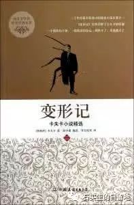
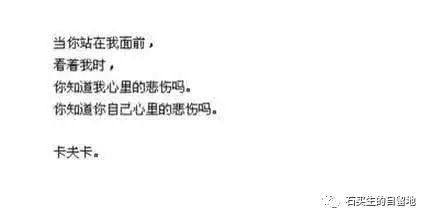
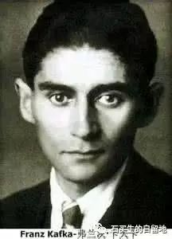
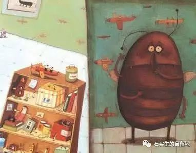
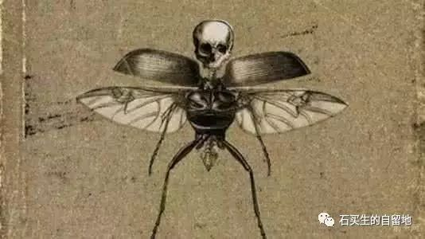

#  异乡人的祝福

原创  石买生  [ 石买生的自留地 ](javascript:void\(0\);)

__ _ _ _ _

** **

** **  

我管心灵的漂泊者叫异乡人。  
有一种人一辈子困守故乡却常被他的乡亲所忽略。有一种人少年时便闯荡在外却被人们牢牢铭记。前一种人因一生寂寞、孤独而退守心灵终于成为智者,后一种人因一生轰轰烈烈而征服世界最终成为将军。命运常常垂青于将军而冷落了智者,于是,许多智者便被故乡放逐了而成为一个个异乡人。

卡夫卡：一只笼子在等待一只鸟

  

有人说天才在他的故乡是寂寞的。弗兰茨·卡夫卡一生是寂寞的。他是一个异乡人,默默无闻活了四十一岁,却不被亲人所理解,一生只以孤独为伴,视写作为乐,乐此不疲地在他构筑的奇异世界里流浪。作为一个沉默寡言的儿子,恪尽职守的职员,卡夫卡却被父母和同事视为陌生人,在他的心灵深处,他有一种真正被放逐的感觉。他成了一个真正的异乡人。
为了留住生命一根,为了拯救有可能沉沦的灵魂,为了自己不厌倦自己,卡夫卡开始了永无休止的漂泊与寻找。他的苦恼、他的困惑、他的忧伤、他的思考都迫使他找到一个倾诉的对象来宣泄自己的情感。格里高尔·萨姆沙满足了卡夫卡所有的渴望与梦想,并且激发了他身上无穷的创造潜能。由于某种神秘的心灵感应,卡夫卡通过格里高尔找到了他灵魂的代言人。  
格里高尔也是一个异乡人。  
如果把卡夫卡的小说世界比作一个神奇的艺术宝库,那么《变形记》就是走进这个艺术宝库的一扇门,而格里高尔则是打开这扇门的一把钥匙。  
《变形记》的著名开篇已经成为现代小说的典范:  
“一天早晨,格里高尔·萨姆沙从不安的睡梦中醒来,发现自己躺在床上变成了一只巨大的甲虫。”  

这个奇妙的句子传达了两个重要信息:一是既然一个好端端的人可以变成一只巨大的甲虫,那么这个变化万端的世界什么都可能发生;二是所有的痛苦和不幸皆从“不安”开始,可以说“不安”是痛苦之源。  
如果将这个梦同庄周的梦进行比照,我们将会发现更多耐人寻味的东西。这个有趣的开头要是换成庄周来写,准会写成这样:  
“一天早晨,庄周从甜蜜的睡梦中醒来,发现自己躲在床上变成了—只美丽的蝴蝶。”  
这种比照确实耐人寻味,一个梦是直接的,是直面现实的承受与担当;一个梦是朦胧的,是游离现实的退隐与逍遥。—个梦充满恐怖读来令人毛骨悚然;一个梦曼妙惬意读来让人遐思翩翩。  
庄周教人远离尘世,卡夫卡劝人直面人生。  
格里高尔由人变成虫的不幸命运正是从“不安”开始的。作为—个旅行推销员,严酷的生存环境使得格里高尔身心疲惫。对家庭的责任感,对于作的担忧,还有粗劣的饮食,颠簸不定的生活,友情的淡漠,都使他处于惶恐之中。他的变形是一种必然。他彻底地成为一个异乡人也是他命中的—个劫数。  
但格里高尔面对苦难与不幸所表现出的惊人勇敢与忍耐却深深打动了人们的心灵。  
从变形的第一天起,格卫高尔梦魇般的生活开始了。他在同事和亲人的眼里突然变成了一头怪物。迎接他的不是尖叫就是惊恐的眼神。但他自己并没有绝望。他还渴望早一点回到单位工作,还挂念着妹妹的读书,还牵挂着日渐衰老的父母,他还想好好地生活。  
他甚至想接近每一个亲人。无奈,现在的他行动迟缓,模样呆板,眼睛忧郁。他的每一次努力都以失败而告终。他带来的只有更多的尖叫与惊恐。  
开初,他的父母和妹妹对他还有一丝关照,希望他变回人样回到以前的生活。但格里高尔行为越来越怪诞,多少回总是让家人六神不安、颜面丢尽。他彻底扰乱了家里平静的生活。他成了家里的一个累赘。  
母亲开始厌倦他,妹妹开始嫌弃他,父亲开始痛恨他。而他也开始意识到自己的怪异与可憎,总是尽量躲着父母和妹妹,小心翼翼地东躲西藏,床底下、沙发旁、墙壁上、天花板上,处处有他藏匿的身影。他常常躲在—个角落里,偷偷地看着亲人在屋里走动的身影,眼睛里充满忧伤与绝望。他深怕他的再—次出现会给家人带来更大的痛苦与不幸。  
然而更大的痛苦与不幸还是渐次降临到他的身上。他先是挤进房门被父亲搡了一把,结果将身子弄得血流如注。继而又被妹妹的玻璃碎片划破了脸,最后又被一发炮弹——父亲扔来的一只苹果打中后背,他彻底瘫痪了。他的生命奄奄一息。现在,不管有多么大的勇气,不管有多么坚韧的意志、他再也不能承受住他痛苦的生命,他再也不能担当他家庭的那一份责任。他的生命该结束了。  
格里高尔在弥留之际,他深情地回忆起和家人一起曾经度过的美好时光。他们的声音,他们的微笑,他们的举止,曾经带给他许多的温暖与愉悦。现在那些感受正离他而去。现在,他最放心不了的还是他的母亲,那个真诚、普通、善良的女人。  
“……他最后瞥子母亲一眼,她完全睡着了。”  
这是格里高尔留给世界的最后—道目光。这轻微一瞥,有着说不尽的疲倦,说不尽的愁苦,说不尽的眷恋。这轻微一瞥,是格里高尔留给母亲的深深的祝福。  

  

这样的告别让卡夫卡心情非常沉重。  
这样的告别让读者非常感动。  
这样的告别让瞬间化作了永恒。  
一个人一不留神竟成了一只虫。一个人一不小心竟变得连自己都觉得陌生。—个人竟莫名其妙地被亲人抛弃”了变成了异乡人。一个人变成了异乡人竟忘不了对母亲投上深情的一瞥。  
这个人是真正的赤子。这个人善良、执着、懂得感恩。这个人外表冷漠但内心有火一般的热情。这个人行为怪诞  ,
但心地非常健康、纯正。这个人留给世界的不是憎恨与诅咒  ,  而是由衷地热爱与祝福。  
这个人名叫格里高尔·萨姆沙。  
这个人名叫弗兰茨·卡夫卡。

  

该文原载2004年9期《创作评谭》

注：以上图片皆来自网络

预览时标签不可点

微信扫一扫  
关注该公众号

****

****

×  分析

__

微信扫一扫可打开此内容，  
使用完整服务

：  ，  ，  ，  ，  ，  ，  ，  ，  ，  ，  ，  ，  。  视频  小程序  赞  ，轻点两下取消赞  在看  ，轻点两下取消在看
分享  留言  收藏  听过

精选留言

