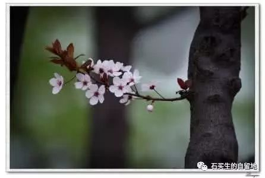

#  老树新花，为谁绚烂----献给尴尬的60后，70后

原创  石买生  [ 石买生的自留地 ](javascript:void\(0\);)

__ _ _ _ _

犹豫，暧昧，绝望，憧憬是60后，70后交替出现的眼神，  

这眼神是暮雨回望朝云，是渴望余生再一次绚烂。

于是，他们又开始在秋天播种，可来年春天仍两手空空！

四季颠倒，是流年把他们负了，他们假装沉静地走着，

不知道明天的路，生活还要继续。

怨言无处诉说，命运早有安排。

  

从一些女人偶然隆起的肚子上，我仿佛看见哥伦布发现新大陆的喜悦，

更多的女人羞赧地挺起扁平的肚子，走在梦魇里，被又一个春天遗忘。

上天总是有选择地对一些人的执着予以眷顾，而对另一些人的幽怨熟视无睹。

这，也叫命。

有时，除了对自己，对家庭表示忠诚，别无选择。

时间总是躲在暗角里，窥视这一切。

  

古语云：命里有时终须有，命里无时莫强求。难道真有所谓宿命？

赣北也有谚：女人不怕丑，生到四十九，四十九上转一弯，生到五十三。

这又是一种怎样的执拗！我仿佛看见，长夜里，烛光摇曳；古道上，有女子在跌跌撞撞。

这是晚开的花，她们为谁而绚烂?

这是祈祷的树，它们一个名字叫柳暗花明；另一个名字叫山重水复。

  

  

  

  

预览时标签不可点

微信扫一扫  
关注该公众号

****

****

×  分析

__

微信扫一扫可打开此内容，  
使用完整服务

：  ，  ，  ，  ，  ，  ，  ，  ，  ，  ，  ，  ，  。  视频  小程序  赞  ，轻点两下取消赞  在看  ，轻点两下取消在看
分享  留言  收藏  听过

精选留言

Eric-Liu来自

不小心踏入石老师尴尬年龄段了[撇嘴]经历 心态影响老树的第二春[微笑]

石买生的自留地来自

握手！

吴丰强来自

黄昏颂！[强][强][强]

乾运基础老石来自

莫非哥嫂有喜了？[呲牙]

石买生的自留地来自

非也。期望天下老男人老女人老树新花。

