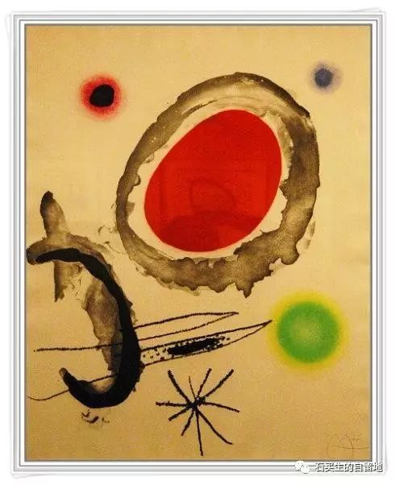

#  答非所问游戏

原创  石买生  [ 石买生的自留地 ](javascript:void\(0\);)

__ _ _ _ _

  

  

答非所问游戏

多年前，我在都昌中学教书时，我跟学生玩了一个有趣的游戏。我把学生分成每两个人一组，每人发一张纸条，每人随意写五个问题，然后交换回答。具体要求是：问要问得出人意料，答要答得匪夷所思。不能按正常习惯思维问答，否则属无效问答。时间十五分钟。我玩这个游戏的目的是想给学生提供“一个真实的场”，让学生的思维来一次彻底的解放，让他们真实的思想自由地驰骋，让他们的情感得以尽情的宣泄，让他们的潜意识光明正大的来到阳光下。结果这个游戏成了学生狂欢的节日。他们一个个问得幽默，答得机智，或调侃，或诙谐，或撒泼，或装呆，或上天入地，或沧桑世故，他们无拘无束，他们突然间仿佛都醍醐灌顶，仿佛都有了许多奇思妙想，仿佛突然间都变得无所不能，仿佛一个个都变成了自由浪漫的诗人。他们在那个特殊的时刻，他们都梦想成真了，他们都进入了一个可能的世界。人生原来是可以多姿多彩的啊，人原来是可以白日做梦的啊，后来我一想起学生灵光闪烁的眼睛和绯红的像朝霞一般的脸颊，我的心就禁不住颤抖，我就渴望一个人来一次自问自答，好吧，现在正是深夜，游戏正式开始吧－－

问：你为什么装嫩？

答：奥巴马的母亲是多么幸福的人啊。

问  :  一个人尿得很高谁最羡慕？

答：河马的眼睛里好像有一朵绿云。

问：你为啥厌世？

答：是女人让世界充满生机。

问：你的眼睛为什么长在后脑勺上？

答：唐代有一个我喜欢的诗人叫李商隐。

问：武则天干嘛那么好色？

答：蝉在秋天叫得很凄美。

问：你最想生活在那一个时间哪一个空间的交接点上？

答：埃及艳后和蛇交媾。

问：广岛原子弹爆炸时你在哪里？

答：恐龙绝对不是外星人。

问：野鸡尾巴上的毛为什么是绿色的比孔雀还好看？

答：最新一届人代会什么时候召开？

问：人变老了以后最不想干最怕干的是什么？

答：老子的思想“道”全世界最牛。

问：生命和时间哪一个先开始？

答：电脑比人更孤独。

问：在和平年代大炮用来干啥？

答：照镜子使人类繁殖。

问：男人最酷爱哪两样东西？

答：蒲公英流浪比三毛更有诗意。

问：世界上垃圾最多的地方在哪里？

答：博斯普鲁海峡有宋代景德镇瓷器。

问：你在哪一年打过赤脚？

答：生命如一场游戏，随时可能结束，随时可以开始。

  

预览时标签不可点

微信扫一扫  
关注该公众号

****

****

×  分析

__

微信扫一扫可打开此内容，  
使用完整服务

：  ，  ，  ，  ，  ，  ，  ，  ，  ，  ，  ，  ，  。  视频  小程序  赞  ，轻点两下取消赞  在看  ，轻点两下取消在看
分享  留言  收藏  听过

精选留言

吴丰强来自

真是思维的体操！

