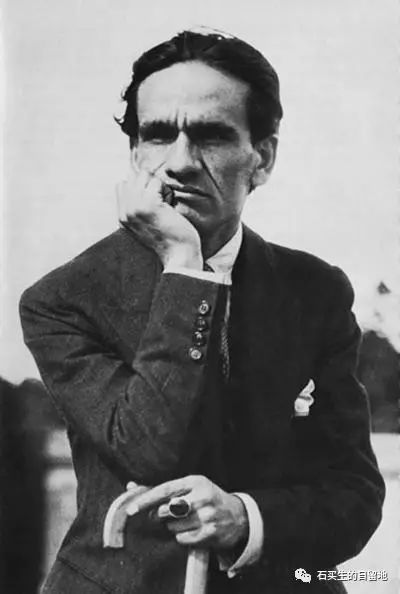

#  诗眼观情色，阴阳两相宜

原创  石买生  [ 石买生的自留地 ](javascript:void\(0\);)

__ _ _ _ _

诗眼观情色，阴阳总相宜

沉迷情色大概是许多男人的癖好。看了《金瓶梅》和《肉蒲团》中关于情色的原生态描写，总想知道诗人是如何描写情色的。近来刚好读到两首描写情色的诗，喜欢得不行，于是有了下面的文字。

  

巴列霍是秘鲁超现实主义大诗人，想象狂野，天马行空，他最神奇的本领，是能把风马牛不相及的事物糅合在一起，变成最酷的诗，让你膜拜。我们来看他怎样描写女人：

  

我相信强者。

那里走来一个凹形女人，

一种无颜色的数量，

她的优雅关上之处

正是我打开的地方。

  

有一个女人正迎面走来，你能猜出她是一个怎样的女人吗？一个凹型女人？到底是凸凹有致，还是骨感魅人？这样的女人，一个就让你的天塌下来了，你无法想得更多，看一眼就把你拿住了，以致你忽略了她的颜色，只觉得天地晕乎乎的转，你关注的是她优雅的门，作为爷们，你的眼里正吐出火焰，那神秘的门，是多么好啊。

诗题叫《我相信强者》，上面是诗的一节。巴列霍渴望变成强者，打开那扇优雅之门。

我相信，面对那扇神秘之门，世上所有男人都跟巴列霍一样，浮现联翩。

而“一种无颜色的数量”，是这首诗的诗眼，就像《伊利亚特》的海伦，她的笔挺的鼻子，让男人疯狂，让特洛伊战争爆发。

由此观之，情色是诗人灵感的源泉。

巴列霍是男性，按吾国传统文化，男性属阳，他观情色的眼睛火辣辣的。

接下来我们看一首女性写的是诗。作为一首情色诗，该诗更加有名。该诗作者为沙朗•奥兹，是美国著名诗人。我们看诗：

教皇的阴茎

它深悬于他的长袍内，仿佛位于吊钟核心的

一枚精致的钟锤

他动，它则动，一尾幽灵似的鱼

游动在一片银白色海藻的光亮中，体毛

摇曳在黑暗与灼热里

而当夜晚降临

他的双眼闭了，它便立起

赞美上帝

此诗诗题相当赤裸，但内容深婉撩人。既可当做情色诗读，也可当作讽刺诗读。先看诗题，教皇的阴茎，教皇干啥子的？布道的。写他那玩意儿干啥呀，挺恶心的呀。

且慢，我们看看在作者笔下，教皇的阴茎有啥不同？一是长，深悬嘛；二是硬，像钟锤嘛；三是活，像游鱼嘛；四是假正经，老是在暗中动来动去嘛。

以上是写在光天化日之下的阴茎，那是不为人知的玩意儿，它挺委屈的。

很多人欣赏诗的第二节，说第二节画龙点睛，其实第一节才是精彩绝伦，极富人性。

第二节写教皇和他那玩意儿原形毕露，直挺起来，在夜晚赞美上帝，他真是在赞美上帝吗？这明显是在撩拨女人嘛，这简直大煞风景。

但此时的玩儿意儿，特别是教皇的，沙朗•奥兹喜欢，女人喜欢，这就够了。

因为在诗人眼里，在阴阳交汇的灰色地带，渴望等于赞美。

  

  

预览时标签不可点

微信扫一扫  
关注该公众号

****

****

×  分析

__

微信扫一扫可打开此内容，  
使用完整服务

：  ，  ，  ，  ，  ，  ，  ，  ，  ，  ，  ，  ，  。  视频  小程序  赞  ，轻点两下取消赞  在看  ，轻点两下取消在看
分享  留言  收藏  听过

