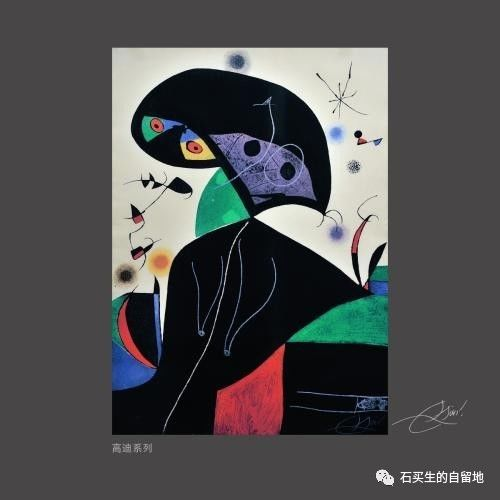
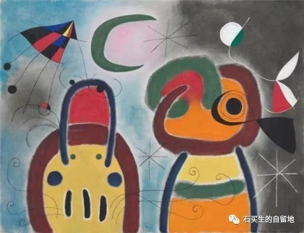

#  学生眼中的我

原创  黄燕霞 卢颖茵  [ 石买生的自留地 ](javascript:void\(0\);)

__ _ _ _ _

** **

** **  

** 永远微笑的赤子  **

**** 2011  届  高二（  8  ）班  黄燕霞

你知道  Smison  吗？那就是人见人爱、花见花开的石买生老师。可我觉得他应该叫  “Smile Sun”
。因为石老师和蔼的微笑，就像一颗小小的太阳，一直都挂在他的脸上。

在同学们的心中，石老师总是一个好人。好人不一定就是好欺负的，虽然老师第一天与我们接触就告诉我们：“别人都说我很好欺负，但你们不要欺负我啊！”

第一印象就是这老师实在太可爱了！

** “善良的人”  **

这个可爱的老师可不一般。和蔼、慈祥、亲切、善良、老实……当你和他相处一阵子后，你一定会发现他居然是这些优点的集合体。于是，我们这群理科班的学生，便借着这些优良品质，常常欺负石老师。

我曾在办公室看到我们班和隔壁班的科代表，在一起商量着些事，手里都捏着一小叠作业本，“哈哈，原来你们班收到的作业比我们班的还少啊……”那时候，我真感到十分的同情。可是，第二天上课，还是看到石老师手里夹着几个本子。没关系……”老师确实常常被我们欺负，可是我们也确实不是真心想欺负他。我坐在座位上，巴望着老师那天真无邪的笑容，竟丝毫没有感觉到他会生气。这个和蔼的人实在太善良了！

** “知音”  **

“作者因为对人类的挚爱而产生的忧伤和痛苦之情深深打动了我，我沉浸在这奇特的文字中间，我觉得经过多少年的期待后，我终于找到了我心灵上值得亲近的大师，我的心因为幸福而颤栗。”在给我们介绍尼采《瞧，这个人！》的讲座中，石老师哽咽着讲出了这段感人的文字。正如他所说的“经过多少年的期待之后，终于找到了心灵上值得亲近的大师”，我觉得，他找到了自己的知音。只是在时间上他们隔了近百年而已。我想石老师对尼采的崇拜和爱戴是超出一般人想象的，甚至是疯狂的。尼采在他的著作中写道：教育不是禁锢心灵，而是解放生命。在石老师身上便能看到对此句最好的诠释。

作为一个老师，他爱他的学生。看到自己的女儿为即将到来的考试而用功至深夜，他对应试教育带给学生深沉的压力而感到痛苦，却无力改变现状，只能奋笔疾书，希望能引起读者的共鸣；他看到在晨读中轻轻睡着的学生，阳光洒在学生的身上，也在石老师心中缓缓升起，为了不打扰到那同学，老师轻轻地从他身边走过；他从容地面对几乎每一次都交得少之又少的作业，并不是因为他不会生气，而是他懂得体谅我们。“为伊消得人憔悴”，石老师到底是为谁憔悴啊？

“ **素材与好文章”**

师者，所以传道授业解惑者也。而石老师不仅帮助我们“习句读”，“解疑惑”，还常常带给我们丰富的课外知识。石老师每周都会跟我们分享一句他喜欢的名言。当他迷恋尼采的时候，他把那有“超人”思想的尼采介绍给我们；当他开始关注王尔德时，他让我们懂得“我们都生活在阴沟里，但仍有人仰望星空”；当他看到我们苦于学习时，他教给了我们王国维的人生三重境界……

当然啦，我更喜欢听老师评讲周记。从厚厚的周记本里随意抽出一本，不管文章写得怎么样，老师总能从中找出一些我们看不到的亮点，他教我们写文章要写人话！而老师那纯真的笑容总是挂在脸上，就如一颗小小的太阳，让课室充满阳关和欢乐。

打开“异乡人手记”，就可以看到老师在博客上发表的各类文章：诗歌、散文、议论文……“好的文章总是折腾出来的。”不知道到底要折腾多少年才可以达到老师的水平。我记得他在
2010  年写的第一首给他母亲的诗，那句  “  她一辈子，吃了两辈子的苦  ”
，仿佛不仅是写他的老娘，而是写着天底下所有辛勤劳苦的娘啊！而我印象最深的还是他在《筷子与妻子》中的那句：  “  一年以后，那个卖红筷子的姑娘成了我的妻子。
”  一句话却写了一个春秋。白驹过隙的顷刻，仿佛繁花落尽，一切都过去了。

好文章、好人、好老师。虽然老师经常被我们欺负，可能以后还会经常这样子，但是老师还是很喜欢他的学生，就像我们也很喜欢石老师一样。

Smison  是同学们给老师起的英文名字。我想，石买生不仅仅可以被译作  Smison  ，还是  Smile Sun
。老师就像一颗永远微笑着的太阳，这是我们学生时代温暖的阳光也是短暂的风景，却是老师面对他的学生不变的微笑。春天来了，让我们与老师一起等待春暖花开吧！

** 恩师石买生  **

**  
**

2017  届  高三（  2  ）班  卢颖茵

第一次见他，他代课，给我们讲《师说》。

买生个子不高，但走起路来带劲儿，他说他这叫浓缩就是精华。头小小个，发鬓微霜，鼻梁上架着一副有着厚镜片的圆眼镜，整个看起来就像蓝精灵里的聪聪。也许缘分注定，分班之后，我有幸成为这个老顽童的学生。

我还记得第一次的周记点评课。我周记的内容就不多说了，可买生读懂了。到现在，他向我投来的肯定的那个目光，那份被人了解的感动，我不曾忘记。我也记得当遇到困难时，我还未说什么，他就对我说：不要害怕，相信自己，要一直坚持，你可以。我还记得，当我拿奖时，同学说买生就像是自己得奖一样，把获奖证书举得高高的，兴奋的像个三岁孩子。每次看到他或是听到他的名字，我都会异常亢奋，好友都说我是买生的一枚小迷妹。

我也陶醉于他上课时激扬澎湃，指点江山的模样。他为我们讲课，汗水都可以将衬衫打湿；他努力地去构造一个活跃的课堂氛围，尽管我们有时候异常活跃超出他的可控范围；他从不拘泥于书本，即便在紧张的高三备考阶段，他仍会腾出时间推荐诗歌文章，谈论时事热点
(  例如于欢的杀人案，老虎咬人事件，同性恋的合法性等  )
，或者畅奇葩怪事青春往事（如日本的厕所卫生，情书等）；他喜欢引导我们积极思考问题，他喜欢我们七嘴八舌给出奇怪又生动的答案，因为在他看来，每一个学生的答案都值得被尊重。

与他相处，传统的师生关系枷锁被打破，取而代之的似是故友重逢。我很喜欢跑去问他问题，也许别人并不能理解，觉得无论大小问题都问，显得太傻。但是，买生是谦逊的。当他的学生两年，每每虚心求教时，这个老师并不会敷衍每一个问题。有时候有些问题的答案连他也不确定时，他绝不会妄下结论，绝不会用“老师就是对的”的姿态给你答案。为师如他，他从来都是谦虚细心的态度。他会陪你一起翻阅字典词典，他会陪你一起在网页上细细搜寻。他的手机，他的电脑，只要你有需要，他都会让你使用以便解决学业上的问题。这便是我以前及以后会一直尊重他的理由。

庆幸如今未断掉与他的联系，他会询问我是否适应大学生活；他还会为我推荐书目；遇到困惑时，他一如既往地耐心为我解答，尽管我已毕业，尽管他已经有新的学生。

当他的学生，最大的财富不仅是从买生那学到许多有益的语文知识，更多的是他用自己的行动去影响我的言行，改变我的为人处世之道。师者，绝不仅限于传道授业解惑。桃李不言，下自成蹊。为师者，更应以身作则，为学生提供一个正确的世界观与价值观，并能使学生从中一生受益。在买生那里，我渐渐懂得无论是学习还是生活都不可自视甚高，亦不可妄自菲薄。我懂得做人该有的姿态——谦谦君子，温润如玉。不忘初心，方得始终。

这一切，都该感谢那位被我亲切称作买生的恩师兼好友。

注：以上图片选自网络米罗名画  

  

预览时标签不可点

微信扫一扫  
关注该公众号

****

****

×  分析

__

微信扫一扫可打开此内容，  
使用完整服务

：  ，  ，  ，  ，  ，  ，  ，  ，  ，  ，  ，  ，  。  视频  小程序  赞  ，轻点两下取消赞  在看  ，轻点两下取消在看
分享  留言  收藏  听过

