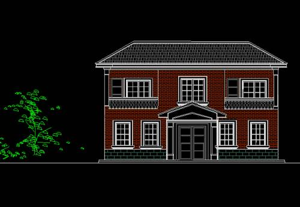

#  拆屋小记

原创  石买生  [ 石买生的自留地 ](javascript:void\(0\);)

__ _ _ _ _

拆屋小记

  

概貌描述

老屋原约建于民国肆零年代，为赣北常见五树三间民居，面积  90
平方左右，土木结构，房产为祖父和细公所共有。上世纪七零年代，祖父过世，细公择地另建新居，将半间屋卖与父亲。从此，我家拥有一栋完整房产。八零年代，房屋土墙日益破损，开始掉落土块，随时有坍塌危险，兄长牵头和父母一起，重修老屋，以青砖砌墙，加以内部整修，使房屋以全新面貌立于村东上塘洲畔。八零年代后期，兄长分家另立门户，这老屋归到我门下。我结婚育女生儿，皆依托老屋。爽儿、行儿皆在西房诞下。我常年在外工作，父母幽居老屋，昼夜绵长，父子、母子，倍感思念。
2003  年，  2010
年，父母相继过世，老屋渐渐成为空屋，日夜除了偶尔有老鼠和小虫光顾，屋里一片静寂，多年来，老屋于风雨飘摇中，日益破败，屋漏到处有，天光时时见。屋里潮气霉气弥漫，屋外院里杂草丛生，墙壁爬满藤曼。父母不在了，老屋被我不知不觉地遗弃了。

拆建理由

首先是国家政策层面：相传户口不在农村的，祖屋可继承或使用，一旦房屋坍塌或倒掉了，土地归国家所有，不能重建。既然政策目前模糊，何不除旧布新，在政策的空白处，为后半生在老家押上一个韵脚。其次是房子本身的质量问题，到处漏，又潮湿，最终倒只是时间问题，房子也像人，衰败是必然，修修补补不能住，还不如拆到重来。俗话也说，旧的不去，新的不来嘛。有时想，书生犹豫怀旧是通病，此次应该果断一回。第三个理由是，为自己选一条返乡的路，老了常回家客居几日，见见兄弟姊妹，为父母扫墓，看看老家熟悉的山水；为孩子留一个根和念想，毕竟孩子是农村出生的嘛。最后一个理由，更加隐秘，假如老屋不拆，逢年过节，我在老屋住着，我总害怕，在很灯瞎火的某一瞬间，或在无眠的漫漫长夜，我劳碌一生的父母从阴间回转来，用我熟悉又陌生的面容来看我。尽管我母亲知道我胆小，她生前就告知我，她死后不会回家吓我。我相信，我那老实巴交的父亲更加是。但我还是怕。

新建计划

原则上，新屋面积跟老屋面积相当。总体设计简洁，大方，经济，实用。当然，如果看上去能养眼，走心，那自然更理想。房子结构分两层，正屋在东边，门前设一门庭，门庭前立两根罗马柱，中西结合，对传统做一些改变。西边是厨房，厨房为一层半，上面半层设一个露天凉台，日晒衣服，夜观星斗，闲时，还可看看远方的丁仙垴。屋前因地制宜，围一个小庭院，庭院里置花坛几个，种果树数棵，等退休后莳花弄草，安享晚年之乐。设计图纸烦请水立方袁总相助，袁总作为老乡，他设计的图纸我十分心仪。新屋实施总监，由堂哥坤朋负责，堂哥进材料，请工匠，样样在行，他的负责，顾家义在我族下是出了名的。我期待的新屋到时肯定实打实地满意。工期为一年，今年中秋动工，明年中秋竣工。明年竣工之日，我掐指一算，离我退休之日，还有
5  年零  3  个月。如果退休还要延长，那新屋难免寂寞，要等一个白发老者魂归故里，也许所有的等待都是值得的。

注：照片来自百度网络  

预览时标签不可点

微信扫一扫  
关注该公众号

****

****

×  分析

__

微信扫一扫可打开此内容，  
使用完整服务

：  ，  ，  ，  ，  ，  ，  ，  ，  ，  ，  ，  ，  。  视频  小程序  赞  ，轻点两下取消赞  在看  ，轻点两下取消在看
分享  留言  收藏  听过

