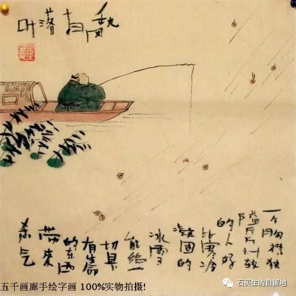
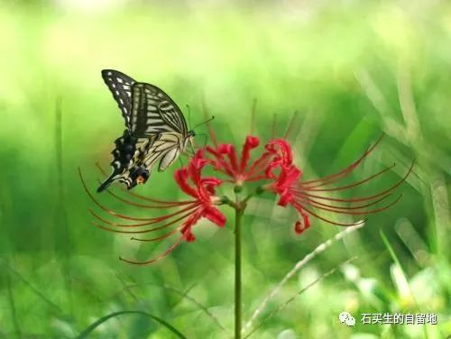

#  秋风词

原创  石买生  [ 石买生的自留地 ](javascript:void\(0\);)

__ _ _ _ _

秋风词

  

1

黎明你望着窗外

莞草丛中鸟儿在欢叫

风儿凉了

在空中打一个呼哨

你一把老骨头就散了

这时节

不适合怀念

犹疑的脚

总蹀躞在冬天

不通向故园

两把更老的骨头

在野麦岭枯草中安眠

它们思念的人

在天边外

2

对面理工山坡上

一个好青年把韶华

系在一棵树上

把遗言用细长的字迹

写给成群的蚂蚁看

秋风袅袅

浑然不知的双亲

鬓发如霜

将怎样挨过

这尘世和冬天

一个沉默的人

莫名厌世

他的故乡

在彩云之南

  

3

你拿一把梳子用力梳头

只因华发滞涩

哪管飘落一肩

妻总在一旁看

笑

顶又稀疏不少

我说你笑什么笑

没见过

笊篱筢松毛

老家的小山岗

被秋风

洗得干净又亮堂

4

里尔克说

这时节谁没有房屋

就不必建筑

秋风刮过田野时

我听见了他的声音里

有劳动  汗水

和祈祷

我不爱他的忧郁

我的祖国

我爱

而且说出来

注：图片来自百度网络

  

预览时标签不可点

微信扫一扫  
关注该公众号

****

****

×  分析

__

微信扫一扫可打开此内容，  
使用完整服务

：  ，  ，  ，  ，  ，  ，  ，  ，  ，  ，  ，  ，  。  视频  小程序  赞  ，轻点两下取消赞  在看  ，轻点两下取消在看
分享  留言  收藏  听过

精选留言

吴丰强来自

在秋风里听到祈祷，是敏锐的发现。那个山坡上的忧郁会被秋风吹散吧

石买生的自留地来自

谢谢老吴鼓励！

戒定生慧来自

我喜欢老骨头散了，有幽默与通达。

石买生的自留地来自

谢海龙赏读！

朱庆龙来自

石老师将敏锐和真实结合到了极致！

石买生的自留地来自

谢谢庆龙谬赞！握手。

庄照岗来自

石老师这首诗写得摇曳生姿又韵味十足[强][强]

石买生的自留地来自

谢谢照岗夸奖！

