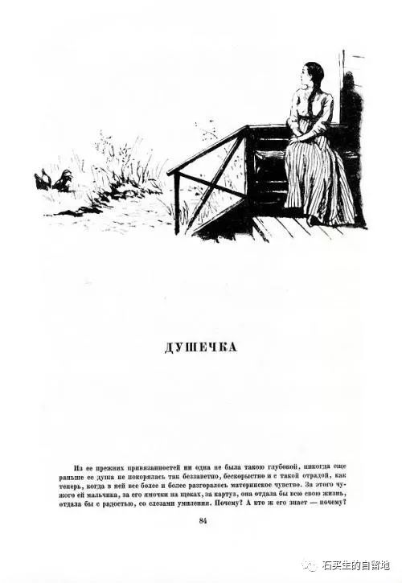
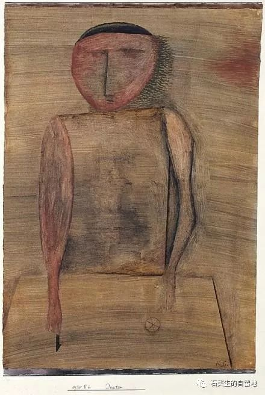
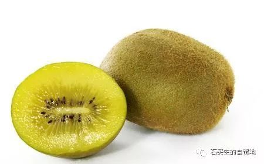
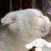

#  四个小东西

原创  石买生  [ 石买生的自留地 ](javascript:void\(0\);)

__ _ _ _ _

****

** 奥莲卡  **

这个俄罗斯姑娘

红脸蛋脖子上一颗黑痣

笑起来很健康

一辈子只干一件事

爱男人

一个又一个

爱得真心实意

爱得地老天荒

可她爱的男人总是死

每当她向生活张开臂膀

总是莫名被掀翻

她被噩梦缠绕

变老变丑

平凡如一根枯木

曾经的纯朴还在

哪去了门廊上那个丰满的姑娘

注：奥莲卡系契诃夫短篇小说《宝贝儿》中的人物。

  

** 尝试  **

你一辈子都在努力

走出自己

吃不吃的东西

走逆行的路

看陌生的景

爱不爱的人

太阳把光撒出去了

万物青翠欲滴

你把自己豁出去了

为何面目全非

** 在东莞  **

男人喜欢干两件事

赚钱

健身

也有外省人爱谈政治

常常唾沫四溅

还有低调的土著

其貌不扬

把早茶当午餐

煲汤一样把日子过得很慢

他们不苟言笑

最会过暧昧的生活

** 猕猴桃  **

先扒掉它褐色的皮毛

再看绿汪汪汁液

再看芝麻大的籽

淡黄色的嚢

然后一口

最多两口吃掉

在一个怡人的午后

  

注：照片皆来自网络

  

  

预览时标签不可点

微信扫一扫  
关注该公众号

****

****

×  分析

__

微信扫一扫可打开此内容，  
使用完整服务

：  ，  ，  ，  ，  ，  ，  ，  ，  ，  ，  ，  ，  。  视频  小程序  赞  ，轻点两下取消赞  在看  ，轻点两下取消在看
分享  留言  收藏  听过

精选留言

喝奶茶不加糖来自

宝贝儿里面不是爱过一个女人吗，好像是个奥莲卡的姑妈

石买生的自留地来自

那是泛爱，引子。真爱应该是男人，那是精神寄托。

吴丰强来自

喜欢《尝试》和《猕猴桃》。《尝试》深刻，《猕猴桃》可亲！

石买生的自留地来自

谢谢老吴鼓励！

Candice来自

努力走出自己 却发现 还是做自己最舒服

石买生的自留地来自

说的是

