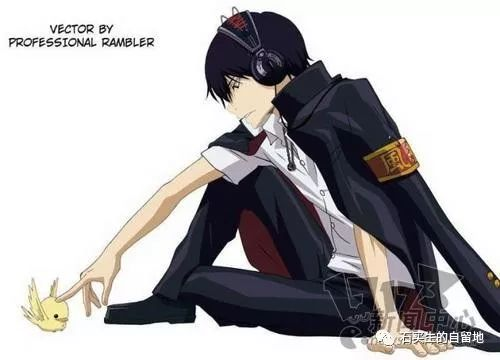
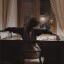

#  我的学生（三）

原创  石买生  [ 石买生的自留地 ](javascript:void\(0\);)

__ _ _ _ _

  

**我爱潘威**  

  

潘威是我的学生。用我另一位学生何杨的话说，还有几个月，他们就要从九江一中光荣毕业了。想想这些聪明可爱的学生马上就要离开一中校园，我心里委实有点惆怅。

潘威让我记住他的名字是从一头猪开始的。那还是高一上学期的事儿。潘威写了一篇周记《老猪礼赞》，里边写台北监狱里的一头猪，一天突然越狱奔逃到大街上，横冲直撞，吓得街上的行人抱头鼠窜，魂不附体。结果警察倾巢出动，四处围堵擒拿，无奈老猪眼露凶光，异常剽悍，警察也不是孬种，见状纷纷躲闪，眼睁睁看着那头老猪，像一道黑色的闪电，消失在光天化日之下，稠密人群之中。自从那头老猪消失以后，潘威心中一直怏怏不乐，对老猪充满怀念。在周记的结尾，潘威动情地写道：老猪之所以越狱出逃，乃是一次对人类的奚落，乃是一次对自由新生活的向往。写到忘情处，好像那头老猪就是潘威，潘威就是那头老猪，二者难以分离。看完周记，我先是忍俊不禁，继而深为感动，一头平凡的老猪，一天突然创造了不平凡的奇迹，这真是一头值得尊敬的老猪。

正是从那头老猪身上，我依稀辨出了潘威身上有一种难得的特立独行的性格。潘威身材魁梧，走路来大步流星，浑身透着一股蛮劲，一双大脚像一对铁锤踩得水泥地嘭嘭作响，每走一步都好像要将地球踩翻似的。听说，还在读初中时，潘威经常肩扛一只竹扫把，像一个幽灵在校园矮山上游荡。有时，他又一个人躲在竹林里抓鸟，或独自在单杠上苦练体魄，以备他日实现雄心壮志。潘威的每一个怪异的举动目的都非常明确：要么遭别人嘲笑，要么让别人难受。比如他上学经常迟到，见到老师不是嘴里哼哼哼，就是用手摸摸后脑勺。在家里他又一贯我行我素，固执倔强，惹得父母老是到学校告状。每回见父母着急，他心里就一阵暗喜，真所谓别人难看痛苦之际，正是潘威心花怒放之时。

潘威的眼睛轻度近视，除了上课，他很少戴眼镜。不戴眼镜，他的眼睛就眯成一条缝，看人时就显得特别呆气。人有呆气交往时就有心理障碍。有心理障碍就彻底退守到心灵的一隅。不过，这样一来也有一个好处，就潘威而言，眼睛这扇窗户关上了，心灵这扇窗户就打开了。跟别的同学相比，潘威同学的内心世界就特别丰富，想象力就特别充沛。潘威经常躲在家里写科幻小说，开始怕父母看见，后来我鼓励他说科幻小说也可算作文、周记。他受到鼓励后更显得十二分来劲，好像乡村女子要不了几个月就弄出一个孩子，潘威也有这等本事，不出几周就弄出两万字的中篇来。瑰奇的想象，迷人的幻想，曲折的情节，极富原创性。潘威的这些习作，尽管目前还像个孩子处在襁褓之中，但它门总有一天会长大成人在天下扬名。

潘威写作文还有一手绝活，那就是他善于将真人假事巧妙地混杂在一起，教你真假难辨，难分东西，如坠云里雾里。潘威有一篇作文叫《要嫁就嫁潘威这样的人》，内容写若干年后潘威成了人民军的统帅，他率几个师偷袭台湾，一举成功。将士们将红旗插上台湾岛，一个个高唱主题歌《要嫁就嫁潘威这样的人》。歌声激越、雄壮，令人荡气回肠。作文情节离奇得古怪，但名字真实得怕人（都是班上同学名字），，文章写得热烈奔放，充满满阳刚之气，潘威就是凭借这篇作文征服了班上的女同学。有几个女同学还私下里将潘威当做心中的偶像。

为了显示男子气概，潘威还有一个看家本领，他总是故意暴露自己的隐私，叫你费尽思量。譬如他有一个癖好，喜欢收集女生的头发，时间选在每天中午放学吃午饭的时候。每当他蹑手蹑脚地从女生的座位上收集到一根中意的秀发，他就兴奋得像哥伦布发现了新大陆。他极诡秘地向一些哥们宣称，目前他已精心搜集到了十三根秀发，他已经将这十三根秀发用透明胶粘在《成功之路
----
数学高考总复习》一书的封面上。当这一爆炸性的新闻在班上被公布时，男同学笑得前仰后合，一个个心里直痒痒；女同学则一个个情绪高涨，精神高度亢奋，都希望自己的秀发被选中。更有人想马上见到那本奇异的破书的封面。潘威得知这一消息时，正倚在走廊的栏杆上，脸上露出狡黠的笑。

好在班上的学生素质都很高，没有把潘威的恶作剧当真。否则，班上真要乱得不行。再说，同学们都知道，潘威尽管有暴力倾向，有号令天下的雄心，但他从不付诸行动，更不想把天下搞乱。因为从心底里，潘威是一个非常纯真的人，纯真的人总希望世界变得更美好。事实上，潘威的许多奇想都变成了他的梦幻。潘威可以说是班上做梦最多的人。光看他如梦似幻的眼睛，就知道他不仅晚上做梦，白天也少不了恍恍惚惚，在他构筑的奇异世界漫游。潘威写有许多记梦诗，来表达他对生活的沉思，对未来的渴望。其情绪的忧伤，信念的执着，让潘威的记梦诗有一种扣人心弦的魅力。潘威有一首诗叫《梦魇》，多多同学读后深受感动，在心底产生了强烈共鸣：

我们在哪儿

我们往哪儿去

我们哭了吗

别怕

也不要使我们后悔

让我们拥抱

那不堪回首的过去

哪柳暗花明的未来

  

一个人能将生活变成梦幻已属不易，能将梦幻再变成诗更令人赞叹。感谢潘威，在一个想象力贫乏的时代，提醒我，生活中，还有另一种美，另一种爱，值得我去追求，灿烂的群星，仍为我而闪烁，我衰老的翅膀，仍有飞翔的可能。

感谢潘威。

  

  

注：此文原载2004年11/12期《江西教育》，文中潘威系九江一中2003届毕业生，2003年，潘威考入中国人民解放军炮兵学院。

  

**孙乐轩**  

  

  

好男孩上天堂

坏男孩走四方

我的学生孙乐轩

羞赧地说

他想做坏男孩

他的眼睛

兔子眼睛一样温良

他的牙齿

有点翘  有点黄

  

  

注：孙乐轩系东莞中学松山湖学校2017届毕业生

  

  

**罗兆添**

  

  

罗兆添早读又睡觉了

我推搡他问为什么

我讨厌背那烂诗文

他埋着头看也不看我

  

注：罗兆添系东莞中学松山湖学校2017届毕业生

  

  

  

预览时标签不可点

微信扫一扫  
关注该公众号

****

****

×  分析

__

微信扫一扫可打开此内容，  
使用完整服务

：  ，  ，  ，  ，  ，  ，  ，  ，  ，  ，  ，  ，  。  视频  小程序  赞  ，轻点两下取消赞  在看  ，轻点两下取消在看
分享  留言  收藏  听过

精选留言

Simon来自

後面的兩位很簡單

石买生的自留地来自

那是诗呀

Alex来自

见字如面，脑海能清晰浮现您憨憨的露齿笑。

石买生的自留地来自

哪位高足？握手。

吴丰强来自

此文把潘威写得如在目前，引起我们共同的回忆！ [强][强][强]

石买生的自留地来自

是啊，温馨美好的回忆

Scarlett来自

栩栩如生，跃然纸上，风趣幽默，忍俊不禁。

石买生的自留地来自

确实有点小幽默。你语文功底还在呀。

Jeffers来自

什么时候能到我[快哭了] 那个不背古诗文的罗兆添同学高考语文可是考了120啊

石买生的自留地来自

你的样子已经刻入了我的记忆呀

Vanessa-kiki来自

老师666都开始经营个人公众号了 厉害者 买生也

石买生的自留地来自

时尚一把

Mer_来自

一如既往的十分可爱

石买生的自留地来自

那必须

易安来自

可惜了竟然没有写我这课代表

石买生的自留地来自

惭愧

