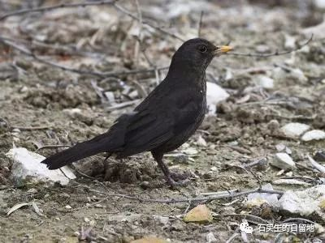

#  一只黑鸟在寻找什么

原创  石买生  [ 石买生的自留地 ](javascript:void\(0\);)

__ _ _ _ _

  

  

**  
**

**一只黑鸟在寻找什么**

**  
**

**  
**

谁也不知道这个僻静的山坡

一只黑鸟脚步轻挪

在枯草丛中寻找什么

  

一个男子打这儿路过

他在想

怎么又到了岁末

  

你的眼袋又下垂了许多

妻子的笑夹着酸楚

他看见秋天的雪

  

老父亲总把日历

每天翻转一页串在钉子上

他留住了更深的寂寞

  

黑鸟不知道这些

还在低头寻找

旁边的荔枝树叶开始掉落

  

  

  

**天使最终变成什么**

**  
**

**  
**

我拿一根嫩树枝叶

在池塘边喂鱼

一个两岁女孩见了

喊我树叶伯伯

  

她的牙白

笑甜

眼睛像宝石

  

她的小手

被年轻母亲牵着

前些日子

我还见过她外婆

  

鱼儿在水面追逐树叶

不知什么叫恐惧

  

  

**不通神**

**  
**

**  
**

我在湖边垂钓时

眼里只有鱼

无半点闲情逸致

  

蚂蚁有时爬上我的脚

有时在我手上咬一口

从不跟我招呼

  

我吹它在水面游

拂它在地上走

掐它只听见一声嗞

  

上帝正在我背后看着

不置可否

我一副皮囊愈发衰老

  

预览时标签不可点

微信扫一扫  
关注该公众号

****

****

×  分析

__

微信扫一扫可打开此内容，  
使用完整服务

：  ，  ，  ，  ，  ，  ，  ，  ，  ，  ，  ，  ，  。  视频  小程序  赞  ，轻点两下取消赞  在看  ，轻点两下取消在看
分享  留言  收藏  听过

