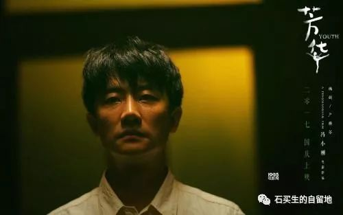
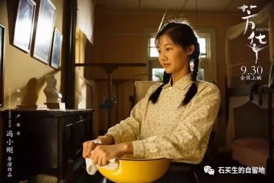
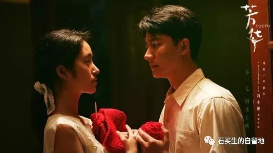
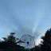

#  我和学生眼里的《芳华》

原创  朱莉冰 等  [ 石买生的自留地 ](javascript:void\(0\);)

__ _ _ _ _

  

行至不惊处，回看皆芳华

高二（  2  ）班  朱莉冰

这是一群来自大江南北各具文艺才能的少男少女，在上世纪七十年代，那个脑子里只有热血没有脑浆的红色年代。他们奔腾着，跳跃着，打着圈儿翻着斗儿前前后后来到西南某部队文工团。小小的红楼里，严格的军纪和艰苦的训练中，那些细小与平凡，那些牺牲与伟大，那些付出和背叛，仍不可抑制的绽放芳华。

文工团的少男少女们满怀一腔热情，以青春为声，唱响红色的年代。他们性格各异，才艺不同。身为干部子弟趾高气扬眼睛长在头顶上的队长郝淑雯，是每个集体中必不可少的那种光芒存在；体弱多病嗲着一口上海嗓子的女独唱林丁丁，总要苍白着一张小脸捂着肚子说：
“诶呦，这胃胀得像只球”。在身不由己的童年阴影中绝望成长的小曼，有着那样一双深不见底的从不流泪的眼睛；以及那个笑容长在脸上，把自己转成陀螺到处忙活的“活雷锋”刘峰。还有坚强开朗独具慧心的穗子，欢快吹号的陈灿
...
红色年代的大风把他们呼啦地吹到红楼，燃烧如火的青春，点亮赤子的梦想。他们身怀不同的命运，带着不一样的过去和不一样的未来，在文工团的芳华岁月里磕磕碰碰，一路成长。

烟花易冷，美好易逝。天大的  1976
年，命运的掌舵手一声招呼也不打便无情的忽转直下。死亡的黑色气息笼罩着那坨不知天高地厚的红，慢慢的压下去，再压下去，压在每个人沉甸甸的心头。然而插上马达一路往前的中华大地并没有因此停下它飞快的脚步，不可逆转的时代潮流来势汹汹，风一般席卷了她们年轻滚烫的活蹦乱跳的心。多少个蠢蠢欲动的黄昏，多少个翻来覆去的夏夜。追求在呆板中发酵，激情在压抑中酝酿，理想在心头上燃烧。于是释放了，无悔了，幻灭了。

“触摸事件”平地炸起一声惊雷，苦等丁丁多年只待转正深夜表白的刘峰在一片批斗声中被调伐木连。刘峰临走的那个早晨，含泪为他送行的小萍眼睁睁看着心中希望被无情掐灭后，对这个捉弄她，抛弃刘峰的集体彻底死心，也转到战地医院当护士。娇弱的丁丁从“触摸事件”中醒过来，若无其事地摆弄着无名指上的金戒指，盘算着这个干事那个华侨。分隔异地，他们迅速成长。当刘峰在枪炮无眼的越南战场上为掩护十六岁的小兵，丢掉那只为大家修修补补的手臂时，当小萍夜以继日地抢救病人，见证太多死亡而精神崩溃时，当刘峰空着一只袖子，坚定地牵起小萍那双手，温柔地注视着那双深不见底从不流泪又带了点疑惑和试探的眼睛时。我的泪，不可遏制地哗哗流满了脸庞。

后来我问自己，为什么会一直不停地哭？封闭的影院里厚重的空气固然令人难受的窒息，可那些柔柔的情感何以蓦地占满我整个心灵？我想我是为了小萍悲剧的黑暗童年和那一代被文革迫害的知青家庭，为了刘峰鲜血淋淋手握扳机时眼里的狠厉与决绝。也是为了穗子靠在车尾随风撕碎的那封情书和她埋死在心底的爱情，为了她不顾教练呵斥，飞奔过操场只为查看心爱人是否安好的那封慌张和无措。是为了文工团解散那天大家满含热泪的送别骊歌，为了他们各奔东西颠沛流离五味杂陈的不同人生。更为了最后的最后，已然年迈的小萍对黑乎乎抽着烟的刘峰说的那句
“你能抱抱我吗”，那在烽火席卷的岁月里隐藏了数十年的渴盼与慰藉。

最初的最初，文工团四周到处种满了冬青，不知什么品种的冬青无论旱涝永远肥绿，像一层不掉的绿膘。记忆里的磕磕碰碰爱恨情仇，最终都化作经年之后再重逢的释怀。那些翻腾着不甘的岁月，那些倔强任性的青春，那些酸甜苦辣的兜兜转转，都化作那株冬青，杵在每个人的回忆里，扎眼的绿。

命运相逢，一场芳华。纠葛不休，便是人间。

  

从时代的棱镜中窥见人

高二（  2  ）班 赵羿舜

我从来都不是一个理性的人。为此，我撞过的南墙也着实不少了。然而我个人却不崇尚理性
——人这一辈子，真要活他个透彻，倒也并没有什么意思。我们的世界，更多的需要一些感性带来的诗意的美感。无论如何，我们也不能丧失了在电影院中潸然泪下的能力吧。

进入正题。

犹记上一部如此  “有口皆碑”的作品还是吴京的《战狼  2
》。然而看完以后，我心中非但没有任何波澜，甚至升腾起了一股轻微的反胃之感——整部电影都是吴京的个人秀，剧情框架十分老套，大肆宣扬大男子主义和一种畸形的爱国主义，超级英雄化的人物和拙劣到似乎足以套下整个宇宙的主角光环
...  心中只有一种感觉：公关做的也太完美了吧。再加上吴京本人的一些不妥言论的他对特殊群体的不尊重，这部电影被我很彻底地打入了黑名单。

反之，《芳华》的情节应是很对得起它的好评了。很长一段时间内，我都被一种奇异的情绪萦绕着。是什么抓住了我？我说不出来，只觉得心中有什么东西在不断地爆裂，以一种沉闷的姿态。导演塑造了许多角色，能做到都如此立体真实也是很不容易的了。也许正因如此，这部电影才能给人一种强烈的代入感。

全片给我留下印象最深的一句话是一句旁白：
“一个从来不被善待的人，最能识得善良，也最能珍惜善良。”我们都不是奥莲卡，做不到对身边的每一个人都倾注爱与善意。于是每一个非个人意愿所形成的群体中，都会存在不合群者。忠厚老实人的恶毒，像饭里未净的砂粒，能给人以一种不期待的伤痛。何小萍便是如此，她处处受排斥，但我们却不能说文工团中的任何一个人坏。相反，从电影所要表现的来看，他们都是再淳朴善良不过的人。所以她只能忍气吞声，任流言蜚语施施然将她撕扯得皮开肉绽，打碎了牙也只能含泪咽下，硌到喉咙都不许哭出声。神是奇怪的，他不仅利用我们的恶来惩罚我们，更借助我们内心深处的美好、善良、慈悲和关爱来毁灭我们。没有人意识到他们的行为中带有一股原始的血腥气。或许，这才是最令人扼腕的。

而刘峰所谓的
“耍流氓”事件则更是荒谬。人人都推举他为“活雷锋”，认为他应该干净到不食任何人间烟火。所以他被推到一个很高很高的巅峰，却无人记得他是一个有自然欲求的人。高处本就不胜寒，而由高处坠落，则更是被捧杀得很彻底了。正如那句话所言；“面具戴久了，便长在脸上，再要想摘下来，须伤筋、动骨、扒皮的。”较之更为可悲的是，这副面具并非他自己戴上，而是他人强行披上的一种人设，渐渐地成为了一层皮囊，入主了他本身。

后来这两个命运截然相反的人在越战战场上相遇。经历了战火与死亡的冲击后，一个身残，一个智残，并在芳华已逝之时走到了一起。杜拉斯在《情人》中写到过；
“与你那时的面貌相比，我更爱你现在备受摧残的容颜”。都说造化弄人，这样的重逢，才是对悲喜交加最好的诠释了吧。

见证了他们的悲欢离合、歇斯底里，黑暗时代的芳华确是
“低到尘埃里，开出花来”，他们，演绎人性；而我们，可以从时代的棱镜中窥见他们，却哪里能参透他们背后的那个时代、那些浓稠的鲜血  ?

记得当时年纪少，你爱谈天我爱笑。

梦里花落知多少，回首肠断皆芳华。

  

  

林丁丁救了冯小刚  

\-----我看《芳华》

一，先说几句题外话

国产电影我看得少。两个学生在周记里，把《芳华》大大表扬了一番，我不能无动其衷，说俺周末也去电影院瞅瞅。一家子看过《芳华》，老婆说，好看，可惜好人得不到好报。儿子说，就喜欢看丛林打仗那一段，其余看不懂。我若有所思，一阵沉默。其实，我想说，看电影嘛，不看白不看，看了也白看。当然，这么经典的话不是我说的，是一个写小说的哥们评价另一个写小说的哥们的小说时说的。这话适合看当代许多小说和许多电影。接下来，入正题，说说《芳华》，说说冯小刚。

  

二，一枚树叶把头靠在了风的肩头上

  

在那特殊年代，一群有貌又有才的男女青年，家庭背景各异，从四面八方，为了一个共同目标，来到部队文工团。他们芳华尽展，合分自然，命运跌宕，时代风云卷裹其中，时间跨度大，每一个观众都为他们的才华所倾倒，为他们的韶华逝去而扼腕，为社会的剧变而深思。冯小刚想通过这部电影，为正在老去的50后，唱一曲挽歌。只可惜这词儿曲儿音调儿伤感煽情有余，忧郁醇厚不足，有好些不和谐的音调儿跑调了，不能进到人的心坎里，在艺术上大打折扣。

最不合谱的是男女主角。

男主角刘峰，冯小刚想把他塑造一个活雷锋，他也知道风险挺大。他开始也能够贴近人物、贴近时代来塑造他，就情节发展来看，刘峰参加丛林战（应该是对越自卫反击）前，还像个人样，他身上至少有那个时代的印记。可后来的残疾英雄，出外打工，老婆跟人跑，结尾留一个画面意淫一下，可怜的刘峰，成了冯小刚手中的一个木偶，身上闻不到一丁点人的气息。整个人让冯小刚糟蹋得面目全非，让人恶心死了。冯小刚可能在京城呆惯了，对脸谱深谙于心，但是对人，对人性的认知，往往浅尝辄止。让人啼笑皆非。

影片的女主角更不合谱。

何小萍是影片中最失败的一个角色。她的形象自始至终就一个字：拽。面容模糊，装神弄鬼，简直像蒲松龄笔下的女巫。你看她，除了开始偷衣服照相有点笑容，脸上一贯的表情就是
----
阴郁，原本是挺高贵的气质，可一看就是装的，跟她命运的悲惨和家庭的不幸没有半毛关系。她在前线救伤员后神经失常，观战友表演后在雪地被唤醒记忆后舞蹈，最后莫名其妙和刘峰坐到了一张椅子上，刘峰也是讷讷的，这简直胡编乱造，蔑视观众的智商。这个情节，我想多说几句，如果影片前面有铺垫，有黏连，人物心灵有呼应，这是多好的情节啊。当何小萍满脸沧桑的坐到刘峰的椅子上，杜拉斯就会借刘峰之口对何小萍说，我以前不知道爱你，但现在，我爱你备受摧残的面容。冯小刚在表现爱情主题这方面，完全是个门外汉。

当我看到影片中，最后，何小萍把头，疲倦地靠在了刘峰的肩膀上，我看到刘峰的表情，讷讷的，怪怪的，我不仅不感动，反而想笑，我突然觉得，一枚树叶把头靠在了风的肩头上。

  

三，林丁丁救了冯小刚

据说，冯小刚是个北京爷们，鼓捣了一辈子电影，总不能老对不起观众。

《芳华》那么多人物，幸亏有了林丁丁。此回，命运女神通过林丁丁，终于对冯小刚眨了一下眼，算是垂青。这种灵感，于冯小刚而言，真是稀有啊。

别看刘峰一辈子傻乎乎的，被人当猴耍，但有一件事他做对了，那就是爱上了林丁丁。也许有观众会问：林丁丁这娘们有啥值得爱啊，我看啊，这娘们长相媚，又有才，还活转，尽管她势利，还落井下石，但真实的人真实的人生就是这样子啊，你看，她浑身的艺术细胞，又浑身的人间烟火。如果时光倒转，我承认，我跟刘峰一样，也会爱上林丁丁。

林丁丁身上，散发着人性的点点微光，让我在这个冬天倍感温暖。冯小刚这次撞大运了，正是林丁丁，把她给救了。

影片结尾，有一个镜头，林丁丁远嫁到澳洲，照片上的她，富态、丰腴，人变得甚至有点臃肿。我更加赞叹：生活最容易把人变成这样子啊！

冯小刚，这老滑头，鬼得很，也许，他在这儿偷师托尔斯泰。因为从林丁丁身上，我看见了娜塔莎的魅影。那个魅影来自《战争与和平》。

几年前，看过冯小刚拍的《老炮儿》，很遗憾，那一炮，没有放响。这一回，恭喜他，这个老炮儿，通过林丁丁，总算放响了。

  

  

  

预览时标签不可点

微信扫一扫  
关注该公众号

****

****

×  分析

__

微信扫一扫可打开此内容，  
使用完整服务

：  ，  ，  ，  ，  ，  ，  ，  ，  ，  ，  ，  ，  。  视频  小程序  赞  ，轻点两下取消赞  在看  ，轻点两下取消在看
分享  留言  收藏  听过

精选留言

李晓睿来自

作为买生17届的学生，看完芳华，感触良多，同时看到老师的公众号发文，第一时间点赞

石买生的自留地来自

谢谢！

Yulia来自

对刘峰和电影情节的一些评价表示认同。 但有些时候看电影就是看非生活，不然就真有点看了也白看了，何小萍是个可怜人，我们有可能难以走进他们的内心世界。

石买生的自留地来自

对何小萍有新认识，谢谢！

Simon来自

老師，我非常想念上你的課，氣氛特別濃烈，你上課很幽默。還記得裝在套子里的人，整節課都在笑，好吧…[捂脸]

石买生的自留地来自

感动啊，问好。

🍁然则何时而乐焉来自

对影评最好的评价就是：你没有看过电影，看了影评，你明白了道理，被吸引入了电影或远离了这部电影

石买生的自留地来自

有意思

DDDanie!来自

所以门当户对很重要，似乎是从出生就能决定的因素

石买生的自留地来自

是的

周歧斌来自

这电影我也看过，本以为只有上了年纪的人才有那么多感触。为石老师您现在的学生把这部电影的观影感写得如此好点个大赞！

石买生的自留地来自

谢谢歧斌！

