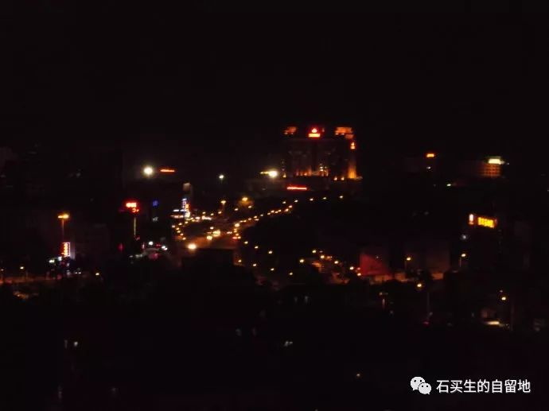
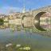

#  南行记

原创  石买生  [ 石买生的自留地 ](javascript:void\(0\);)

__ _ _ _ _

** 南行记  **

** 老吴的天空  **

一个男人  41  年的孤独

弥漫在萃智楼  3  楼单身宿舍袅袅升起的烟圈里

长夜无眠

当好莱坞俊男靓女灿若星光

这个男人和一只蚊子一棵核桃树

在另一个维度

他梦想

把云彩变成花朵

将梨花嫁接海棠

因为酒

他常腾云驾雾超尘脱俗

每当他和曙光躺在草地疯言疯语

你不能不说  竹林七贤

他曾为一棵大树因位移枯死而悲戚

一辈子爱他所爱诲人不倦

他口吐莲花时

世间纯洁或不纯洁的孩子都受到了祝福

2006  年一个冬日在大岭山老华润公交站

他微笑向我走来竟被我当成异乡人

有一回他门牙掉了一颗

我看见里面的天空

比他宿舍前在芦苇丛中筑巢的夜鸟的天空

还高一点

**_ 难民  _ **

2007  年刚过完年

我和女儿挤上了一辆南行的列车

车上人密密匝匝热气腾腾

我和女儿一路站着

早已成了肉饼

人缝中我看见一个姑娘

吃杨梅干

手勤唇红牙黄

一会儿我想到火车票字样

九江  —  东莞

一会儿又看看蛇皮袋大皮箱

好像少了标签

中国  —  江西  —  难民

** 午夜来电  **

农历庚寅年腊月十三以前的以前

特别是午夜

我手机总是开着

那时母亲还健在我老担心来电不祥

  

** 在矮岭冚凝望万家灯火  **

我的新居在矮岭冚

东莞大岭山镇一个充满乡土味的地方

入夜

我在十八层楼上凝望万家灯火

我听见  107  国道上的汽车呼啸而过

我的心徜徉在灿灿星河

我眼睛里群星闪烁

我看见一片蔚蓝的海

将我定格

在尘世无论怎样奔逃

命都是一样的

要么成为一叶孤舟

要么成为一个过客

  

  

预览时标签不可点

微信扫一扫  
关注该公众号

****

****

×  分析

__

微信扫一扫可打开此内容，  
使用完整服务

：  ，  ，  ，  ，  ，  ，  ，  ，  ，  ，  ，  ，  。  视频  小程序  赞  ，轻点两下取消赞  在看  ，轻点两下取消在看
分享  留言  收藏  听过

精选留言

one two three ～go来自

老师的文字总能让人引起共鸣，看似洒脱不羁，却又深刻触底。于生命的长河里，谁又不是匆匆过客呢？

石买生的自留地来自

记得殷舟以前诗写得不错啊

Simon来自

我亦是行人

石买生的自留地来自

共鸣

邢祥如来自

十年前的景象仿如隔世。当年正追梦，意气风发。繁华了，美丽了似乎是他人的世界。 眼看着绿叶渐渐泛黄，终将归于尘土，花自娇艳！

石买生的自留地来自

老邢好伤感，你风采依旧啊

小山耗子来自

生命就像远走的火车永远不能回头，我们在无法摆脱的轨迹中等待自由；生命就像那命运的河流中随波逐流的船，我们用尽一生的时间去寻找彼岸

石买生的自留地来自

生存在彼岸。我80年代的名言啊。

吴丰强来自

老石把我写得太好，我的恶习臭脾气都成了诗。跟老石在一起，不是诗人也有三分诗意

石买生的自留地来自

遗憾。韵味还有未到处。

老板番茄炒蛋要加糖🍅 🍅来自

虽然不是老师的学生，但是很喜欢看老师的杂文[西瓜]

石买生的自留地来自

谢谢赏读

江东焱来自

都是过客[呲牙]不是孤舟[强]

石买生的自留地来自

是啊

