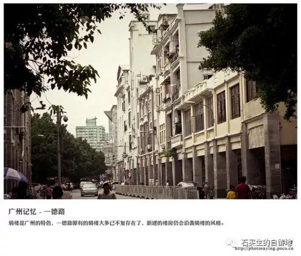

#  一德路上的流浪汉

原创  石买生  [ 石买生的自留地 ](javascript:void\(0\);)

__ _ _ _ _

一德路上的流浪者

大年二十八早上  6.30
分，我、妻和石行从逸米公寓出来，经过一德路，去往孙逸仙纪念医院给石行做牙龈囊肿切除手术。晨光熹微，我看见一德路两边商铺的走廊下，一长溜一长溜睡有许多流浪者，当时温度约
12  度，无风。

一德路是广州越秀区一条老街，楼房古旧不高，两边商铺林立。大清早，人影车辆稀少。商铺的走廊里，一排排的蛇皮袋上，破旧布条上，盖有许多被子，被子里一个个人蜷缩着，有的露出一张脸，有的蒙头而睡。露出的脸黝黑，眼神朦胧，看年龄大部分是青壮年、也有大伯。好像都是男的，没看见一个女的。还有一个清瘦摸样的人满头白发，年龄比我还大，他看我的眼神竟清亮透彻，我打了一个寒噤，我看见，一个异乡老者和一座老城的一条老街一同醒来。此时，天上没有一颗星，穷人的头顶上没有屋顶。

这应该是一群有家不归的人。他们也许来自广西、江西、湖南、湖北，安徽，河南；兴许还有来自遥远的宁夏，新疆，或者更远的黑龙江。他们破旧的被子旁边，胡乱的堆放了些大小包袱，他们一年到头没赚到几个钱，也没有梦想，就是想糊口饭吃，但是，由于没有什么专长，连这最低欲求要想实现也难。现在，到了年关，他们回望家乡的天空，倍感羞惭。回家过年，那是富裕人的理想，他们自始至终都想不明白，常年在外奔波，怎么一不留神，就变成了流浪汉！他们瑟瑟的身子贴在一德路两边商铺的走廊上，想在异乡的屋檐下，感受些温暖，他们受冻的身子，感受到了么？

大年二十九早上，几乎同一时间，我们又从一德路经过。迎面走来一位四十岁左右的壮汉，蓬头垢面，胡子拉渣，身高一米七左右，他一路走，一路低声唱“过年啦，你们吃香的，喝辣的，我喝西北风！”一副吊儿郎当模样。眼神既有揶揄，也有嘲讽。他把自个儿当做了《水浒》中的落难英雄。

妻看见那人一副不正不经的样子，哼一句“好手好脚的，怪谁！”

  

注：图片来自百度网络

预览时标签不可点

微信扫一扫  
关注该公众号

****

****

×  分析

__

微信扫一扫可打开此内容，  
使用完整服务

：  ，  ，  ，  ，  ，  ，  ，  ，  ，  ，  ，  ，  。  视频  小程序  赞  ，轻点两下取消赞  在看  ，轻点两下取消在看
分享  留言  收藏  听过

精选留言

吴丰强来自

穷人头顶上没有屋顶。简约如诗。 写出了流浪汉的多面，好文。

石买生的自留地来自

谢老吴谬奖！

江东焱来自

或许流浪汉中就有神仙变的[呲牙][呲牙]

石买生的自留地来自

真的？

