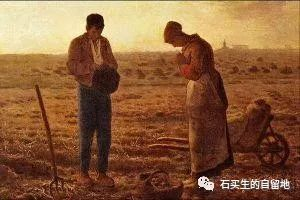

#  多年后

原创  石买生  [ 石买生的自留地 ](javascript:void\(0\);)

__ _ _ _ _

** **

** **  

** 土  **

人吃土一世，土吃人一回

这是我学生罗源

写他外婆去世时

引用的民谚

我老家赣北管老人去世埋葬

叫入土为安

《圣经》上说

你来自尘土，归于尘土

这似乎在说

人活一世欠土一份恩情

这情景我见过的

我父母做了一辈子农民

他们生前

对土满怀虔诚

不管落雨还是天晴

他们的裤脚和鞋

沾满泥土

他们劳碌一生和土相依相伴

她们做梦

咸汗融进泥土

变成粮食和黄金

土神赏赐两位素朴老人

一面向阳山坡

四季花草

和

永久宁静

  

** 司汤达  **

肯定通晓爱情密码

他

让男人野心膨胀

叫女人春心荡漾

他一生最成功的事儿

是做了读者心中的蛔虫

让你一百年后

还对他念念不忘

他最近成了我学生黄欣俞的偶像

不是由于他活过爱过写作过的著名段子

而是源于另几句疯语疯言

你来自天堂将往地狱正路过人间

** 多年后  **

你记不得以前的容颜

也不看云也不赏花

也不忆经年旧事

甚至懒得想故去的亲人

日渐模糊的友人

子虚乌有的知己

甚至不觉有风

吹来

你在等

什

么

呢

  

  

注：图片来自百度网络

预览时标签不可点

微信扫一扫  
关注该公众号

****

****

×  分析

__

微信扫一扫可打开此内容，  
使用完整服务

：  ，  ，  ，  ，  ，  ，  ，  ，  ，  ，  ，  ，  。  视频  小程序  赞  ，轻点两下取消赞  在看  ，轻点两下取消在看
分享  留言  收藏  听过

精选留言

吴丰强来自

诗歌又唤起我对土地的感情。[玫瑰][玫瑰][玫瑰]

石买生的自留地来自

同感

Mer_来自

我对不起司汤达我用了他的话还打错了他的名字[流泪]

石买生的自留地来自

司汤达原谅了你

万事如意来自

不懂诗和远方 但看到你的诗和散文 总会认真看完 有时好多遍

石买生的自留地来自

感动。谢谢老同学！

笑嘻嘻来自

最喜欢《多年后》，把我看哭了！

石买生的自留地来自

谢谢老同学鼓励！

小山耗子来自

不知有没有人知道今天是复活节，有句话想在复活节说出来：移开掩住墓穴的巨石是容易的，移开掩住人心的巨石就难了

石买生的自留地来自

不明玄理呀

