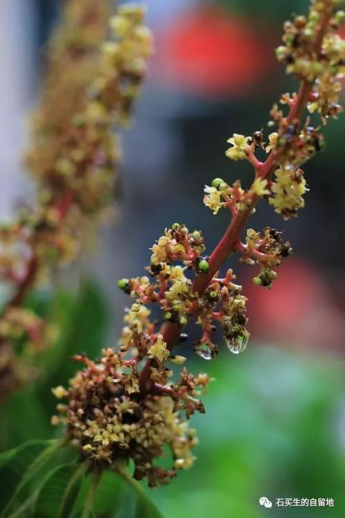
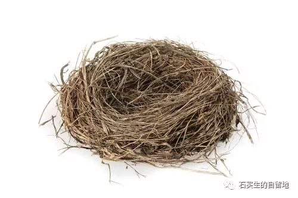

#  小青果

原创  石买生  [ 石买生的自留地 ](javascript:void\(0\);)

__ _ _ _ _

  

  

**小青果**

**  
**

荔枝树一律开淡黄色花

芒果树的花一律紫褐色

他们都结青色的果

小小的长圆形的

一簇簇在枝头摇曳

  

这春天的绿色火苗

它们又香又甜

它们想点燃一方又一方天空

它们甚至想做云的衣裳

夜的眸子

  

没想到招来了一拨又一拨

灭火队员

许多不知名的鸟儿

天天来扫荡

它们用吻让春天变得残缺不全

  

总会有阴差阳错

剩余的小青果在枝头执拗地招摇

它们不是命大而是耐心长大

期待一个白发男人前来

承受孤独与衰老

  

拥抱宿命与流年

那消失的火焰已变成了

另一种闪电

让落魄者六神有主

不从人间走失

  

**鸟巢**

**  
**

早上我钓鱼回来

看见路上躺着一只鸟巢

漂亮的鸟巢

用细草编织的鸟巢

散发清香味的鸟巢

我用脚翻转它

寻找它的入口

我看见了

密密的小小的入口

它里面是空的

什么也没有

没有鸟蛋

没有鸟

我四周望望什么也没有

昨晚不知什么风

不知从哪里飞来的这只鸟巢

今早砸中了我

让我很失落

  

预览时标签不可点

微信扫一扫  
关注该公众号

****

****

×  分析

__

微信扫一扫可打开此内容，  
使用完整服务

：  ，  ，  ，  ，  ，  ，  ，  ，  ，  ，  ，  ，  。  视频  小程序  赞  ，轻点两下取消赞  在看  ，轻点两下取消在看
分享  留言  收藏  听过

精选留言

0喵了个咪0来自

“不从人间走失”……不知为何想到了人间失格

石买生的自留地来自

联想好

Statice Lavender来自

好喜欢“让落魄者六神有主，不从人间走失”这一句(｢･ω･)｢嘿，给我买生打call

石买生的自留地来自

谢谢啊

吴丰强来自

好诗！[玫瑰][玫瑰][玫瑰]

石买生的自留地来自

谢老吴鼓励！

老 安来自

晚上钓鱼 不知的风 鸟巢吹落 砸中了我 ——这世界怎么了？

石买生的自留地来自

这世界充满悬疑呀

鱼梁来自

好诗

石买生的自留地来自

谢谢！握手。

Qcxx.来自

也许曾经是一个幸福美满的家庭的温馨小窝，一场风，都消失了。

石买生的自留地来自

美丽的想象

