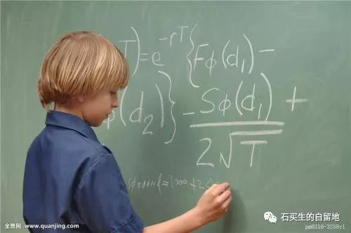
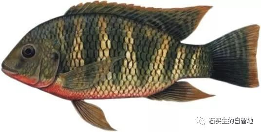

#  有一个少年常从函数中迷失

原创  石买生  [ 石买生的自留地 ](javascript:void\(0\);)

__ _ _ _ _

** **

** **  

** 有一个少年常在函数中迷失  **

他的老父亲常为此忧心生气

没办法，那奇妙的字母

总是闪烁、跳跃

少年就是变成小鹿

也跟不上它们的节奏

老父亲奇怪

为什么有的少年从  1  、  2  、  3  、  4  中

发现了美

他的冤家只看到空虚

而且赔上纯真的泪水

其实老父亲奇怪生气忧心毫无道理

30  多年前，当他也是一个少年

他也搞不清甲乙双方

在一座桥上相向而行什么时间

在哪一个点上相逢

他发呆的时候多

精神的时候少

在他清澈的眸子里

顶多看见了一些可爱的乡村小麻雀

一两条水牛在池塘安静地喝水

现在两代人在两个世界交集了

少年在函数中迷失

不知他迷茫的眼睛在智能时代

能否发现另一片灿烂星河

可以肯定

他的老父亲会变得更加昏聩

更加搞不清  X  、  Y  、  Z  的奇妙组合

但是他会祈祷

让他长成一个好青年

双手合十，尽管动作有点笨拙

  

** 关于罗非鱼做法的争执  **

妻子有个怪癖

每次杀我从湖里钓来的罗非鱼

总要把头切掉

她说鱼头不能吃

含重金属

我总劝她不要把鱼头切掉

说鱼切掉了头好丑

煎了也不好吃

其实还有一层意思

罗非鱼在水里漂亮地活着

尚不能自已

死了被吃也不能保持全尸

这层意思从没跟妻说

所以她总是赢

注：图片来自网络

  

预览时标签不可点

微信扫一扫  
关注该公众号

****

****

×  分析

__

微信扫一扫可打开此内容，  
使用完整服务

：  ，  ，  ，  ，  ，  ，  ，  ，  ，  ，  ，  ，  。  视频  小程序  赞  ，轻点两下取消赞  在看  ，轻点两下取消在看
分享  留言  收藏  听过

精选留言

橙几耶🍊来自

如果你觉得生活过得很痛苦 那你一定还没有做过数学题

石买生的自留地来自

阿耶

CaO.Y来自

没有什么问题是解决不了的，除了高数

石买生的自留地来自

霸气，有何高招？

吴丰强来自

我们都被数学迷茫了。我也祈祷！[玫瑰][玫瑰][玫瑰]

石买生的自留地来自

谢谢赏读。

谈君来自

妙哉

石买生的自留地来自

握手

Skylar来自

赞，朴素生动趣味

石买生的自留地来自

谢谢鼓励！

Tsuki_Y来自

妙

石买生的自留地来自

谢谢！

平*賢来自

我们都是迷失的一类

石买生的自留地来自

是的呀，谢谢！

