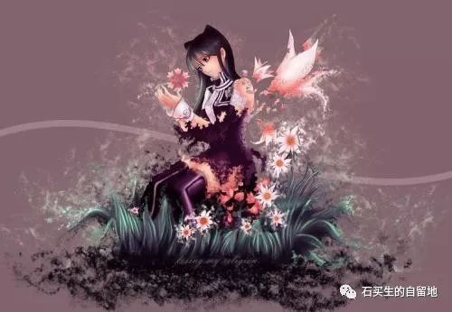
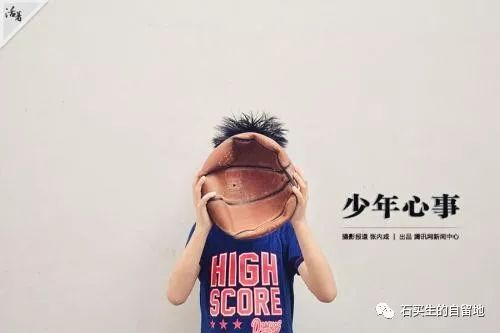
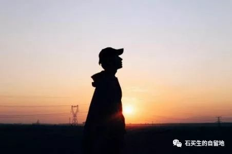

#  少年心事皆有诗

原创  石买生  [ 石买生的自留地 ](javascript:void\(0\);)

__ _ _ _ _

黄怡等  

  

**** ** 今天吃什么好呢？  **

**  
**

高二（  2  ）班  黄怡

有的东西是不能被忘记的，比如春天。她是草莓，摘蒂洗净放在玻璃碗里，第一颗是酸，汁液溢满口腔，很快又甜，仿佛日日回暖的天气，给人不动声色的惊喜。她是艾果，或蒸或煎，草木香气不容置疑地占领你整个鼻腔。她是新茶，滚水带茶叶重回云雾缭绕的山巅，回顾采茶女柔软手指的触感。桑葚、枇杷免不了落一地色彩斑斓，在鞋底也纹上细细密密的甜。春卷最是应景，一张面皮包了一片春色，什么也不落下。

夏天最是漫长，难免叫人倦怠。冰箱里备好的蜂蜜柠檬和凉粉是唤醒舌头的良药，清凉无比，仿佛叫人远离了热岛，回到乡下祖母蒲扇下。南方人好甜，糖水是夏天的必备佳品。香芋粉糯软甜，西米圆润弹牙，共同被椰奶包裹，入口时让人不由自主绽出一个笑。雪耳在透亮的木瓜糖水里如蝴蝶蹁跹，落在唇齿间也轻轻扇动翅膀。荔枝无疑是夏天的明星，剥开红色的外壳，白嫩的果肉一个个堆在瓷碟上，空气中泛着岭南山林的气味。我不吃，但爱剥，手上汁水淋漓，犹如一场酣畅的季风雨落在掌心；也爱看，美人红唇水光泽泽，低头从口中蹦出圆圆的果核，“好甜啊”，殊不知她比荔枝更沁人心脾。夏天怎能不奔赴烧烤的战场，铁勺一撬，生蚝肉在壳中一抖，唇齿便忙不迭地凑上去，肥美的肉伴着葱蒜香菜一起入口，正是人间的精彩味道。

南方的秋天不落叶，因此没有一丝瑟索的气氛，中秋节于此时更是一个热闹的节日。好的双黄白莲蓉月饼，松而不散，香而不腻，蛋黄的油脂由内而外沁出，并不浓重，似有若无地勾引你咬破柔软的面皮和细密香软的莲蓉来一亲芳泽。正是田螺长成的季节，紫苏、辣椒、一点料酒，各家各户的厨房里飘出诱人的香云，来自山沟河涌的生灵与锅铲欢快交谈，热热闹闹，孩子们在门口巴望，心里充满期待，全然忘了钳尾的辛苦。

妇女们把晒东西的被单铺上天台时，冬天就到来了。菜干、果皮、龙眼肉，琳琅满目，各家制法不同，却都对时间和天气寄予厚望。鱼干和腊肠，是整个冬天餐桌上的霸主，放进米饭一起蒸熟，平凡的大米也带上山海的味道。和蔬菜一起炒，或干脆带油清蒸淋上酱油，是永远忘不了的家乡味。一家人聚在一起打个边炉吧，鸡鱼肉菜，小孩子喜欢的香肠鱼丸，百无禁忌，真正一锅山珍海味。冬天是进补的季节，猪肚鸡最简单粗暴，火候刚好，肉反而爽脆肥美，用海碗盛上一碗汤，趁热喝，胡椒味直冲天灵盖，战胜南方冬天的“魔法攻击”也不算什么。冬天的夜晚真是漫长，不妨来一锅生滚粥。大骨熬汤作底，加上喜欢的配料，别忘了头菜葱花炸米粉，佐以白话大谈家常琐事，最后一杯茶冲净口中咸鲜，足以心满意足回家睡觉。

晨光熹微，今天吃什么好呢？

**** ** 想念  **

高二（  2  ）班  杨雅智

常常会无端地想念一些人。

想起这些人时，总感觉自己的生命是切成一段段的。每一段都有一些人的名字留在心里。没有这些人，生命似乎也变得苍白贫乏，没有着落。但也不单是朋友，一些不是朋友而不得不与他们有联系的人，甚至一些伤害过我的人，一些憎恶的人，也常常会想起他们。所以生命被分成了几段
:  一些被你爱的人分去了  ;  一些被你恨的人分去了  ;  一些被你无所谓爱恨的人分去了  ;
你的生命被这三种人分去了。你在漫长的岁月里想念他们，因此你觉得自己的生命很丰足。

幽幽的想念不为人知，带着往昔的感情色彩，或爱或恨，或浓或淡，或长或短。当你想念着一个人时，便觉得心底有一股颤动，若隐若现，欲升还沉，了犹未了。你想紧紧抓住他们，但他们稍纵即逝。

当你想念滑过你生命的那些人时，所有的爱憎都蒙上了一层淡淡的晕光，透过晕光，你再看他们，爱和憎都化作一种体验生命深广的欣慰了。

****

** 无题  **

高二（  1  ）班  梁嘉琪

春风掠过湖面

湖水笑着说痒

一棵树站在湖旁

摇摇头

抖落一身哀伤

** 父亲  **

高二（  1  ）班  蔡润秀

我的父亲，

沉默而细心的男人。

他会在周六的夜晚，

替女儿缝起白衬衫上的扣子。

在昏黄的灯光下，

用白色的线。

细密的针脚，

隐匿在白色的绦纶中。

正如父亲斑白的鬓角下，

藏匿的温柔。

** 谎  **

高二（  1  ）班  邓雅怡

人的一生，撒过大大小小的谎，就像湍急的白色河流带走的那些黑色石头，即使不断冲刷，也依然存在，那么清楚地，暴露在几乎透明的河底。

就像小时候有一次生日收到了男同学的一盒巧克力，当妈妈问起时下意识地选择说是女同学送的。也许只是不想解释，也许是害怕误会。其实也只是一盒巧克力而已，但总觉得男同学和女同学送的就截然不同，不敢去想说是男同学的后果，人就在那一瞬间突然变得紧张不安，各种情绪突如其来，像是巨大的浪潮向我迎面扑来，人有时就是这样慌不择路，往溪水中扔了一颗黑色的石头，于是溅起的水花将我淋湿，那些蓄在衣服中的水突然变成沉重粘稠的黑色，一滴一滴地落在地上。

在这些方面妈妈总是警觉谨慎地让我觉得有些可怕，到最后也不知怎么的竟然被她发现了，慌乱与恐惧再次袭上心头，于是为了圆这个谎我将会编造更多的谎言，那些谎言结成一个网，将我包裹得喘不过气来，但总归无法这时候收手。那时的我固执地认为，承认撒谎是会让人更痛苦的一件事，好像是变相承认了另一些事情。

其实也只是一盒巧克力，不管是谁送的，它也只是一盒巧克力。但也许人就是喜欢无中生有，在不断地揣测世界的恶意中慢慢变坏的吧。越来越多的黑色石头在河底堆积，直至所有的空间被填满，这却是一条没有水的河流了。

记得以前听过一句话：在世间，本就是各人下雪，各人有各人的隐晦与皎洁。有时候很难理解人为何要将各自藏起，包裹在一个又一个名为谎言的薄膜中，只看见世界的阴暗面，学会伪装而不是真诚。招人嫌的恐惧，被嘲笑的猜测，害怕被发现内心的贫乏与无趣，只听见血泉哗哗作响地流淌，却摸不着伤口在什么地方，但从未明白，别人也是跟我一样的人，害怕被伤害，跟我一样地犹豫，跟我一样地不安，跟我一样的善良与渴望。

  

** 怜惜  **

高二（  2  ）班  钟玥

一想到你呀！

我就怜惜塘边被你甩了只青蛙在脸上的倒霉蛋，怜惜被我们一人捏一条腿扯成两半的蝗虫，怜惜从前每晚我被你的钢琴曲烦扰的耳朵。连你爬树踩折的树枝，和采来的白玉兰，我都要怜惜。

我还怜惜熹微的晨光中面庞上的绒毛，和一双潋滟的桃花。

时光的夹缝里散落了一本书，一只竹编的小马。

懵懂的年华里你还牵着我的手，连楼下传来的呼唤都清澈嘹亮。

于是一想到你呀！

我又怜惜每一条无人作伴的路，怜惜一场欢笑和一处孤独。怜惜那门外的月儿远远地挂在心弦上。连脚边属于或不属于你的影子，和你窗外的蟋蟀，我都要怜惜。

将来的某一天你看着我的眼睛不再明亮，带着过尽千帆的新伤。而我会在阑珊处挑出这束灯火。或许你会生涩地弹着久违的致爱丽丝。我就坐在你的不远处，用不再尖利的嗓音和着伴奏。

这时我在念着：

一想到你呀！

我就怜惜那站在风正吹过的白玉兰树下，对我笑的少年。

花瓣落了你一头。

你陪了我多少年。

如果这时你耳朵又红了，就更加令人怜惜。

**Mr.Ku,Mr,Cool**

高二（  2  ）班  殷梓萍

他是最真实的杨过，最“平平无奇”的丁鹏，最完美的项少龙  ......  这个男人，他叫古天乐。

大概许多人都不解，像我这个年龄的人居然会喜欢一个父母辈的明星，他今年  48
岁，比我爸还要年长些，可是不知道怎的，很轻易地就被他身上的魅力打动，为他折腰。

他最近被提起是因为他终于在熬了  25
年后拿到了影帝的奖杯，我看到他领奖的一瞬间，眼泪就刷的一下流下来，他终于做到了，一次次错过后终于得到了属于他的荣誉，他一直就这么盯着那座奖杯，这一刻，他真的等太久了。

他不是没有演技，也不是没有颜值，年轻的他还没有现在这么黑，白净的少年，阳光般夺目的笑脸，有张力的表演，他曾经是  80
年代少女疯狂迷恋的对象。可是在他风头正盛的时候被曝出曾经进过少管所，于是他前面所有付出过的努力都被一下子遗忘，名声大跌，顿时跌入低谷。后来他谈起这段经历，只是淡淡的一句：“都过去了。”后来有人为他澄清他是为了帮朋友顶罪而坐的牢，真相大白，可是这份伤害是难以弥补的。他选择了拿起行李离开香港，再回来的他剪掉头发，皮肤黝黑，双目炯炯地出现在观众面前，他依然有很优雅的微笑，只是双眉之间，多了一抹化不开的忧伤。

古天乐，你为什么不快乐？

他变得低调，十多年来没有一条花边新闻，从头到尾只承认过一个女友。他的时间都用在工作上，早上在香港，下午飞横店，凌晨再回香港，世界各地的跑。也有一段时间有人吐槽说他净是拍烂片，他也不解释，就一直这么拼命。终于有人看不下去，在微博上放出他这些年捐的上百间小学的照片，他和一群又一群孩子在一起，笑得像个耕种多年饱经风霜的老农民，可是再也没有人多一句嫌弃的话，因为大家都明白，一个人拼了命拼了名声去维护的善良，是需要被尊重的。不过，遗憾的是，因为他的不挑戏，他也一次次地错过了影帝大奖，其实优秀作品也不少，提名一次又一次，就是拿不了奖，真是让人又好气又好笑。

他唱过一首歌，叫《像我这样的男人》，当一个硬汉把自己最脆弱，最温柔的一面流露出来，我真的无法抑制住自己心中那种悲伤的情绪，忍不住心疼他这些年的辛苦。

我喜欢过许多明星，因为他们的学识、颜值、性格、声音、性格，可是没有一个人的时间比得上他，从小开始至今至少有八年的时间了，见证他从“古仔”到“古先生”。尽管我不多提起他，可是那份对命运的执拗，对人生的看淡，对所爱之人的坚定，对朋友可以赴汤蹈火的义气，在我心中久久聚集，成为永不消散的光晕。他是
Mr Ku  ，也是我心中

永远的  Mr Cool  。

** 理想生活  **

高二（  1  ）班  王明宇

想过中年生活，

一些欢愉。

熬好了的粥，

墙上的梵高。

浇完花，

妻子不再说谎。

我爱她，

此时此刻。

这种人间烟火，

对得起每一次日落。

  

** 嗨！猪！  **

高二（  1  ）班  周诗苡

嗨！猪！

我羡慕你，

你拥有肥美的身子和白腻的皮肤

你有个窝，有个家

你可以不为生存而挣扎

你能够睡个日久天长

在梦中就能够遨游四海。

嗨！猪！

我真的羡慕你！

在餐桌上完成了使命，

不费吹灰之力。

**** ** 吹萨克斯的人  **

高二（  2  ）班  王静蓓

夏夜的晚风，和着泥土与野花的幽香徐徐飘散在院落。

我提议要去一家餐厅，家人也欣然答应。

闲聊之时，一首曲子似溪水潺潺淌出，优美的旋律细得如游丝绕住了我们的脚步。是那位吹萨克斯的人，他经常在植物园附近吹奏。静默片刻，爸爸终于开口了：“不如，下次再去那家餐厅，今晚就在那儿吃吧”他指向二楼的露天餐桌，那是观看演奏者的最佳位置。我读懂了老爸的心思便爽快答应。

我们享用着晚餐，眸子却不自觉地注视院落中央。那是一位大概四五十岁的先生，梳着整齐的头发，戴一透明框眼镜，身着西装挺直了腰板吹奏。一曲《莫斯科郊外的晚上》经纯正的萨克斯演绎，有与往日常听的人身、钢琴声不一样的感受。在藕断丝连的乐声里，我听到了先生的用心。那是一种如泡沫般细腻，似轻纱般神秘的音韵，随着气息的运用而流动，呈现出极具表现力的特点。细细聆听，一种飘然出世的畅快占据心头，那一刻，唯有流淌在月色里的乐声才得与寂静共舞。

驻足的人渐渐多了，甚至有几个女学生走上前想要给萨克斯的人费用。先生向她们表示感谢就拒绝了，“我只是个业余的爱好者，自娱自乐罢了。”他用麦克风说，随即是一阵憨笑，再是又投入到下一曲子里。待他吹完激情澎湃的《我爱你，中国》，周围路人的掌声响得异常强烈，几乎盖过了结束的伴奏。

已经九点了，我们早就吃完了晚饭。吹萨克斯的人也要回家了，他一边像帮孩子擦去嘴角的饭粒一样地擦拭着萨克斯，一边对大伙说：“今晚的演出到此结束，有机会再来听啊。”

他返程了。四周缓缓流动的空气亦如蓓蕾熟睡时均匀吐出的气息，院子又静了。

夏夜的晚风吹拂着他，像使者一路护送，直到他挺得笔直的腰板消失在我的视线。

  

**17** ** 岁的篮球  **

高二（  2  ）班  李昕悦

夜空被墨汁晕染开来，黑压压的找不出一颗星。月光一泻千里。

年轻的身躯爆发出迅猛的速度，力量。他们张扬跋扈的横冲直撞。真是不明白明明只是一个普通的篮球，竟能在他们手中迸发出神奇的魅力。像是在枝头绽放的鲜花，鲜艳的大张旗鼓。丝毫不知道自己美的充满杀伤力。那种没有意识到自己的美好的美好，真纯粹啊。

走近了，我站到场外，努力瞪大了眼睛，想要发现这其中的奥妙。听见场内的男孩子们在议论着什么，声音压低了许多，不似之前肆无忌惮。一句“高二的”窜入我的耳朵，顺势看去，发现是一同校异班的同学，一时竟没认出来。一个男孩子吹起了口哨，余音在空气中轻盈的盘旋，落在我的肩头。一个本来打球热的汗流浃背于是赤裸着上身的男孩子不动神色的下场把衣服穿上了。其余的几位揶揄道：“哎呦，你不是很热吗？怎么就有把衣服穿回去了？”窸窸窣窣的有意压低的声音还是溜进了我的耳畔。“谁女朋友呀？”“过来看谁的呀？”“你怎么认识她？”“惹咦
~  ”

呵，男孩子们。

由于我在篮球方面的造诣是在不敢恭维，在旁边的长椅上正襟危坐一本正经的假装自己看得懂。我真对他们的活力感到讶异。是怎样的造物主才能创造出这样神奇的生物呢？为什么他们只是看似不经意的举手投足却会让我心脏不由自主的骤然一缩，在篮球进入篮筐的一瞬间有种想要为之鼓掌的冲动呢？为什么明明是一样的躯体，他们的却更有力量更为挺拔，到底是怎样的奇迹才能牵动那些美好？胴体上挂满的汗水是他们年轻的最有力的证明，他们手中
17  岁的篮球虎虎生威

呵，男孩子们。

打球的节奏慢了下来，一个男孩子不怀好意的声音响起：“一球，你输了你自己去，我输了我去。”另一个声音：“好。”篮筐的微微的震动，篮球在篮板上撞击出闷响后毫不犹豫的宣判了没进球的事实。那个男生登时有点急的抓耳挠腮：“等等等等，再来一球再来一球。”“你要去就去，别怂啊，一会人家都要走了。”那个男孩子在原地徘徊了一阵子，周围的男孩子们在瞎起哄，他终是向我走来，用手不好意思的抓了抓头发，：“小姐姐打球吗？”颤抖的韵脚恰如其分的彰显了他的紧张。我也显得手足无措：“我，我不会啊……”“没事我们都不会的。你随便打就好了。”

像是星星之火，却在我脸上燎原。我迟疑的走上前去，局促的手脚都不知道往哪放。他冲同伴几乎是羞赧的吼了一句：“球啊，会不会做事的？！”另一个马上心领神会的传过来。“唰——”篮球轻而易举的被投入框内。由于离的较近，我可以清晰的看见他手臂上肌肉紧绷的状态，正暗暗琢磨为什么他的手臂跟我的那么不一样时，他的声音悄然而至：“你要不要也试一个？”“啊啊啊…我是真的不会啊。”“没关系，试一下嘛。”“啊，好吧。”果不其然……没中。我正羞恼的想要撤退，他再将球传给我，：“再试一下？”果不其然……还是没中。直到第三个时，终于…篮球给了我个面子，终于中了。不然我真的尴尬的要找个地缝钻下去。余光里瞧见其中一个男孩子冲他挤眉弄眼，可能是男生中的暗号？他走到三分线处，娴熟的投篮，进了。另一个男孩子也投了一个但差一点点，篮球在框边象征性的转了几圈，还是掉了出来。他扯着嗓子：“唉可能是因为有小姐姐在，太紧张了。”其余的男孩子们齐声吼回去：“你变了。你以前不是这样的。”

呵，男孩子们。

普通的篮球在他们手中却仿佛有了生命，变成了  17
岁少年的样子。看着他们挺拔的身影和有力的手臂。温热的汗珠顺着年轻的古铜色的胴体滑落，在一泻千里的月光的照耀下晶莹剔透。男孩子们，他们真神奇啊。

今晚的月光也太摇曳生姿太柔情似水了吧。

  

  

** 奇怪  **

高二（  2  ）班  方凤妍

喜欢做白日梦，却总是失眠；

喜欢在床褥上做作业，却在书桌前玩手机；

喜欢安分守己的青苔丛。却伸手蹂躏得汁液横溢；

喜欢镜中赤裸的身体，却难以接受细吊带裳的打扮；

喜欢清醒时的肢体接触，却反感睡梦中的任何呼吸。

我还，

喜欢冬日里的雪糕，冻到牙颤颤那种；

喜欢夏夜里的棉被，焗到汗津津那种；

喜欢蜂蜜，甜腻至封喉那种；

喜欢拥抱，紧箍到窒息那种；

喜欢思念，想极都不会降临那种。

  

预览时标签不可点

微信扫一扫  
关注该公众号

****

****

×  分析

__

微信扫一扫可打开此内容，  
使用完整服务

：  ，  ，  ，  ，  ，  ，  ，  ，  ，  ，  ，  ，  。  视频  小程序  赞  ，轻点两下取消赞  在看  ，轻点两下取消在看
分享  留言  收藏  听过

精选留言

Trop'y来自

现在的小朋友好厉害 18岁的我真的老了[流泪]

石买生的自留地来自

老少年也有诗心啊

TSUNAMI来自

写的真好！

石买生的自留地来自

是不错啊

Аврора来自

我写的是纯洁的友谊谢谢。[微笑]

石买生的自留地来自

勿解释

Simon来自

都是與我同齡的人啊！ 讀起來是那麼得親切。

石买生的自留地来自

共鸣啊

🍁然则何时而乐焉来自

年少时就该多写文，意趣多多，想法奇妙，老了就不行了

石买生的自留地来自

有理

欧泡果奶来自

黄教主的明明是“粤地人间”#我饿了[坏笑]#

石买生的自留地来自

我改了个题目呀

____ÝÝäö来自

我爱黄怡。她的文章很有感染力。黄怡是我的女神

石买生的自留地来自

才女

🌕来自

打卡[呲牙]又想念起在SSL的日子

石买生的自留地来自

温馨回忆

0喵了个咪0来自

诗不在考场，而在日常

石买生的自留地来自

不一定啊

Fernando来自

第一次感觉自己真的过气了

石买生的自留地来自

未必呢

傻蠢懒来自

脑海不禁浮现买生这个老司机嘴角的邪魅一笑

石买生的自留地来自

邪魅？观察真细啊

吴丰强来自

万紫千红，好看！[强][强][强]

石买生的自留地来自

谢老吴鼓励！

方凤妍来自

奇怪有个标点打错啦 真奇怪

石买生的自留地来自

那个标点？

幸运鹅来自

好喜欢《理想生活》

石买生的自留地来自

有眼光

小游鱼🐠来自

十七八岁是个诗意的年龄呢[玫瑰]

石买生的自留地来自

是啊，花样年华

秀波来自

绒花一般的少年心！颤颤巍巍。

石买生的自留地来自

感觉好

