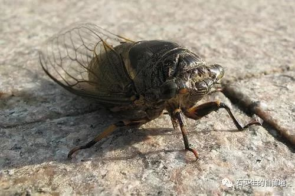
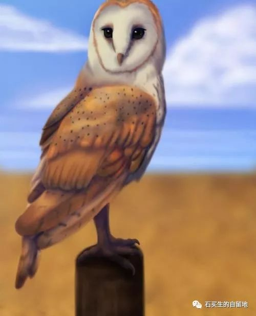

#  蝉蜕

原创  石买生  [ 石买生的自留地 ](javascript:void\(0\);)

__ _ _ _ _

  

**蝉蜕**

**  
**

他打开门

看见纱门上歇一只蝉

他痴痴地看

它一动不动

  

穿过什么样的暮色

和灯火

它来到筒子楼

像一高僧

  

它不知道

贸然拜访的是一书生

他要把惊讶

告诉儿子

  

待儿子看到它时

它仰面躺在走廊上

蝉翼和身子

煞白煞白

  

暮春的蝉容易死

才饮清露

未见星辰

活着像一残梦

  

天生娇贵

不安分

有萤火一样的灵魂

盲目又懵懂

  

  

**鸟在左，他在右**

**  
**

教学楼二楼楼梯转角处

一只棕褐色的鸟

拼命往玻璃上撞

砰砰响

扬起几根漂亮的羽毛

  

这哥们真执着

头破了也不知道

前面的天空是假的

其实只要回回头

扭扭脖子

  

身后的天空更广大真实

正等着将它拥抱

只要愿意

任它翱翔和逍遥

它更不知道

  

它有一兄弟他在理工学院

一面玻璃前也撞墙

那是一个春风怡荡的晚上

眼镜店门口

走出两个姑娘

  

他瞟了几眼

径直往一面透明的玻璃上撞

额头裂开一道小口

滴了几滴血

店里卖眼镜的小伙

  

挤出几抹暧昧的笑

灯光闪烁

照着他的心苦涩苦涩的

蠢货，他一边骂一边念叨那棕褐色的鸟

兄弟，你在左，我在右

  

预览时标签不可点

微信扫一扫  
关注该公众号

****

****

×  分析

__

微信扫一扫可打开此内容，  
使用完整服务

：  ，  ，  ，  ，  ，  ，  ，  ，  ，  ，  ，  ，  。  视频  小程序  赞  ，轻点两下取消赞  在看  ，轻点两下取消在看
分享  留言  收藏  听过

精选留言

吴丰强来自

我们都是撞向明亮玻璃的人！好诗，有趣，有悟！

石买生的自留地来自

谢老吴鼓励！

Qcxx.来自

17岁的少年们，不就是像暮春的蝉么。萤火般的灵魂 懵懂 易死

石买生的自留地来自

像吗？

西部歌王来自

不是拯救鸟，是鸟和鸟一样的兄弟不自省。

石买生的自留地来自

有理。

Simon来自

讚賞一下

石买生的自留地来自

谢谢！

江东焱来自

玻璃的颜色要改变，可以拯救鸟的生命！

石买生的自留地来自

有悲悯心

