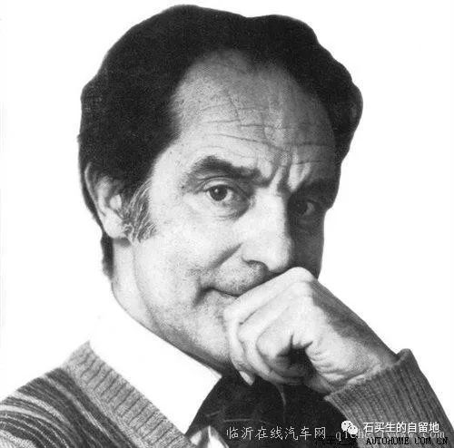
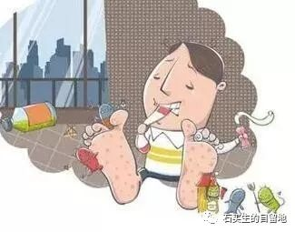
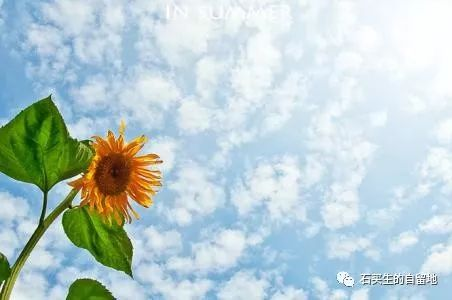
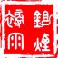

#  谁是卡尔维诺？

原创  石买生  [ 石买生的自留地 ](javascript:void\(0\);)

__ _ _ _ _

  

  

**  
**

**谁是卡尔维诺？**

  

  

如果一群白羊里

混入一只黑羊

  

如果一个蒙面人突然喊

一个子虚乌有的人

  

如果一个男人被弹片

分成两半

  

如果一个孤独者注定

要冬夜旅行

  

如果一个人在东方建成

一座看不见的城

  

这个世界就有一扇

叫可能的门

  

为你开着

就有一个面相幽默的男人

  

冲你戏谑地笑

说  你好

  

我叫卡尔维诺

欢迎你来到美丽新世界

  

  

**香港脚**

  

  

它的体征

远没有名字出名

  

皮屑斑疹毒水奇痒

叫你日夜不宁

  

自嫌自弃

还考验耐力

  

它比草更顽固

它对抗各种药性

  

存在即诅咒

很少见天日

  

从未被赞美

它让人全面认知自己

  

好听名字

里面有个蛆

  

  

**本真**

**  
**

  

一株向日葵朝向太阳

笑弯了腰

这向日葵没长籽诶

你看

妻说

  

没长籽也可以弯腰呀

弯腰的样子

有好多种啊

这向日葵身子弱

我说

  

  

  

** 致钱  **

  

也只有在血气方刚的青年时代，才能

蔑称你为身外之物

为此我曾俘虏了一个女子的心

你面容模糊时

世界向我敞开了许多扇门

我对山川草木鸟兽星辰的厌倦

始于哀乐中年，始于对你的过度迷恋

为此我备受女人的打击和嘲讽

这个我认了，我爱上你绝对心甘情愿

哪怕通向世界的路又少又窄

有好些年了，我只关心工资卡和日益虚浮的肉体

此时，我常呼唤你，只有你能拯救我麻木和堕落的灵魂

你能让世界重新变得纯洁而美好

如果生活因你而肮脏而丑陋而糟糕

那一定不是你的错

现在、我准备接受命运的失败

在老去之前，我决定改变初衷向你膜拜

这个简单的真理其实我早该明白

深夜听见你在寂静中歌唱

我等于又重活了一次

  

  

预览时标签不可点

微信扫一扫  
关注该公众号

****

****

×  分析

__

微信扫一扫可打开此内容，  
使用完整服务

：  ，  ，  ，  ，  ，  ，  ，  ，  ，  ，  ，  ，  。  视频  小程序  赞  ，轻点两下取消赞  在看  ，轻点两下取消在看
分享  留言  收藏  听过

精选留言

吴丰强来自

这一期每篇都好！都喜欢！

石买生的自留地来自

谢老吴鼓励！

老农来自

读老师的诗，满满的都是思想

石买生的自留地来自

季春谬奖。

Qcxx.来自

哈哈哈 向日葵是晒蔫儿的

石买生的自留地来自

有理

