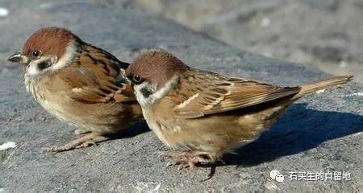
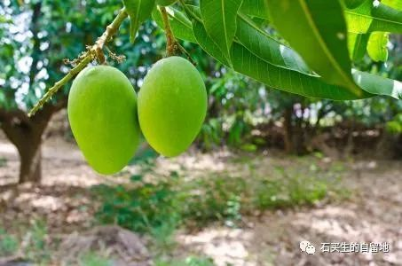

#  清欢

原创  石买生  [ 石买生的自留地 ](javascript:void\(0\);)

__ _ _ _ _

** **

** **  

**  
**

** 清欢  **

两只麻雀排开翅膀

交缠在一起

在地上翕动

像垂死一样

晨光不改往日安详

桃花心木叶落一地

青草绿得静止

天空越发高远

一对中年夫妇

站立痴看

男的走下台阶

两只麻雀松开了

飞了

  

** 喜剧  **

金正恩和文在寅

在板门店拥抱

夸张地笑

两只大芒果乐坏了

也相拥而笑

它们的母亲在一旁看着

特骄傲

它的孩子同金文相比

又多又长得好

它是一棵矮小结实

枝叶稀疏的树

不像它的邻居

高大枝叶繁茂

可孩子寥落

美中不足

两只大芒果他妈

又有点像乡下农妇

瘦小干练臀翘

可很会生孩子

生一个成一个

个个赛过金文

** **

** 六安颂  **

我跟学生讲

六安教师讨薪被押抓

学生说

老师六安不叫六安

叫  Lù  安

我一惊

翻开了历史的帷幕

2100  多年前

汉武帝东巡

希望六水汇合之地草民

不再叛逆

永做顺民

现在我亲爱的同仁

碗里的饭被扒了

他们开始呼喊

勇敢抗争

我又遗憾又欣慰

遗憾是

同格林威治时间相比

北京时间总是慢一点

欣慰是

六安扬起的手

将北京时间

往前拨了一格

  

  

注：照片来自网络

预览时标签不可点

微信扫一扫  
关注该公众号

****

****

×  分析

__

微信扫一扫可打开此内容，  
使用完整服务

：  ，  ，  ，  ，  ，  ，  ，  ，  ，  ，  ，  ，  。  视频  小程序  赞  ，轻点两下取消赞  在看  ，轻点两下取消在看
分享  留言  收藏  听过

精选留言

吴丰强来自

芒果长得比金文好看，亏老石想得出！

石买生的自留地来自

胡思乱想，嘿嘿

