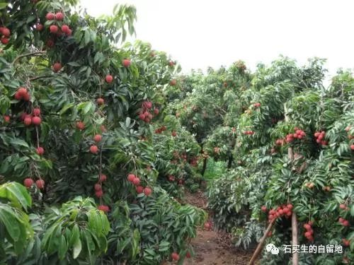
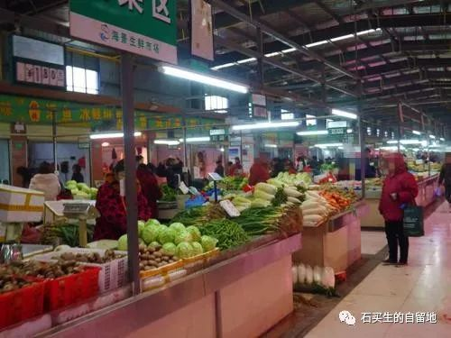

#  荔枝谣

原创  石买生  [ 石买生的自留地 ](javascript:void\(0\);)

__ _ _ _ _

** **

** **  

**  
**

** 荔枝谣  **

春风中受孕

夏雨里成熟

不知道把丰腴的身子

献给谁呀

梦见贵妃

却无红尘一骑

只好把山间爱了

滚落在落叶的怀抱

青草的衣间

一颗，两颗

更多的想梅开二度

绽开雪白的肉

此生将要虚度

前生之愿未还

路过的君子呀

请驻足相看

荔枝烂于山间

男子走过中年

  

** 元岭菜市场  **

早起的人有福了

能听到温暖的市声

醒得更早的还有萝卜

大蒜、辣椒、藕、葱

鸡、鸭、鱼、黄鳝

一字排开，仪态万方

男人的脚，女人的脚

温良又慵懒

一个买肉的女子睡眼惺忪

她的手又美又冰凉

一个卖鱼的男子是个壮汉

他满脸横肉眼露凶光

更多男人女人暧昧地笑着

心思莫测

一帘雨幕中，我和妻拎着

南瓜、黄瓜、芹菜、五香干

八两辣椒、四条小海鱼、半斤小平菇

心里装满了小确幸

元岭菜市场在大岭山

大岭山是东莞一个镇

** 老之将至  **

进了洗手间

该关的门忘了关

进了餐馆

只看菜单不看美人

  

注：图片皆来自网络

  

预览时标签不可点

微信扫一扫  
关注该公众号

****

****

×  分析

__

微信扫一扫可打开此内容，  
使用完整服务

：  ，  ，  ，  ，  ，  ，  ，  ，  ，  ，  ，  ，  。  视频  小程序  赞  ，轻点两下取消赞  在看  ，轻点两下取消在看
分享  留言  收藏  听过

精选留言

西部歌王来自

得益于石老师影响,每每记得石老师92年讲的王国维读书三境界.

石买生的自留地来自

谢谢，欣喜熊健不惑之年还有诗和远方。

西部歌王来自

一骑红尘妃子笑,无人知是荔枝来.

石买生的自留地来自

熊健爱唐诗呀

乐yi李来自

进了餐馆，也可以边看菜单边看美人[奸笑]

石买生的自留地来自

那是啊

吴丰强来自

“温暖的市声”，醒来的萝卜青菜，卖肉女人的又美又冰凉的手，感觉真好！

石买生的自留地来自

谢老吴赏读！

陈离来自

买生兄诗越写越好！

石买生的自留地来自

谢谢陈兄谬奖与鼓励，握手！

