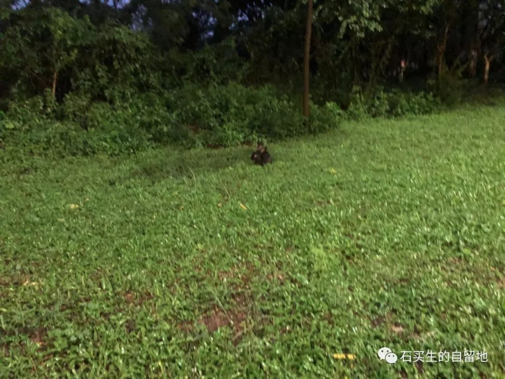
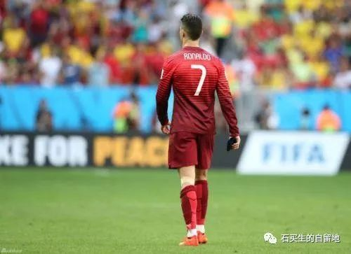
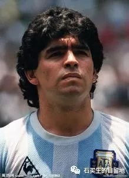

#  一个人的世界杯

原创  石买生  [ 石买生的自留地 ](javascript:void\(0\);)

__ _ _ _ _

** 一只黑兔  **

一只黑兔

在红棉路  1  号红绿灯路旁

吃夜草

我用手机拍它

它旁若无人

吃得更欢

妻拿一把雨伞追它

它在草丛里跳啊

蹦

妻也跟着蹦啊

跳

总比它慢

我和行儿在路边上笑

一路小跑

目送小黑兔

消失在茂密的苇草丛中

这真是意外相逢

夜色温柔

日子泛起涟漪

但是抱歉啊，今晚

我们打扰了

一位神秘客人的清梦

  

** 一个人的世界杯  **

四年一届

绝对不是为了止痒

它眷顾的

是一些孤独的人

是一些寂寞的人

是一些单纯的人

是一些羞涩的人

是一些怕老的人

他们脸色苍白

或者赭红

  

人到中年

我的郁闷源自

只能单选

不能双选

当看见梅西疲倦的眼神

当看见  C  罗落寞的背影

当看见内马尔夸张的举动

我竟心如止水

我的心永远停留在

1986  年那个燃烧的夏天

我痴迷的

是那个叫老马的人

他让足球

使上帝降临人间

时光啊

请善待残梦者

那个敲盆拍桌乱吼的人消失了

他现在很少熬红双眼

看见足球再美妙的弧线

他都间或打盹

他的血正在慢慢变冷

目送绿茵场

一代又一代英雄谢幕

他有可能

变成一个不再鼓掌的人

注：第一张照片为自拍，其余照片选自网络

  

预览时标签不可点

微信扫一扫  
关注该公众号

****

****

×  分析

__

微信扫一扫可打开此内容，  
使用完整服务

：  ，  ，  ，  ，  ，  ，  ，  ，  ，  ，  ，  ，  。  视频  小程序  赞  ，轻点两下取消赞  在看  ，轻点两下取消在看
分享  留言  收藏  听过

精选留言

小浣熊干脆面来自

法国年轻气盛，阿根廷的中年阵痛，姆巴佩格里兹曼的意气风发，梅西的落寞，不知在多少届世界杯上演，而大力神杯始终只有一座

石买生的自留地来自

理性

Ricardo来自

阿德意西的传统踢法终究适应不了时代  未来足球的好几年将被年轻一代主宰

石买生的自留地来自

有远见

吴丰强来自

《一个人世界杯》读后凄然。《一只黑兔》读后温暖。好诗！[玫瑰][玫瑰][玫瑰]

石买生的自留地来自

谢老吴赏读！

腾达改装-車臣来自

红棉路在哪

石买生的自留地来自

东莞中学松山湖学校东门那条路啊

