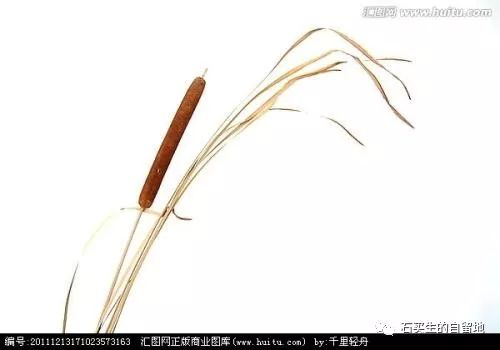

#  慈悲

原创  石买生  [ 石买生的自留地 ](javascript:void\(0\);)

__ _ _ _ _

** **  

**  
**

** 慈悲  **

一个年逾七十的老妇人

搭摩托摔了两次

她拄一根拐杖在村里一瘸一瘸走着

风烛残年

她跟细崽说

想打一眼新灶，她打了

想买一个大理石洗衣盆，她买了

想置一组煤气灶、煤气罐，她置了

她似乎还有很多东西要买

每次细崽回家探亲

她总是指着她置办的家什给细崽看

脸上满是欢喜

她细崽总是呵呵呵应着一脸不解

都一把年纪了

还置办这么多家什作甚

他哪里知道他的老母啊

这辈子苦吃得太多了

她想多活些日子

再看看世事

享享清福

可阎王爷叫她的愿望落空了

赐她与食道癌

以前想吃没得吃

现在有吃不能吃

她瘦成了皮包骨头

还记挂着满堂儿孙

忆起村里陈年往事

她的命啊正化作村东一缕青烟

阎王爷不忍心了

在一个大雪纷飞的冬日

把她接走了，她的细崽啊

成了秋风中一株芦苇，无枝可依

** 日暮乡关  **

一双老眼

不遥望

一方屋檐

一口池塘

一处坟茔

一只牛背上

嘤嘤的青蝇

  

预览时标签不可点

微信扫一扫  
关注该公众号

****

****

×  分析

__

微信扫一扫可打开此内容，  
使用完整服务

：  ，  ，  ，  ，  ，  ，  ，  ，  ，  ，  ，  ，  。  视频  小程序  赞  ，轻点两下取消赞  在看  ，轻点两下取消在看
分享  留言  收藏  听过

精选留言

老灯来自

轻言细语，诉说情怀。老同学的诗是越来越有神韵了。[强][强][强][强]

石买生的自留地来自

谢谢老灯鼓励！

贝壳卖房石兰 招聘13802907677来自

世界上最亲的人走了……

石买生的自留地来自

谢谢赏读！

祥云来自

火热夏日，怎么突然飘来一丝凉意？！

石买生的自留地来自

握手。

吴丰强来自

无枝可依呀！痛！

石买生的自留地来自

谢老吴赏读！

