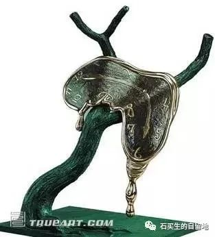
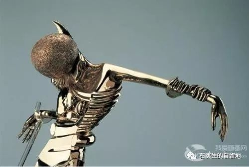

#  50肩与520

原创  石买生  [ 石买生的自留地 ](javascript:void\(0\);)

__ _ _ _ _

** **  

**  
**

** 50  肩与  520  **

从去年开始，我的左肩时常隐隐作痛。手臂可起曲，可平伸，但不可上扬。左手拿东西只能低，不能高，最多只能作水平运动。左手突然被规定，失去一半自由，竟没有一点征兆，我心一惊，坏了，这只手要废！整天看着它耷拉的样子，我神情抑郁。妻子看我沮丧，问明缘由，笑着安慰：
“别怕，不打紧的，这叫  50  肩。男人过了  50  岁，左肩都要发炎疼痛的，但无大碍。”

妻子神情淡然，我一脸愕然。

为什么男人肩膀疼是自五十岁始，而不是  40  岁或  60  岁？又为什么是左肩而不是右肩？女人过了  50  岁左肩也疼吗？

带着一系列的疑问，我想探求个究竟。

男人  50
岁，说老未老，说少不少，事业上，想再折腾可有心无力；情感上，空出一处无名沙漠，只有苍白没有翠绿；精神上，有时想野一下看看远方，可地平线早已消失。生活上，老、小、亲、朋一起挤压而来，你早已成了一块夹心饼干。男人
50  岁，注定干瘪、无色、无味，这个年龄，注定是一个最尴尬的年龄啊。

疲惫的肩膀，如果再瘦弱，那就只有用疼痛发出警报  \-----  主人啊，请善待我，帮我减负！

于是，我常见有男子在夜幕中疯狂疾走，大幅度划动臂膀；也有人在篮球场挥汗如雨，用双臂拥抱日月，还有人在双杠上苦练体魄，双手紧握，想抓住中年的尾巴；在故乡，我的叔伯们呢，他们常肩一柄锄头，用沉默和执着和泥土对话，而且从不厌倦；在异乡，我走在陌生的人群中，双手插进裤兜，并非不想与世界握手言欢，只是，我的手小、软、羞涩、温柔，深怕搅夜色，和星空，和星空下的小草。我没想到，我的手，我的臂膀，会生气，会感到屈辱，更没想到，它们会抗议，会给予我残忍的惩罚。

我是无辜的啊，我的左膀右臂。

从十八岁离开故乡，到现在人到中年在外飘零，我对家庭，对左膀右臂一直倾情相待，不管何时，不管何地，不管得意还是失落，从未让它们离开我哪怕一丁点。我的忠诚，日月可鉴，天地可知。我被如此相待，冤啊。

既被惩罚，就当承受吧。

那为啥左肩开始啮齿我的心灵，而右肩默不作声呢？

你不公呀。

哪里不公呀？

你总让右肩主动出击，而让左肩默默承受。

这是习惯使然呀。

习惯决定命运啊。

想想也是。黑格尔曾说：存在即合理。其实，存在不一定合理呀。比如，无穷无尽的漠视，比如天经地义，比如非白即黑。

当我的右手握紧鱼竿，我的左手抓的不一定总是鱼。

明年妻子也  50  岁了。我最大的愿望是，她的肩膀不要成为  50  肩，不管是左肩还是右肩。省得我明年又疯言疯语。

最理想是，我的  50  肩慢慢好起来。

具体做法是，我的左手能主动起来，在理工散步时，主动挽起妻子的手，不能像左手挽起右手，而应像暮云对晚霞的相依相靠。

还有，左臂，应该绵软、温馨，像荞麦枕，像港湾。

省得每年情人节妻子总是抱怨，我发的红包不是  “  520  ”而是“  66  ”。

  

  

  

注：图片选自网络达利名画

  

预览时标签不可点

微信扫一扫  
关注该公众号

****

****

×  分析

__

微信扫一扫可打开此内容，  
使用完整服务

：  ，  ，  ，  ，  ，  ，  ，  ，  ，  ，  ，  ，  。  视频  小程序  赞  ，轻点两下取消赞  在看  ，轻点两下取消在看
分享  留言  收藏  听过

