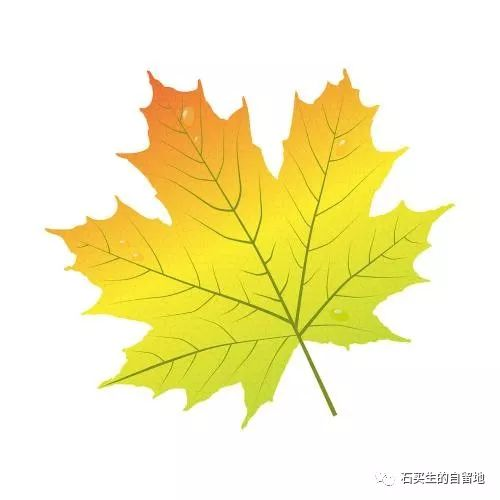
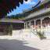

#  秋天的木心

原创  石买生  [ 石买生的自留地 ](javascript:void\(0\);)

__ _ _ _ _

** 秋天的木心  **

又一个秋天到了

我看见他

坐在一幅画里

目光清澈冰凉

枫叶落在肩上

耳朵像一弯新月

手指散开又握紧了

空虚

是他用了一辈子的颜料

他涂啊画啊

没有人知道

他一生都在画自己

这个不服老的男人

总喜欢

一些不合时宜的事物

破旧的马车

生锈的锁

写给死者的信

还有

东逝的水

晚天的云

可惜他不知道他的心

像不像雪花

是八角形的

还是六角形的

他真正爱的

是他纷纷扬扬的情欲

一只鸽子飞过秋天

是因为迷恋卡夫卡

上帝成为万人迷

是因为究其一生

皆用心爱之物向女人致敬

他是佛洛依德嫡传弟子

可到死他都没承认

这厮有福了  

一生隐逸却知所终

将灵魂安放于断桥

垂柳与斜阳之间

一只棕色的蚂蚁

哼着江南小曲

这天籁般的祝福

沁人肺腑

这个水做的男人

有一段时间

迷倒众生

其实

他真正的名字

叫乌镇之子

  

预览时标签不可点

微信扫一扫  
关注该公众号

****

****

×  分析

__

微信扫一扫可打开此内容，  
使用完整服务

：  ，  ，  ，  ，  ，  ，  ，  ，  ，  ，  ，  ，  。  视频  小程序  赞  ，轻点两下取消赞  在看  ，轻点两下取消在看
分享  留言  收藏  听过

精选留言

吴丰强来自

同调同歌！[玫瑰][玫瑰][玫瑰]

石买生的自留地来自

谢谢老吴赏读

侯海峰【移动】来自

石老师 您好 我在吉林市[微笑] 您的诗您的文章还是那么好[调皮]

石买生的自留地来自

啊，你家在吉林呀

戒定生慧来自

这首诗节奏感好，喜欢！

石买生的自留地来自

想解构一下大众偶像，而已。

