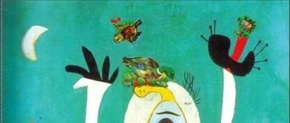
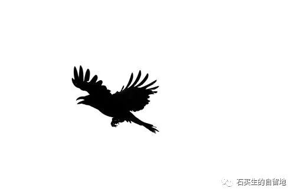
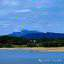
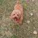

#  想象暮年

原创  石买生  [ 石买生的自留地 ](javascript:void\(0\);)

__ _ _ _ _

** **  

**  
**

** 想象暮年  **

就是那道门槛吗

越来越近了

应该是村东一口古井吧

井沿爬满湿青苔

清凌凌的水

映一方静的天

或者至少像一僧人

山下化缘

山上种菜

一次小解即是涅槃

可惜啊都不是不像

一辈子入世

不深不浅

不爱不恨

把杂念当红尘

把庸常当有常

认他乡作故乡

脚盲目

心不如止水

曾经啊

双亲一阴一阳

云一样别过

拖家带口南行

比摩西还悲壮

也怕

变成异乡一点磷火

在暗夜闪烁

怎料

日子由陌生而熟悉

由琐碎而残缺

因为平淡

每一天都过成了节日

原来习惯就是不厌

重复就是不弃

喜欢就是沉默

你的样子

总在岁月的背面

你一摩挲

你摸到的不是皱褶

不是逝水

是雪

祈祷不是愚昧

是另一种馈赠

如果没有来世

此世即是天堂

有一棵老树将粗枝

伸进暮色

它感到夜的温柔吗

如果

天意不怜幽草

人间不重晚晴

你注定面容模糊

看啊

有一只昏鸦

不在巢中安眠

宁去远天坠落

  

预览时标签不可点

微信扫一扫  
关注该公众号

****

****

×  分析

__

微信扫一扫可打开此内容，  
使用完整服务

：  ，  ，  ，  ，  ，  ，  ，  ，  ，  ，  ，  ，  。  视频  小程序  赞  ，轻点两下取消赞  在看  ，轻点两下取消在看
分享  留言  收藏  听过

精选留言

羽教渔乐来自

情感真挚，恨自己读书少[害羞]

石买生的自留地来自

谢谢小崔赏读与鼓励！🤝

丁伯刚来自

如此苍凉，如此震撼，

石买生的自留地来自

谢谢老丁鼓励，让我涂鸦有点自信。🤝

邢祥如来自

宁去远天坠落，那不是乌鸦，分明是我的心思。

石买生的自留地来自

谢谢老邢赏读与鼓励！🤝

吴丰强来自

在车站看这首诗，好像浮身之水突然干涸。

石买生的自留地来自

老吴美言，谢谢鼓励！

陈离来自

写得好，学习🌹

石买生的自留地来自

谢谢陈离兄鼓励🤝

秋水来自

习惯就是不厌，重复就是不弃。写得真好

石买生的自留地来自

谢谢鼓励！

蔚蓝的海来自

被标题吸引，被文字震撼，被石老师圈粉[玫瑰][玫瑰][玫瑰][强][强][强]

石买生的自留地来自

谢谢赏读！🤝

Simon来自

緣分就是如此

石买生的自留地来自

正是

戒定生慧来自

石老师这首诗我特别喜欢，写出了生命的况味，真诚于心，真挚于诗。

石买生的自留地来自

谢谢海龙赏读，国庆随感，没想到吟出一些暮年的苍凉与悲戚。

一束阳光9.9来自

老师的诗如果读出来声音是在心里响起来的，写的真好呀[爱心][爱心]

石买生的自留地来自

谢谢赏读！

Catie.🍶小富婆🧸来自

不敢自己一个人看，跑到热闹的人群中，把诗看完。却又不得意，又跑到只一人的地方，把诗读完。🧡

石买生的自留地来自

谢谢赏读！

厚朴来自

写的真好

石买生的自留地来自

谢谢李老师赏读！

Vanessa-kiki来自

老师 真的太棒了👏

石买生的自留地来自

谢谢赏读！

nonstop来自

意境悠长，令人回味。

石买生的自留地来自

谢谢啊

Simon来自

如果高二沒走的話，現在是高三2班，蘇同學

石买生的自留地来自

纸上有缘啊

1hxin🦁来自

好诗

石买生的自留地来自

谢谢鼓励！🤝

Simon来自

[握手][握手]老師好

石买生的自留地来自

哪位弟子？老客人啊！

