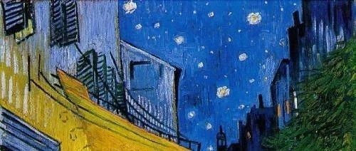
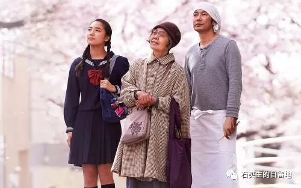
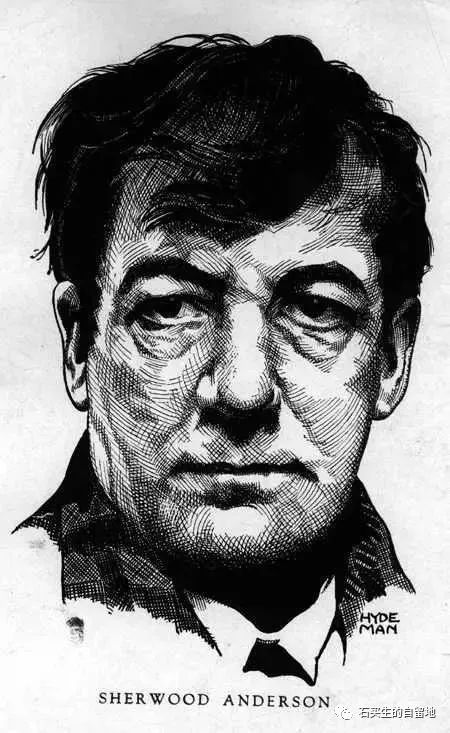

#  看见星星打盹的人

原创  石买生  [ 石买生的自留地 ](javascript:void\(0\);)

__ _ _ _ _

** 看见星星打盹的人  **

是个清洁工

矮个

眼睛和善

头发干黄蓬乱

脚上的解放鞋又旧又脏

他老家在湖南

总是后半夜起床锻炼

一抬头

就看见星星打盹

只憨憨地笑

不会说星星你好

按时叫醒

晨露中垃圾车

草帽

撮箕

扫把

当落叶温顺归位

心中欢喜

嘴里就哼些小曲

习惯校园路面干净

跟人招呼问好

连空气都想拥抱

人到中年

好像每一天都是新的

每次见到我散步

总是向我致敬

动作笨笨的

特别真诚

** 三位一体  **

\----  观日本电影《澄沙之味》

德江女士  76  岁了

她想帮

千次郎做铜锣烧红豆馅

同红豆低语

摸红豆的身子

想红豆在岁月中长大的样子

天气晴好时

她喜欢看樱花盛开

对中学生若菜

她也打心眼里爱

她把一切人

看做世上的初民

她的眼睛

又清亮又澄澈

她少年起得了癞病

手指扭曲变形

安详离世前

她善待了世上的一切

她与自己万物他人

融为一体

** 舍伍德·安德森  **

海明威福克纳的老师

舍伍德·安德森

讲了一个故事

哈奇夫妇中年得子

儿子叫威尔

长大了到芝加哥学美术

常有作品寄来阅读

哈奇夫妇很幸福

在小镇种种地

看看落日

像满月容易缺

威尔出事故死了

得到消息

哈奇夫妇没有哭

老两口穿着白色睡衣

在暮色中

捧着玉米种子

一边种

一边祈祷

  

安德森一脸忧郁

我的心

紧一下松一下

松一下紧一下

别样悲伤

让我从身体里走出来

又走回去

注：图片选自百度网络，致谢。

  

预览时标签不可点

微信扫一扫  
关注该公众号

****

****

×  分析

__

微信扫一扫可打开此内容，  
使用完整服务

：  ，  ，  ，  ，  ，  ，  ，  ，  ，  ，  ，  ，  。  视频  小程序  赞  ，轻点两下取消赞  在看  ，轻点两下取消在看
分享  留言  收藏  听过

