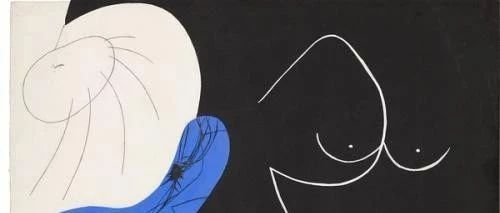
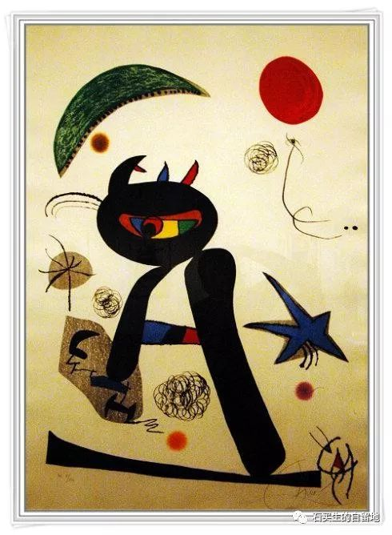
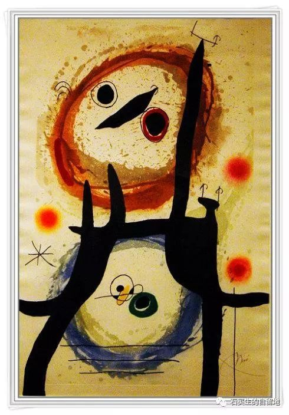
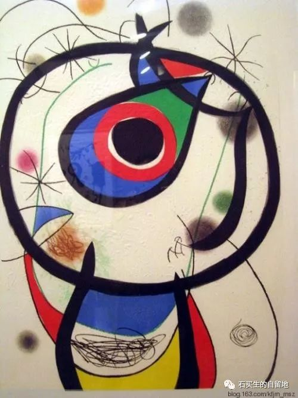
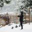

#  亲人

原创  石买生  [ 石买生的自留地 ](javascript:void\(0\);)

__ _ _ _ _

  

**亲人**

**  
**

总有一天

你会觉着世上的亲人

越来越少了

他们或是杳无音信

或是不打招呼就出了远门

  

就像童年的雪

无声就落满

哀乐中年

  

你在北回归线彳亍

总有讶喜

  

一些弟子心有灵犀

他们从北京上海深圳广州

佛山海南东莞前来探望

穿越廿几年的时光

  

他们笑得开心

你笑得憨厚

天清气朗

  

酒过三巡

话说五遍

你被他们看作了亲人

  

一棵老树长得静默

旁边

有花开得娇艳

有树长得挺拔

  

岁月人土地

对你充满恩情

  

**老龄化模式**

**  
**

大清早

我和妻

穿过未名湖

图书馆

到操场散步

  

我在前

妻在后

  

在斜坡上

见到更早的人

我们说

早

  

在操场

看见旭日东升

我们不说

早

  

黄昏

我和妻沿老路

又走了一遍

  

妻在前

我在后

  

我们没有手牵手

  

**滑旱冰的老顽童**

**  
**

校篮球场

一个头发银白的老者

在滑冰

  

弓腰

左脚颠地

右脚缓慢地滑行

  

下午的阳光

照着他的脸越发赭红

他的心跟年轻时一样跳动

  

他每一次前冲

每一次暂停

都力争跟世界同步

  

甚至每一次旋转

每一次晕眩

都如同一次黄昏恋

  

除了冰鞋

除了身上的盐

眼前什么都不存在

  

他不想等待

残枝败柳一般枯萎

  

他要先把自己甩出去

然后在黑夜来临之前

张开双臂

把自己抱得紧紧

  

注：图片来自网络米罗名画

  

预览时标签不可点

微信扫一扫  
关注该公众号

****

****

×  分析

__

微信扫一扫可打开此内容，  
使用完整服务

：  ，  ，  ，  ，  ，  ，  ，  ，  ，  ，  ，  ，  。  视频  小程序  赞  ，轻点两下取消赞  在看  ，轻点两下取消在看
分享  留言  收藏  听过

精选留言

Anneliese来自

石老师的诗里满满是生活的味道

石买生的自留地来自

谢谢鼓励！🤝

秀波来自

石老师的诗总是饱含情感 满满的恩情！车外是晚桂的弥香……

石买生的自留地来自

谢谢您鼓励！握手🤝

老石来自

生活的诗词

石买生的自留地来自

🤝

Simon来自

為什麼不牽手

石买生的自留地来自

难为情啊

老石来自

是的，来珠海或澳门一定联系，下次到松山湖去拜访您，我是您的粉丝，看过您好些文章，有空可以加个微信，我的微信号13928088429，谢谢

石买生的自留地来自

好的，我侄女华妹也在珠海呀[微笑]

老石来自

叔，我是石家三姑的儿子

石买生的自留地来自

啊，你好啊，你是不是在珠海发展？[微笑]

曲旦来自

下次牵手后再写一首[呲牙][呲牙]

石买生的自留地来自

好的呀

吴丰强来自

诗很美！[玫瑰][玫瑰][玫瑰]

石买生的自留地来自

谢谢老吴鼓励！🤝

厚朴来自

石老师的诗温暖、明润，就像你们的生活，安静、温馨！

石买生的自留地来自

谢谢李老师鼓励！

阿郎来自

总有弟子请喝酒[强][强][强]

石买生的自留地来自

谢谢郎兄鼓励！拙诗，请批评。🤝

