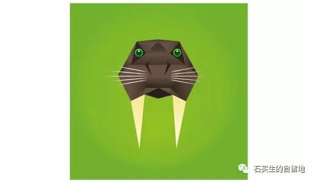

#  在哪里过年

原创  石买生  [ 石买生的自留地 ](javascript:void\(0\);)

__ _ _ _ _

** **  

**  
**

** 在哪里过年  **

这词儿一出口

你已经

前不着村

后不着店

双亲已出远门多年

儿女也将渐行渐远

风儿越来越凉

异乡成了故乡

有一道门槛

叫尴尬中年

****

** 一个梦里笑醒的人  **

嘻嘻嘻

我崽真能干

她女儿被笑醒了

一起被笑醒的

还有午夜的星光

中年的疲倦

不打招呼的白发

不该有的迷茫

只有夜的潮汐

一拍一合

哦  她的梦

让黑白两个世界

得到奇妙的中和

  

** 鸟看见他了吗  **

一只隐秘的鸟

叫了一声

又一声

从办公室

到教室

他听见

鸟不停地叫

一声

又一声

他看见了

同事和学生

没有看见

鸟

鸟看见他了吗

这么美的冬夜

** 他的呼噜不能给良宵带来温情  **

他打呼噜

像扯风箱

把儿子吵醒了

他的呼噜

抑扬顿挫

不断变换花样

很有节奏感

他从未被

自己的呼噜声惊醒

有一只蚊子被感染

也来赶场

呼噜声嘤嘤声

此起彼伏

儿子放下了蚊帐

半闭着眼睛

** 泰戈尔式的祝福  **  

****

****

在万绿湖连锁店

小张和老吴

在一个充满爱意的礼物上

写下名字

和

2019  年新月

祝女儿一生幸福

  

预览时标签不可点

微信扫一扫  
关注该公众号

****

****

×  分析

__

微信扫一扫可打开此内容，  
使用完整服务

：  ，  ，  ，  ，  ，  ，  ，  ，  ，  ，  ，  ，  。  视频  小程序  赞  ，轻点两下取消赞  在看  ，轻点两下取消在看
分享  留言  收藏  听过

