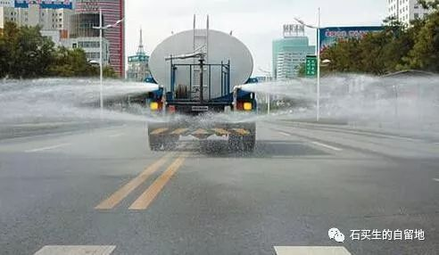
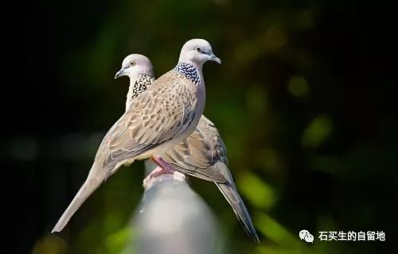

#  洒水车是一个城市最温柔的部分

原创  石买生  [ 石买生的自留地 ](javascript:void\(0\);)

__ _ _ _ _

  

**  
**

**洒水车是一座城市最温柔的部分**

  

每天6.40分

洒水车准时打我身边开过

由北向南

喷出的白色水雾

让地面干净又潮湿

我看见

绿道两边的小草

也轻轻摇曳

似乎在说

早

  

伴随这份温情

被唤醒的

还有右边的教学楼

那里有琅琅书声

左边

过一条马路

再过一片荔枝林

是松山湖

正睡眼惺忪

等待日出

  

  

  

**斑鸠在冬天也求爱吗**

  

在岭南

我在校园闲逛时

总听见

斑鸠在咕咕咕叫

一方热烈急促

一方慵懒舒缓

叫得我心里

老是痒

  

在赣北

也常听见斑鸠叫

也是成对成双

叫声悠扬绵长

应声婉转情深

胜似

旖旎春光

赛过

汩汩清泉

  

  

**夜钓者说**

  

  

在东莞

我喜欢夜钓

原因呀

鱼和我

都爱夜生活

  

天上群星闪烁

地上万家灯火

水边夜风习习

只要你

持一钓竿呀

总有各色鱼儿

前来赴约

  

钓鱼也讲缘分

在一线天

你和鱼

有时是一次清谈

有时是一场热恋

那份缱绻

是人间至乐

  

缘分尽时

也如诗仙太白

沧浪兮罢钓竿

添几根白发

发几声慨叹

这世间呀

人儿越来越多

鱼儿越来越少

为啥

  

预览时标签不可点

微信扫一扫  
关注该公众号

****

****

×  分析

__

微信扫一扫可打开此内容，  
使用完整服务

：  ，  ，  ，  ，  ，  ，  ，  ，  ，  ，  ，  ，  。  视频  小程序  赞  ，轻点两下取消赞  在看  ，轻点两下取消在看
分享  留言  收藏  听过

精选留言

吴丰强来自

终于等来了你的钓鱼诗！钓的不仅是鱼。[玫瑰][玫瑰][玫瑰]

石买生的自留地来自

🤝

