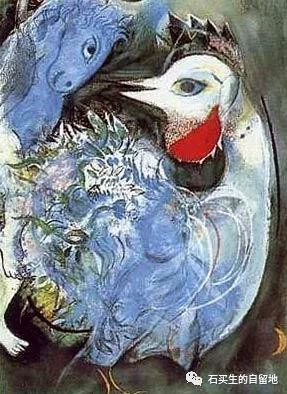
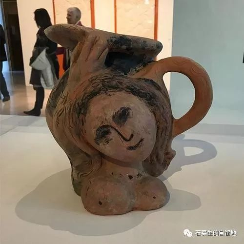

#  大年三十晚乘软卧由莞返赣

原创  石买生  [ 石买生的自留地 ](javascript:void\(0\);)

__ _ _ _ _

  

**年三十晚乘软卧由莞返赣**

  

  

你想想

年三十晚

当全国人民

都在看春晚

我和石行

正斜倚在K92次列车上

看夜景

享受南中国稀有的

空旷与安闲

那滋味呀

一想

就他妈激动

  

  

**关于屌丝上帝从不做安排**

\------读杜鲁门•卡波特《冷血》

  

迪克和史密斯

这两个屌丝

为了子虚乌有的保险箱

和一万美元

弄死了农场主

克拉克一家四口人

克拉克是一个与世无争的人

他妻子还是一个病人

儿子和女儿

是未成年的天使

  

迪克这个浪荡子

离妻抛父弃子

丑事做尽

整天嬉皮笑脸

临死前还假装坦荡

说

我将去一个更好的世界

我不怨任何人

  

史密斯也好不到哪去

又猥琐又阴险狠毒

母亲早死

父亲落魄

自个儿在南韩参战

落下半身伤疤

他唯一招人喜欢的

是会弹吉他会唱情歌

他眼睛忧郁嗓子迷人

上绞刑前

只说

我很抱歉

但不知所终

除了黑暗

  

这是上世纪60年代

美国乡村的故事

卡波特评论这两个屌丝

说他们也是圣人

上帝怎么看呢

关于有辜和无辜

他既不做划分

也不做安排

不像古老的星辰

  

  

**服恨**

  

大年二十七早上

我在南校区散步

又碰见矮个子清洁工大叔

他招呼我停下来

从口袋里摸出一支笔

在自己手掌上写下

“服恨”二字

问我什么意思

我摇摇头

他说这世道

“服恨”就是做人

要服服帖帖不能怨恨的意思

我头一回看见

大叔没有笑

表情甚至有点苦涩

  

  

注：图片来自网络和夏加尔的画

预览时标签不可点

微信扫一扫  
关注该公众号

****

****

×  分析

__

微信扫一扫可打开此内容，  
使用完整服务

：  ，  ，  ，  ，  ，  ，  ，  ，  ，  ，  ，  ，  。  视频  小程序  赞  ，轻点两下取消赞  在看  ，轻点两下取消在看
分享  留言  收藏  听过

精选留言

阿郎来自

有空约卫平教授一聚[呲牙]

石买生的自留地来自

好啊，到时看有没有时间。我回都昌过年。还没见过阿郎兄呢，当年，你在《九江日报》工作时，还是我拙诗的责编老师ni[玫瑰]

Qcxx.来自

作为当地人，没有坐火车回家过年的需要。不过从火车看着窗外夜景，怀着回家的憧憬真的很美好啊。

石买生的自留地来自

🤝

阿郎来自

口语诗高手[强]

石买生的自留地来自

谢谢阿郎鼓励！问候过年好！[握手]

