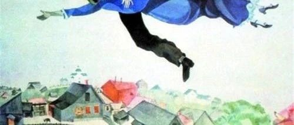
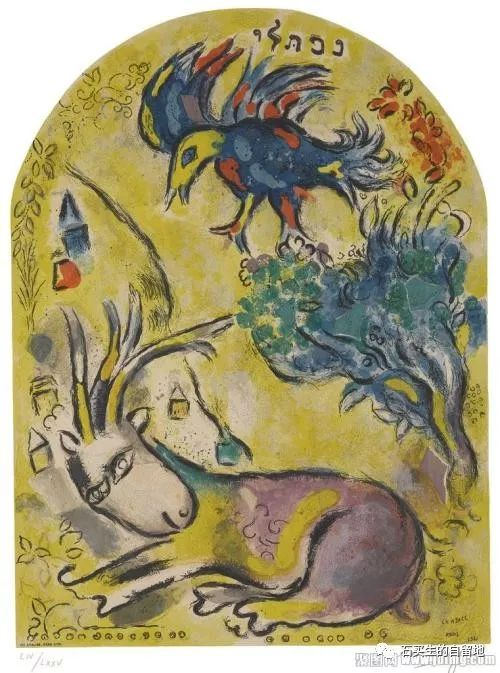
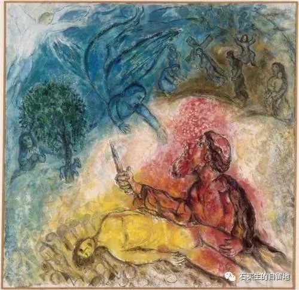

#  虚妄的新年

原创  石买生  [ 石买生的自留地 ](javascript:void\(0\);)

__ _ _ _ _

** **  

**  
**

** 张默欣的纸团  **

参加  1998  届学生毕业  20  周年聚会

看学生个个面色潮红发表感言

求学创业家庭

一个主题就是一幅画卷

有的讲得温柔

有的讲得狂放

轮到张默欣

只见他乜起眼慢条斯理

讲起他当年一个揉皱的纸团

他得意地嗫嚅

你们别小看

任何一只揉皱的纸团

都藏着上帝的初恋

说完

他深情地看着我

示意我是他灵感的源泉

搞得我有点羞赧

其实跟纸团相伴的

还有校西北角的食堂

坡下的水井

坡上的桂花树

南边的运动场

还有若干年后的诗和远方

  

** 虚妄的新年  **

我见过最悲观的一副春联

说什么新年旧岁

分明是昨日今朝

这真是风清云淡

没想到

我的穷村庄还有哲人

我常想

新年神奇的地方

是狂欢和喧闹带来的虚妄

又一年了

对小孩

徒增成长的烦恼

对大人

又要为生计劳碌奔波

如果是游子

顶多增添一丝乡愁

说穿了

新年就是一把瑞士军刀

它恍兮惚兮

就把你给修理了

让你变老

还不让你知道

** 性急的娘子  **

有些花说开就开

比如黄花风铃木

阳光一来

它就开了

让你这个官人

心里好生欢喜

  

预览时标签不可点

微信扫一扫  
关注该公众号

****

****

×  分析

__

微信扫一扫可打开此内容，  
使用完整服务

：  ，  ，  ，  ，  ，  ，  ，  ，  ，  ，  ，  ，  。  视频  小程序  赞  ，轻点两下取消赞  在看  ，轻点两下取消在看
分享  留言  收藏  听过

精选留言

吴丰强来自

任何一只揉皱的纸团，都是上帝的初恋。这是情人节最好的礼物[玫瑰][玫瑰][玫瑰]

石买生的自留地来自

🤝

