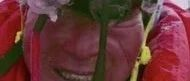
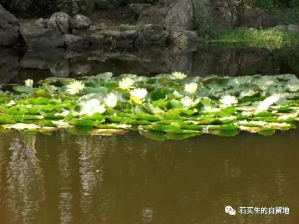
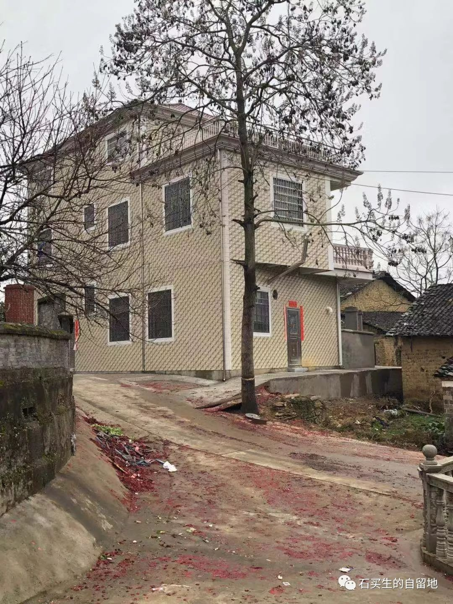

#  夏伯渝的百度百科

石买生  [ 石买生的自留地 ](javascript:void\(0\);)

__ _ _ _ _

** **  

**  
**

**  
**

** 赞美诗  **

没风的春天

小香樟叶儿也片片飘落

它呀为了长出新绿

不像海南蒲桃

总是沉默

看着我从它身边经过

如琴湖里的睡莲

不经意就开了

嫩黄的美人呀

你为谁而媚

** 夏伯渝的百度百科  **

夏伯渝

这个老家伙

69  岁

凭一双假肢

登上珠穆朗玛

他两只真腿

45  年前

献给了队友

和

皑皑白雪

他目光坚毅

让

海明威

那老渔夫桑提亚哥

特朗普

那老金毛狮子

不再嘚瑟

** 惊蛰  **

在东莞

已经有雷声滚过

紫荆花遍地锦绣

人越发懒散

喜欢随遇而安

故乡

一如往昔吗

鱼在水草里打籽

姑娘在偷偷怀孕

凉云飘过村庄

不解少年心事

** 去美使馆签证被拒有感  **

签证官是个女性黑人

看上去中年微胖

先问我们什么职业

我说教师

妻说餐馆员

儿说学生

又问我们去美干什么

我说参加女儿博士毕业庆典

再问

去过国外吗

我们说

没

她一听

在一张纸条上戳一个章

递给我

上面写有有移民倾向拒签

我一看血脉喷张

直想大骂

这女黑鬼

真他妈霸道高冷

** 为乡下未名别墅拟的对联  **

上联

客居他乡诵诗书求真向善

两袖清风如赤子

下联

梦回故里瞻云岫念慈怀亲

一生淡泊似初民

求横批

注：照片来自网络、自拍

  

预览时标签不可点

微信扫一扫  
关注该公众号

****

****

×  分析

__

微信扫一扫可打开此内容，  
使用完整服务

：  ，  ，  ，  ，  ，  ，  ，  ，  ，  ，  ，  ，  。  视频  小程序  赞  ，轻点两下取消赞  在看  ，轻点两下取消在看
分享  留言  收藏  听过

精选留言

吴丰强来自

向老金毛狮子致敬！

石买生的自留地来自

🤝

郝莉来自

石买生是你小名吧，我怎么觉得这名字好熟悉？

石买生的自留地来自

🤝

腾达改装-車臣来自

粤东人士？

石买生的自留地来自

非也

乾运基础老石来自

好男儿当落地生根，哥！

石买生的自留地来自

有理，老四。

