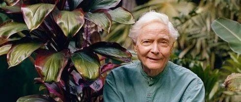

#  怀念W.S默温

原创  石买生  [ 石买生的自留地 ](javascript:void\(0\);)

__ _ _ _ _

  

**  
**

**怀念W.S默温**

  

  

2019年3月15日

91岁美国老头

W.S默温在夏威夷

和他亲手种植的棕榈林

融为一体

  

他比我的老父亲

那个乡村篾匠大七岁

晚死16年

他离世时淡然安详

不像我父亲充满恐惧

  

他一生不像一个休止符

简直是一个圣徒

他善待了大地上一切生灵

他爱昆虫山石云朵

超过爱他自己

  

他还是一个艺术家

是这世上稀有的

把灵魂安置妥帖的人

他能让时间静止

能化实为虚

  

他像极了那个老里尔克

眯起眼

对流动的水说 我流

对静止的地说 我在

他一生足以自傲

  

但他不 他最懂自己

他是谁 要什么 去向哪里

他从没有走丢过

他上天入地 游弋东西

他的笑感动了小松鼠

  

有一个春天在科约特山谷

我成了他身边的小书童

和他一起带着鹿 熊 玉米面饼

坐在一藨草舟子里

顺水漂流

现在他去到另一世界

我看他一头银发的照片

读他遗世的诗篇

追他走过的足迹

希望把余年过得好一点

  

  

注：图片来自网络

  

  

预览时标签不可点

微信扫一扫  
关注该公众号

****

****

×  分析

__

微信扫一扫可打开此内容，  
使用完整服务

：  ，  ，  ，  ，  ，  ，  ，  ，  ，  ，  ，  ，  。  视频  小程序  赞  ，轻点两下取消赞  在看  ，轻点两下取消在看
分享  留言  收藏  听过

精选留言

