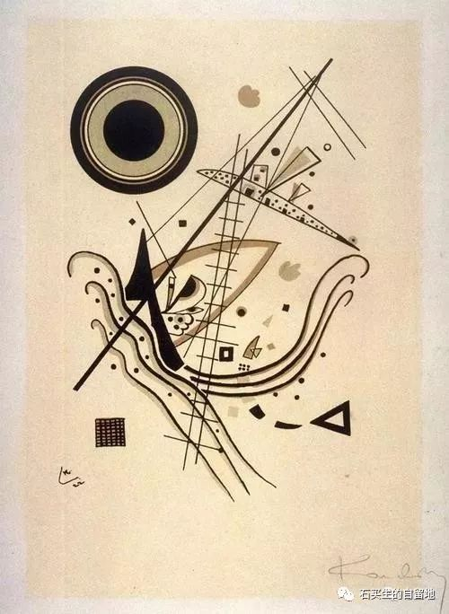
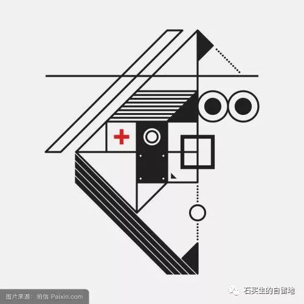

#  旧日短歌

原创  石买生  [ 石买生的自留地 ](javascript:void\(0\);)

__ _ _ _ _

** 旧日短歌  **

  

** **

** 蟑螂  蟑螂  **

东莞的蟑螂个儿小

身子单薄  在橱房地面砖上蠕动

动作迟缓  模样羞涩

典型的营养不良

她苯拙地抖动翅膀

想飞歇在碗柜上饱餐一顿

我折断了她的翅膀

看她在地上瞎折腾

她横竖飞不过这个冬天

因为她长得丑

甚至她不该做梦

更不该背井离乡

她多像盲目的穷人

在世间跌跌撞撞

想恨却不会

想爱却不能

2007-11-05

** 中年的雪  **

父母的离世

妻身上的痛

生命中不打招呼的雪

没说来就来了

2012-12-31

** 总有一天  **

你发现自己像冬天的炉火

此生不是为了燃烧

而是化为灰烬

生命短暂而悲凉

一只鸟

有了犯罪的冲动

2013-04-19

** **

** 梦中偶得  **

三君

你看你多美

我只能到月亮上遥望你

在这混浊的俗世

2013-12-26

** **  

** 这些年  **

\----  和南屿兄

脸上起沟壑，心中少波澜。

头顶降霜雪，人老珠未黄。

作业越来越少，

日子不淡不咸。

看见美，也想折腾。

欲静不静，

遗世不独立，

残梦吊余生。

平静中，父母离世，

星光暗淡。

抱紧一个虚妄，

面死而生。

** 2014-03-04  **

** **

** **

** 残花  **

一朵花将要枯萎了

她惊羡

众花之上蜂儿嘤嘤

蝶儿翩翩

她偎依一根残枝

像斜阳

恋着

柳絮

2014-06-04

** **  

** 一个失魂落魄者的火焰  **

在这个致命的黄昏

一个年轻人将绿道上木棉花的尸体聚拢来

摆成心字形

他低首弯腰伸手动作轻悄满含柔情

地上燃起的火焰

多像他短暂的青春

热烈  嚣张  纯粹  任性

暮色中他缓缓离去的背影

跟星光一样黯淡

2015-04-15

** 社保卡  **

什么时候

这蛋白色四方形的小卡片

时常被我揣在怀里

我的眼睛和白发一起泛着安静的光

冬天快到了

我在异乡走着

不是为了触摸现世的温暖

而是为了躲避隔世的寒凉

2016-08-30

** 祈祷  **

世上之一切变坏

得

慢一点

天之青

海之蓝

地之芸芸众生

2016-12-07

  

预览时标签不可点

微信扫一扫  
关注该公众号

****

****

×  分析

__

微信扫一扫可打开此内容，  
使用完整服务

：  ，  ，  ，  ，  ，  ，  ，  ，  ，  ，  ，  ，  。  视频  小程序  赞  ，轻点两下取消赞  在看  ，轻点两下取消在看
分享  留言  收藏  听过

