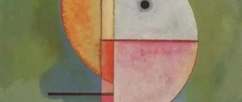
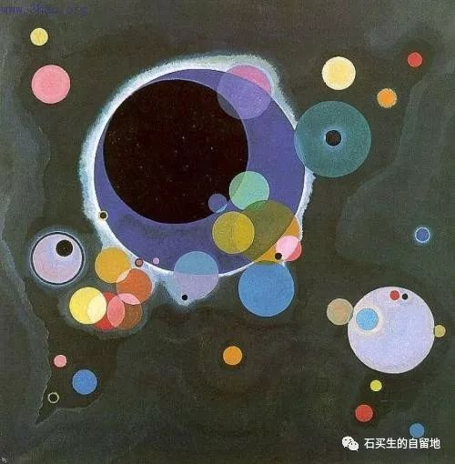

#  鳄鱼的眼泪

原创  石买生  [ 石买生的自留地 ](javascript:void\(0\);)

__ _ _ _ _

**打卡**  

  

单位每天下午三点前

都要上班打卡

打卡地点在图书馆

教室或办公室

有一次我正回看《都挺好》

尝试在家打卡

没想到竟打成了

我高兴得想咬苹果一口

心想

她简直是我的公主

另一回我腰疼

又想在家打卡怎么打都不成

她真没同情心

我一边骂骂咧咧

一边下楼来在车棚前

对着图书馆打卡

咦

也打成了

这回尽管也打成了

我对手里的苹果却没有好感

好像她是后娘养的

  

  

**鳄鱼的眼泪**

  

巴黎圣母院被烧了

普京好像很伤心

他对记者说

巴黎圣母院是法国乃至

欧洲文明的象征

动情处

他竟热泪盈眶

他的眼泪

是鳄鱼的眼泪吗

  

  

**新八股**

  

最近教高三学生写作文

提醒他们要关注

宏大叙事

主旋律

要有我

要有国

要有时代的浪花

最好还有一带一路

紧要处

还要来点抒情

学生对这写法心领神会

每次写来

都得心应手

把自己感动得稀里哗啦

不能自己

我也甚为欣慰

因为一代人的青春

通过这些热烈的文字

得以奠基

  

  

注：图片选自百度康定斯基名画

预览时标签不可点

微信扫一扫  
关注该公众号

****

****

×  分析

__

微信扫一扫可打开此内容，  
使用完整服务

：  ，  ，  ，  ，  ，  ，  ，  ，  ，  ，  ，  ，  。  视频  小程序  赞  ，轻点两下取消赞  在看  ，轻点两下取消在看
分享  留言  收藏  听过

精选留言

Simon来自

同學們不可能一輩子都寫官樣文章吧？

石买生的自留地来自

那是，眼下既是策略，也是无奈。

夏来自

“最近教高三学生写作文 提醒他们要关注 宏大叙事 主旋律 要有我 要有国 要有时代的浪花 最好还有一带一路 紧要处 还要来点抒情”。
石老师不愧是跨省特招名师！[强][强][强]

石买生的自留地来自

谢谢！谬赞也。[握手]

Scarlett来自

叙述通俗，又很有画面感，有趣

石买生的自留地来自

喜宝荣来读[微笑]

青瓷在土来自

石老师的配图都很好看啊！[强]

石买生的自留地来自

谢谢郑老师鼓励！图是选了康定斯基名画[微笑]

庄照岗来自

因为一代人的青春 通过这些热烈的文字 得以奠基 有深意[强]

石买生的自留地来自

向照岗学习！[玫瑰]

阿飞来自

老师好

石买生的自留地来自

你好！[握手]

