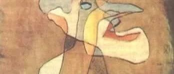

#  爱土豆的老任

原创  石买生  [ 石买生的自留地 ](javascript:void\(0\);)

__ _ _ _ _

** **  

** 爱土豆的老任  **

被老美卡住脖颈

不露一点心虚

仍一脸

风清云淡

讲备案

讲科研

讲教育

讲家乡

也讲持久战

也讲被人

推下珠穆朗玛

还要继续攀登

动情处

还讲感谢敌人

那眼神儿

那胸襟儿

真迷倒众生

当然

老任讲得最好的

还是坦诚

说自己一家子

都爱苹果

并希望

吾国吾民

如果真爱国

就种好一颗土豆

  

** 一个痛风病患者的独白  **

两碗墨鱼排骨汤

加上疾行六公里

就让你的左膝盖

不能弯只能直

你的腰

轻柔的配合着右脚

你的身躯

前倾或后仰

上下楼一瘸一拐

总会有关切的眼神

投过来

总会在凌晨前

痛醒过来

突然

生活错位了

你和世界的关系

也彻底改变了

因为一条腿

一只膝盖

** 故人  **

****

总是走散

在原乡，在天涯

坐花醉月，湮于红尘之中

一个个面容模糊

下落不明

你看啊

从新花到老树

由青丝转为白发

从相携到自怜，相忘于江湖

总在弹指之间

尘世也有幸

曾高山流水

清风一夕，明月半墙

诗书相伴，把酒言欢

那时呀四时流光

大半生活成一个问号

哪是东篱旧菊，黑洞新月

盲目彳亍于南国天宇下

徒自感伤，成为故人

竟成了宿命

  

** 山竹来过的地方  **

****

去年九月

山竹袭击东莞

我窗前的小叶榄仁

一根粗枝被拦腰折断

露出

雪白新鲜的肉

折断的枝桠

也翠绿温顺好看

你现在看

去年的伤口

又长出新枝冒出新绿

比去年更养眼

好像山竹

压根没来过一样

  

预览时标签不可点

微信扫一扫  
关注该公众号

****

****

×  分析

__

微信扫一扫可打开此内容，  
使用完整服务

：  ，  ，  ，  ，  ，  ，  ，  ，  ，  ，  ，  ，  。  视频  小程序  赞  ，轻点两下取消赞  在看  ，轻点两下取消在看
分享  留言  收藏  听过

精选留言

乾运基础老石来自

老任是个老滑头。

石买生的自留地来自

老任有大格局呀[玫瑰]

吴丰强来自

直骨头，柳腰身[呲牙]保重！ 每看一次老石的怀思，总不知今夕何夕，好诗！[玫瑰][玫瑰][玫瑰]

石买生的自留地来自

谢老吴鼓励！[握手]

