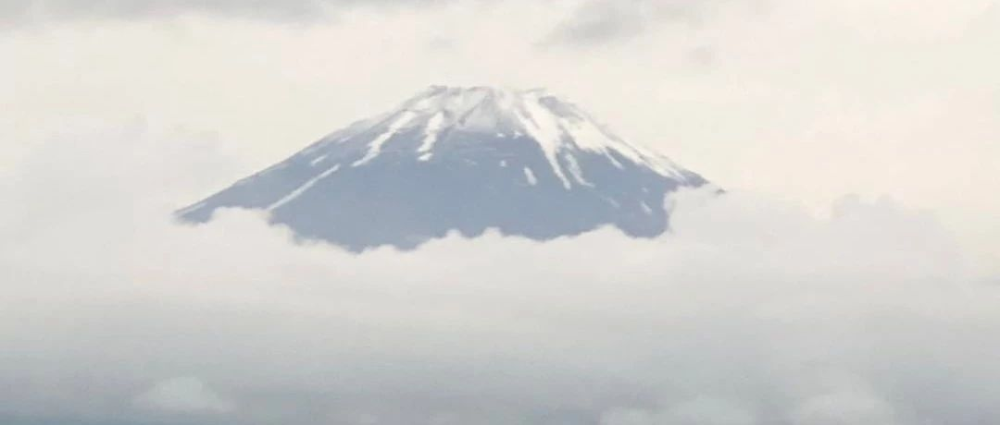
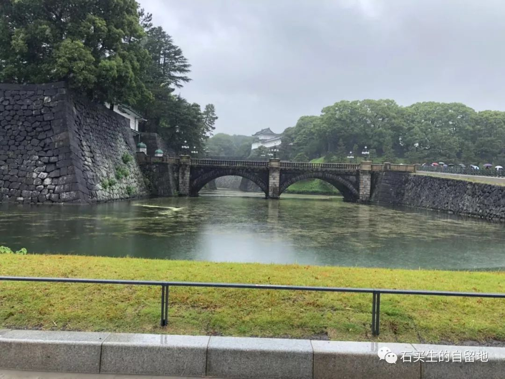
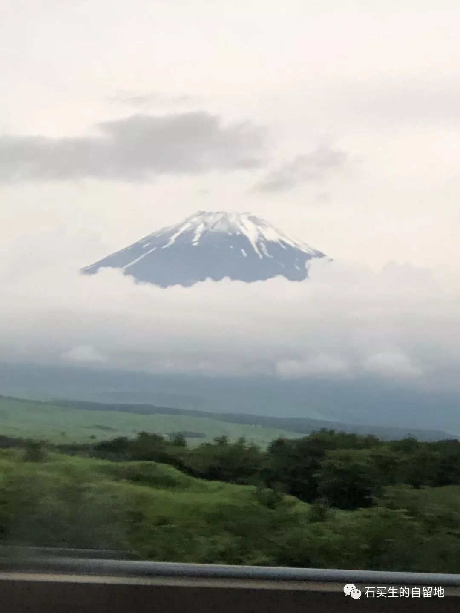
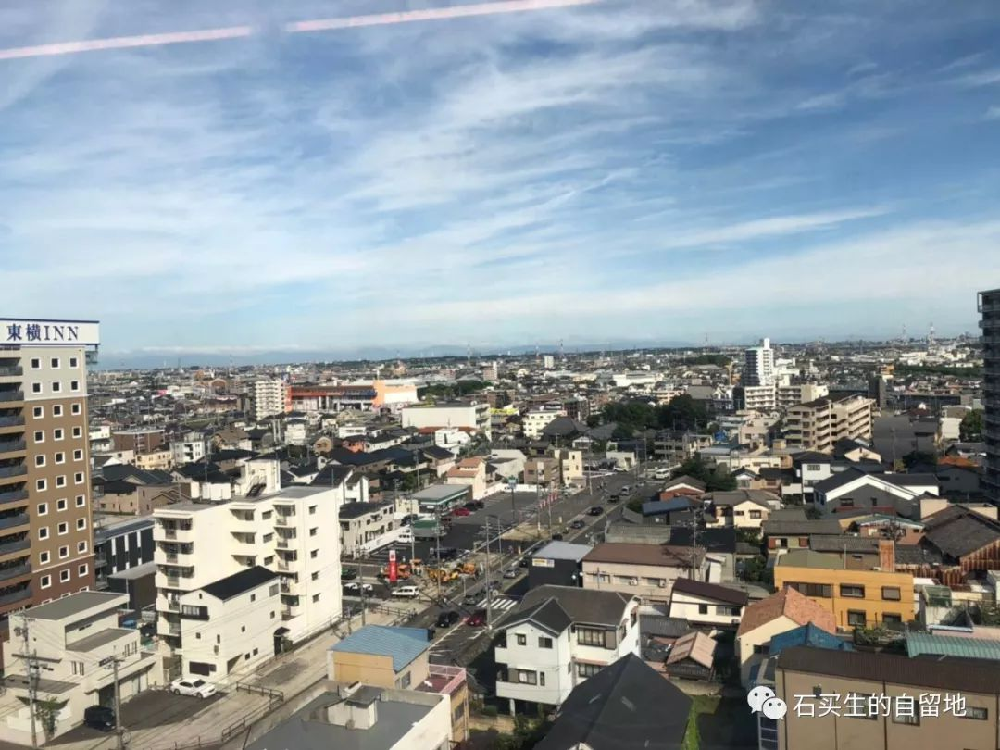

#  日本素描

原创  石买生  [ 石买生的自留地 ](javascript:void\(0\);)

__ _ _ _ _

** 日本素描  **

  

** 雨中观皇居  **

六月中旬了，东京的雨，竟冰凉扎骨，充满寒意。风又刮得紧，让人不停打寒噤。

皇居被包裹在雨帘中，只能依稀看见一些不算高大的古朴建筑，既不庄严也不肃穆，倒显出几分落寞。天皇和皇后，就在前面的里面住着，游客如想一睹他们真容，那是不可能的，你只能看见皇居前古旧的二重桥，还有桥边水池旁一些垂柳，在静默里向你招手，邀你合影，让你臭美一顿。

皇居最吸引的人之处，在它被一个巨大广场围着。广场绿草如茵，古松遍布，置身其间，让你心旷神怡。广场靠近二重桥，有两块褐色碎石子铺就的空地，踩在上面，碎碎碎地响，相传，这是古代皇宫里为了防止刺客潜入，特意设置的一道屏障。

参观完皇居，却没看见天皇，有人难免失落；当然，也有人好奇，日本政界高官，比如安倍晋三，住在什么地方？

皇居广场。有一条长长的橘黄色盲道，连着皇居和街市，脚走在盲道上，鞋子会发出咭咭咭咭的响。因为这奇异的响，我跟日本人一样膜拜天皇。

** 伊豆泡温泉  **  

一直觉得，最纯碎的日本，在川端康城笔下。《伊豆的舞女》中描述的风情，曾撩起我无穷遐想。

伊豆，原来是一个乡间小镇。黛黛的山，蓝蓝的天，矮矮的房，窄窄的街，汩汩的水，宁静悠远。信步而行，随便一个一个街角，你都能遇见一个温善之人。一个早起大叔，一个识礼大娘，一个表情淡然的孕妇，可就是不见一个风姿绰约的舞女！

幸好，还有温泉可泡。

早年，泡温泉是男女混泡。试想，当一个个男女胴体飘入水池，那情景，宛若亚当夏娃在伊甸园一般曼美。可惜，后来有些泡客在享受温泉时喜欢非分逾矩，把人生至美之事变得龌龊可鄙，这美好习俗就取消了，变成了男女分开泡。

其实，分开泡也是一种享受。

日本的温泉水是碱水，水温  36  度至  40
度不等，当你赤身裸体，冲完凉顺着斜梯滑入水中，你顿时四肢绵软，飘飘欲仙，享受到人生至乐。日本人一天要三泡，因为舒服，所以泡了还想泡。

** **  

** 富士观云海  **

富士山是日本的象征。

只要到日本，没有人不想看看富士山。遗憾的是，富士山只能吊胃口，不能睹真容，说白了就是不能上到山顶，一睹天下美景。

但是，到了富士山下，总该看些什么玩些什么呀！别急，读者诸君，富士山风景区，不是徒有虚名，它呢，还是有看有玩的。

先在山脚下，为你准备了一个大型游乐场，摩天轮，极速跑车，灵异鬼屋，让你尽情浪，尽情疯。

再沿盘山公路蛇形上到半山腰，来到一个观山好去处。只要天气晴好，都能有幸近距离看看富士山真切的样子。可惜，我来得不是时候，立于山腰，往四周看，山顶山腰一片云雾弥漫，山顶时隐时现，山景变幻莫测，极富神秘色彩。你如果是一个画家，肯定会觉得富士云海是天下少有的奇观，你笔下会添上最迷人的色彩。

富士山相传是一座休眠火山，  300  多年前喷发过一次，据科学预测，  300  年后又到了喷发期。对世界游客来说，富士之旅也是冒险之旅。

富士山还是一座神山，日本人希望它永远休眠，因为它脚下住着两万多居民。日本人相信万物都有神灵，富士山的神灵肯定被感动了，我想。

  

** 扶桑赠镜子  **

日本国古代称扶桑国。扶桑扶桑，这名字听上去闻上去，有贴近泥土的古雅和芬芳。自古以来，日本跟咱们们中国一衣带水，日本受唐文华影响很深，大街小巷随处可见汉文化的影子。如日本人管“停车场”叫“驻车场”，道路拐弯处不叫“左拐弯”“右拐弯”，叫“左折”“右折”，到日本寺庙参观游览，你都能看见门前一提示牌，上书起止时间。日本人把“结束”称为“终了”，在名古屋古城参观，我看见城门前就标示每日
18  ；  00  参观终了。看多了这样的汉字，这份古雅会让你的心变得柔软。

日本最可敬之处，在于其国民的爱清洁精神。在日本游逛，除了在服务区和入住酒店，你看不到一只垃圾桶，但地面清洁干净，一尘不染。原来日本人习惯在家里将垃圾分类，然后交由垃圾车回收。一只普通的矿泉水瓶，竟可以分类为四种垃圾，此种精细令人叹为观止。

日本人的爱清洁精神还集中表现在公厕和卫生间，公厕干净得令人惊讶，地面干净如镜，便池前无半点尿渍，即使有刚留下一丁点尿渍，也马上有清洁人员处理得干干净净。公厕里有专门供小孩、孕妇、残疾人用的便池，这些便池，或低矮，或有扶手，或有靠椅，让各类人在小便时舒舒服服，在解决应急这一方面，日本人都想到了人性的最深处，难怪有人称日本是一个可怕的民族。

刚入住酒店，我就头一次在马桶盖上感受到了文明之光。日本的马桶盖有温度调控设备，还有自动冲洗肛门机关，是痔疮和便秘患者的福祉。我安坐在马桶盖上，不光能感受到有怡人的温度传遍全身，还能听到悦耳的轻音乐，让灵魂受到洗礼，整个人彻底放松。如果用粗话讲，就是拉屎真他娘的舒服。听闻前几年，有不少中国大妈大叔远涉重洋，东渡扶桑，一个个肩背马桶盖登机，那景观真不是大煞风景，那拳拳之心，实乃是对文明的一份向往啊。

日本日本，弹丸小国，不去不信，去了再回，真可以改变一个人啊。

我深信，任何一个去过日本的人，回国时都会带上一面镜子，这面镜子就是清洁的镜子。这面镜子提醒我们，在生活中要做一个干净整洁的人。浮世有尘，我身洁净，我爱我身，我才有可能爱众生啊。

世界变年轻了

在日本六天，我发现自己变成了年轻小伙，世界也好像变年轻了。

因为呀，在日本，我看见许多七老八十的人仍在工作，他们不管在哪个地方工作，都乐此不疲。

在伊豆温泉酒店用早餐，一个七十左右的阿婆把我进门的鞋摆齐整，让我羞愧难当；在镰仓一家餐馆，另一位上了年纪的阿婆做服务生，帮我端上荞麦面；在一辆公交大巴上，我看见一位银发大爷做司机，他满面红光，其乐融融；还有在便利店，在停机坪，在服务区，我看见许多大叔大娘忙碌的身影，他们一律目光清澈，表情平静，对工作充满热情。这些老人，活在当下，热爱眼前，他们握住的不是夕阳红，而是青春的绵延与绚烂。看看眼前这些老人，再想想高晓松的歌词“生活不止于眼前的苟且，还有诗和远方”，这个词秀里秀气的，原来我们是在虚掷青春和生命啊。

在日本，现在男人平均寿命是  83  岁，女人寿命平均  86
岁，真正步入老年社会。老人老了还在工作，他们不是出于应付和无奈，而是实在喜欢工作，喜欢把余生过充实。一群老者在工作，我看见的，不是社会的暮气沉沉，而是黄昏时天空白云的闲时与从容。

返程时，在大阪一家酒店  10
楼用早餐，我透过玻璃窗目视窗外，东方霞光万道，一轮旭日冉冉升起，我心神激荡，想找人分享，只见一个老服务生正微笑看着我，见我一副呆样，他的目光也投向旭日，我们的目光同时投向远处，同看美丽霞光，此时，我脑海里闪着泰戈尔的诗句：

“世界正敞开它的光明之心。”

  

预览时标签不可点

微信扫一扫  
关注该公众号

****

****

×  分析

__

微信扫一扫可打开此内容，  
使用完整服务

：  ，  ，  ，  ，  ，  ，  ，  ，  ，  ，  ，  ，  。  视频  小程序  赞  ，轻点两下取消赞  在看  ，轻点两下取消在看
分享  留言  收藏  听过

精选留言

Duan先森来自

石老师，在日本感受比较深刻的是不是： 街道特别干净，人很有素质？[呲牙][呲牙][呲牙]

石买生的自留地来自

正是[微笑]

青瓷在土来自

石老师是个多情之人，温情之人。[玫瑰][强]

石买生的自留地来自

向郑老师学习[玫瑰]

江东焱来自

日本是一个把中国古代文化保存得最好的国度[呲牙]，石老师的文章让没有去过日本的人有种身临其境的感觉[强]

石买生的自留地来自

[咖啡]

万红梅来自

看了石老的文章，我更想去日本了！

石买生的自留地来自

万老师谬赞，谢谢鼓励！[玫瑰]

吴丰强来自

东瀛莫还乡，还乡欲断肠！欢迎老石回来！

石买生的自留地来自

谢谢老吴[咖啡]

熊本周来自

文笔优美流畅，令人无限向往。

石买生的自留地来自

谢谢老熊鼓励！[玫瑰]

