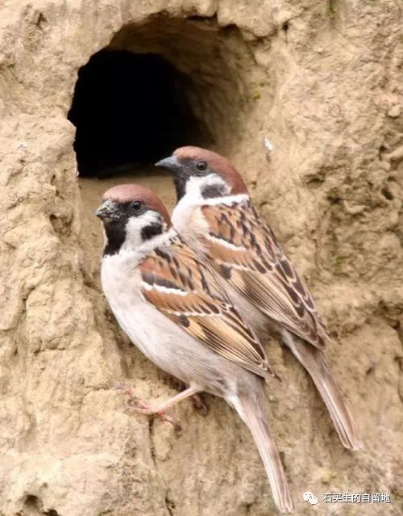
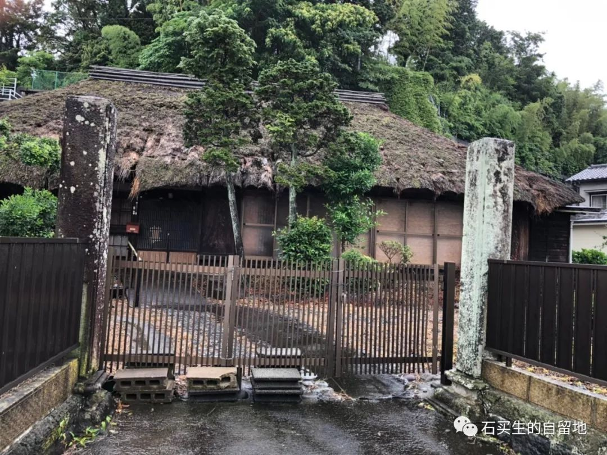

#  一朵云不经意飘走了

原创  石买生  [ 石买生的自留地 ](javascript:void\(0\);)

__ _ _ _ _

** **  

**  
**

** 黄金时代  **

他从龙眼树下走过

突然

停住了脚步

地上枯叶层里

两只鸟

一只张开翅膀

仰面朝天静静躺着

另一只

俯靠在她身上

他嗟嗟

嗟

嗟

两只鸟

箭一般消失在暮色中

** 一朵云在不经意间飘走了  **

****

好几次

在理工东门的暮色里

你微笑跟我打招呼

总错把我当成另一个同事

我跟江老师挺像吗

尽管委屈

我还是爱看你走路的样子

笨笨的

像企鹅黏着沙滩

我还爱看

在大岭山元岭大排档

你和老吴老姜对饮

你吹水的样子

真炫

那是几年前的事了

那时的房价

不像现在这样疯长

你说你有好几套房  N  多存款

一脸的平静与淡然

哪知世事难料

天命无常

恐怕连你自己也没想到

有一天晚上

你会歿于心爱之物

狄奥尼索斯啊

你让一个孤独的人

突然变成一朵云

甚至来不及

跟亲人朋友告别

就转瞬即逝

甚至没留下一声叹息

甚至来不及

在寂寞的日子里

通过一尊江月

再抱抱自己

  

  

** 在伊豆  **

我看见了很美的乡村

好山

好水

一间古朴

沾满干青苔的茅舍

一个淡然

肚子隆起的年轻女子

我没有看见

川端康成

和穿和服的舞女

我把惆怅

留在了日本

  

预览时标签不可点

微信扫一扫  
关注该公众号

****

****

×  分析

__

微信扫一扫可打开此内容，  
使用完整服务

：  ，  ，  ，  ，  ，  ，  ，  ，  ，  ，  ，  ，  。  视频  小程序  赞  ，轻点两下取消赞  在看  ，轻点两下取消在看
分享  留言  收藏  听过

精选留言

橙几耶🍊来自

像一朵云不经意飘走了，听起来也是一件浪漫的事

石买生的自留地来自

[咖啡]

嘉嘉来自

谢谢老师，写得这么美，那朵云是我初中最喜欢的老师了[玫瑰][凋谢]

石买生的自留地来自

🤝

蔚蓝的海来自

向石老师致敬！期待您的诗集[玫瑰][玫瑰][玫瑰][强][强]

石买生的自留地来自

谢谢鼓励[玫瑰]

吴丰强来自

把每个瞬间变成晶莹之滴，犹如早晨的露珠，又清凉，又晶莹[玫瑰][玫瑰][玫瑰]

石买生的自留地来自

[咖啡]

老灯来自

伊豆的舞女终成遗憾

石买生的自留地来自

留下一种美

静如深秋来自

不经常留言不代表没有关注，每一次阅读都会有期待和惊喜。

石买生的自留地来自

谢谢赏读？[玫瑰][抱拳]

