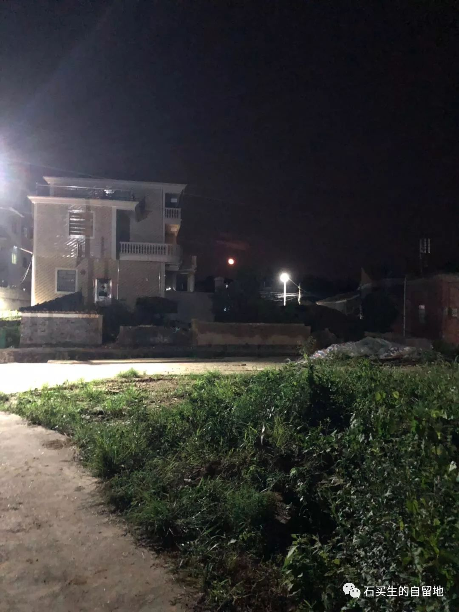
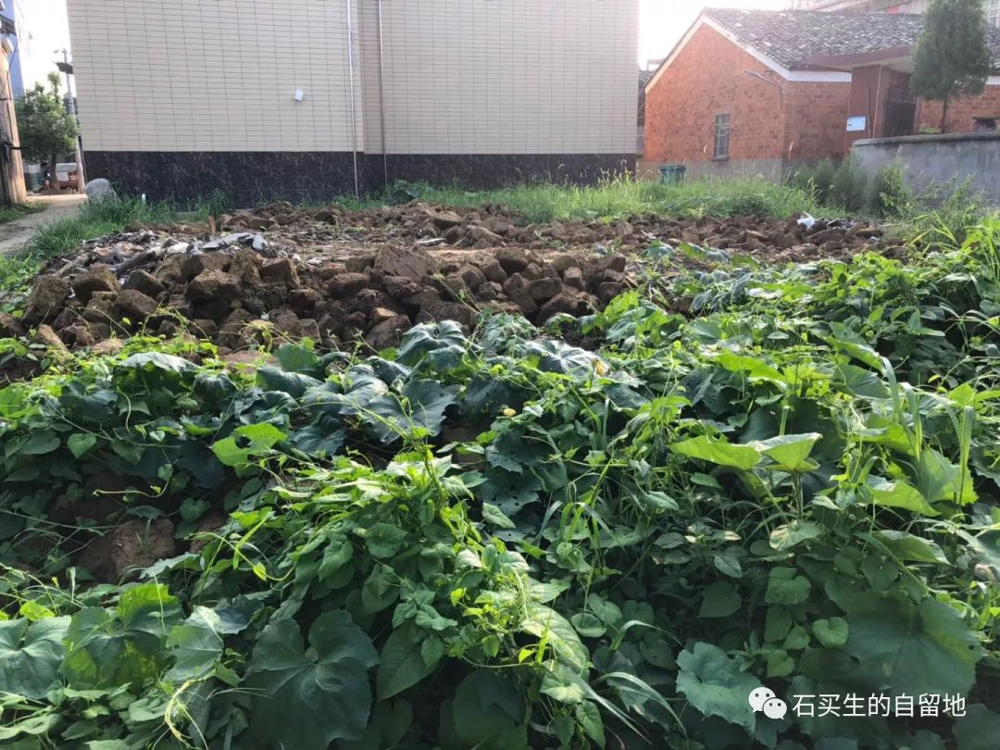
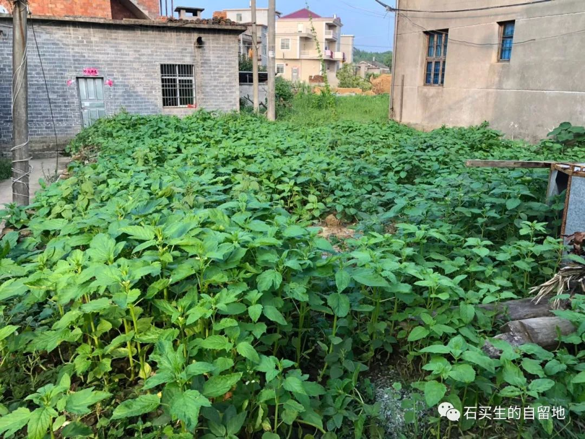

#  正在消失的村庄

原创  石买生  [ 石买生的自留地 ](javascript:void\(0\);)

__ _ _ _ _

正在消失的村庄

夜的眼

村东夜幕下

月亮——一个橘黄色大圆盘

路灯——一个银白色火球

将上塘洲静静照亮

我和妻刚打完麻将回家

夜色柔和

一颗桂花树守候在桥旁

七年前那个暑假

一个寻常夜晚

我看见乾昌大爷在此乘凉

而今乘凉的人不在了

树和桥未见得寂寞

我也和以前一样

活着

花之主

像村子许多土坯房

被推到一样

规水老馆的土坯房

也被推到了

土坯转横七竖八躺着

旁边儿爬满了几丛南瓜藤

开着几朵南瓜花

半个世纪前多一点

规水老馆在此默默耕耘

十朵金花应时而生

朵朵水灵

而今很遗憾

金花渐渐枯萎

南瓜花不像我对规水老馆

充满怀念

芝麻与长寿叔

长寿叔肯定没想到

死后多年

他家土坯房被推到了

更没想到

倒塌的地基上

芝麻长得绿油油一片

芝麻在农村可是好东西啊

既代表吉祥

又是美食

这好东西是谁种的呢

长寿叔又是哪一年死的呢

我想着想着

眼见芝麻一天比一天长得高

长的绿

预览时标签不可点

微信扫一扫  
关注该公众号

****

****

×  分析

__

微信扫一扫可打开此内容，  
使用完整服务

：  ，  ，  ，  ，  ，  ，  ，  ，  ，  ，  ，  ，  。  视频  小程序  赞  ，轻点两下取消赞  在看  ，轻点两下取消在看
分享  留言  收藏  听过

精选留言

