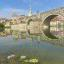

#  在姑妈葬礼上的致辞

原创  石买生  [ 石买生的自留地 ](javascript:void\(0\);)

__ _ _ _ _

各位亲朋：

今天，我和各位一样怀着沉痛的心情悼念我姑妈。我姑妈今年81岁，16岁嫁到江府上，几十年来，我姑妈和姑爹一起，含辛茹苦，抚养六个儿女长大。尤其是我细佬表自幼患脑炎病，生活不能自理，我姑妈为了护理幼儿，饱经磨难，备尝艰辛，而今，细佬表四十好几，这么多年来，我姑妈自始至终尽到了一位母亲的神圣责任，几十年如一日，不光对细佬表，对所有儿女，都关怀备至。作为一个农村妇女，作为一位母亲，我姑妈，平凡而伟大。

65年前，我姑妈嫁到江府上时，我姑爹家境贫寒，生活异常拮据。加上儿女一个接一个出生，姑妈家遇上了典型的遭儿荒，家里常常有了上顿没下顿。记得小时候，有一次，我和我弟坤福到姑妈家做客，姑妈竟跑到邻居家借几把米，磨成粉，做米粑给我们吃，姑妈借米时的那份窘态和羞赧，我们小孩根本体会不到。在家境最困难的时候，姑妈和姑爹同甘共苦，患难与共，经过几十年艰苦奋斗，终于使家庭度过难关，在江府上撑起了一片天。我四个老表和一个表姐也个个争气，成家立业，事业兴盛。逢年过节，我姑妈每当看到儿孙满堂，家庭兴旺，脸上总露出幸福的笑容。而今，我姑妈家成了江府上一个大家族，谢谢多年来乡里乡亲对我姑妈的关心与帮助，我姑妈在天有灵，一定会保佑乡里乡亲。

我姑妈心肠仁慈，为人宽厚，对子孙慈爱有加，对邻里宽宏大量，深得子孙和乡亲爱戴。作为晚辈，我们一定要继承姑妈的优秀品德，铭记她老人家的遗训，忠良处世，厚道传家，让她老人家含笑九泉。

江水滔滔，泗水汤汤（姑爹生活的村庄叫江泗源村），姑妈逝世，我心哀痛！

姑妈，安息吧，您老人家永远活在我们心中！

预览时标签不可点

微信扫一扫  
关注该公众号

****

****

×  分析

__

微信扫一扫可打开此内容，  
使用完整服务

：  ，  ，  ，  ，  ，  ，  ，  ，  ，  ，  ，  ，  。  视频  小程序  赞  ，轻点两下取消赞  在看  ，轻点两下取消在看
分享  留言  收藏  听过

精选留言

朱庆龙来自

一个优秀的父亲改变一个家庭的命运，一位优秀的母亲改变一个家族的命运。愿逝者安息，生者自强！

石买生的自留地来自

谢谢啊

笑嘻嘻来自

了不起的女性！原逝者安息！[合十][合十][合十]

石买生的自留地来自

谢谢啊

Witch来自

逝者安息 生者也要带着她的那份好好继续活着[拥抱][拥抱]

石买生的自留地来自

谢谢

邢祥如来自

逝者安息！

