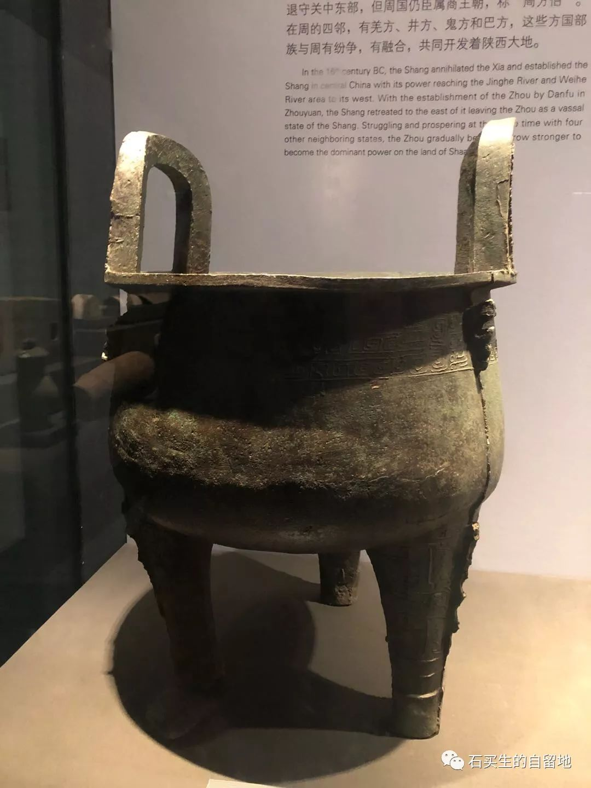
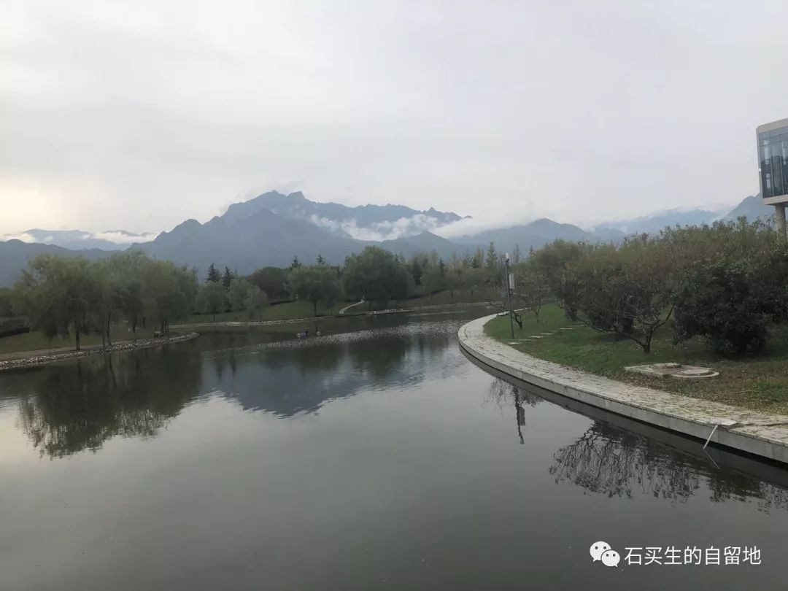
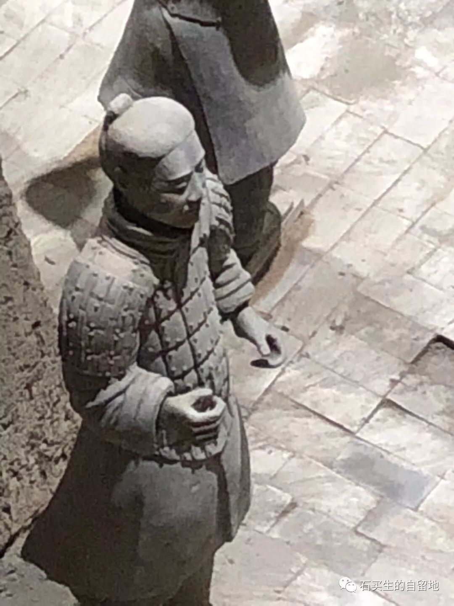
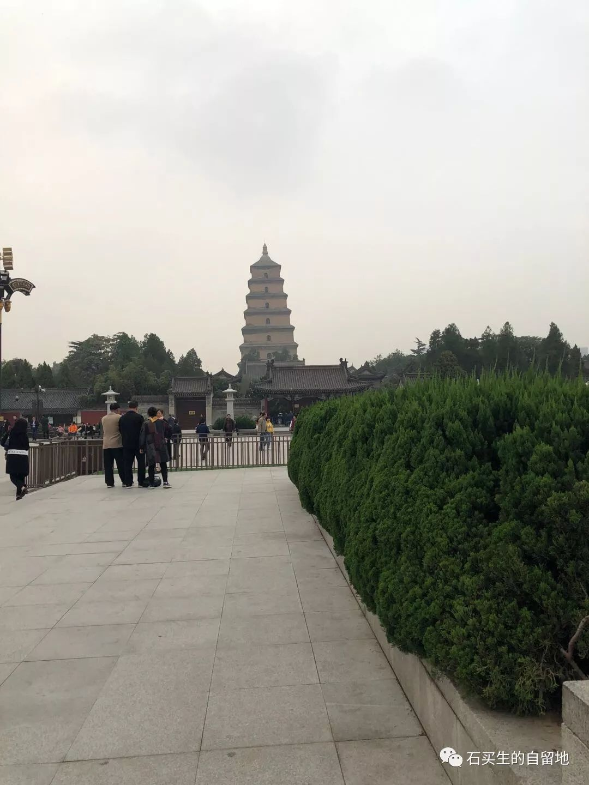
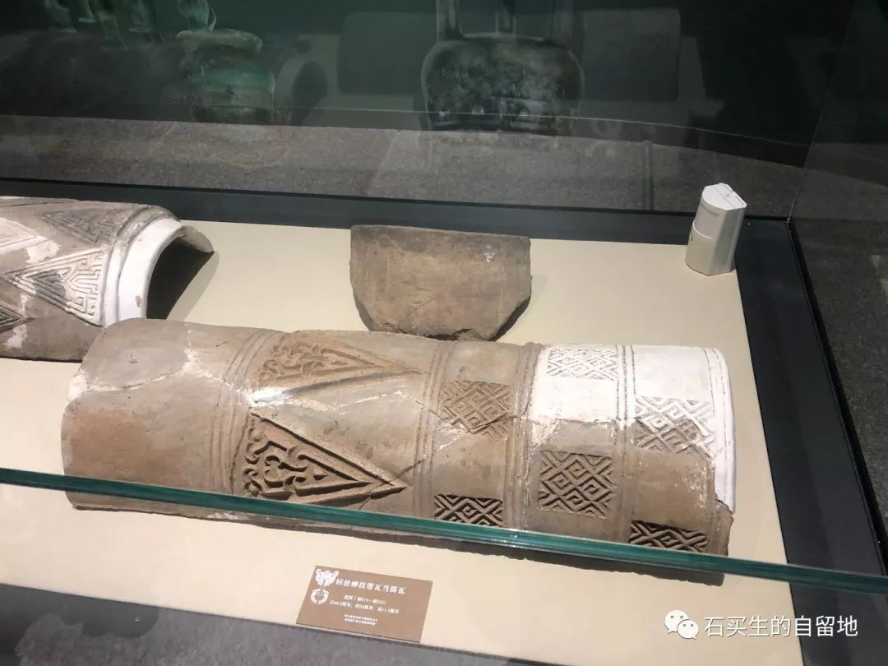
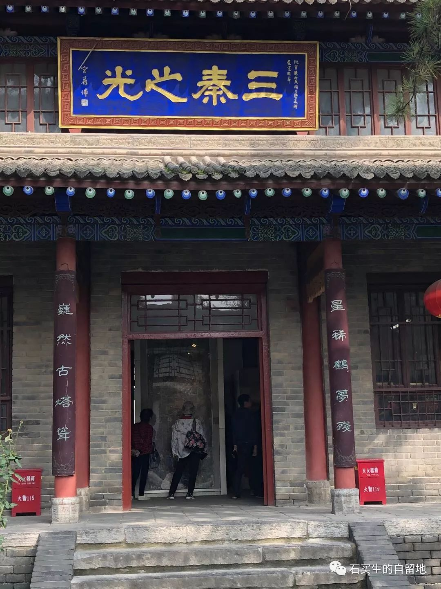
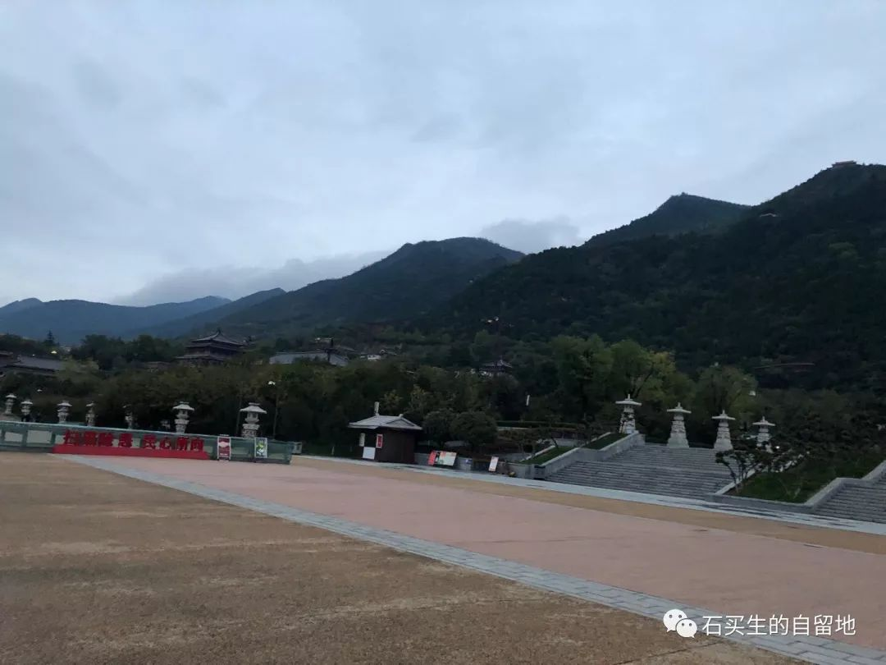

#  长安九帖

原创  石买生  [ 石买生的自留地 ](javascript:void\(0\);)

__ _ _ _ _

鼎

品千年长安

只需一鼎

评万古一帝

只要一陵

未央一棵草啊

也做着

黄

帝

的

梦

在西工大望终南山

西工大长安校区

金黄色的银杏

真美

立于小桥之上

身边有曲水

可以流觞

可那些雅人呢

抬头

远眺终南山

只见山岭如黛白云缭绕

我看见

祖咏

身

上

的

雪

我在骊山看到了什么

几棵垂柳

一些浮萍

华清池

碑林

捉蒋亭

三五行人

骊山倒影

梦中

的

阿

房

宫

秦俑

擦亮了

亿万双眼睛

没想到

一个暴君

成了

世

界

男

神

大唐西市

一声驼铃

让人想起

一个王朝的背影

那来自西地的

波斯绸缎呀

比天上的彩虹

还要彩虹

比女人

还

要

女

人

乐游原哪去了

只看见

鉴真和尚

大雁塔

曲江霓虹

李商隐

那个颓废男人

哪

里

去

了

瓦

盖在秦人哪一家

屋顶上

怎么像我老家

赣北的沟瓦呀

褐色的釉

想当年

爬

满

青

苔

三秦之光

一只仙鹤的残梦

比星辰还璀璨

我多想

折一枝灞桥柳呀

看

渭水不老

早流向

了

天

边

外

秦岭，秦岭

昌黎先生

做了一辈子官

还舍不得离开长安

骑一匹瘦马

在大雪天携妻带子

泪别秦岭

把枯骨

留

在

潮

洲

预览时标签不可点

微信扫一扫  
关注该公众号

****

****

×  分析

__

微信扫一扫可打开此内容，  
使用完整服务

：  ，  ，  ，  ，  ，  ，  ，  ，  ，  ，  ，  ，  。  视频  小程序  赞  ，轻点两下取消赞  在看  ，轻点两下取消在看
分享  留言  收藏  听过

精选留言

Ursweetieash来自

怀念买生老师的语文课！[大哭]

石买生的自留地来自

[咖啡]

1hxin🦁来自

上了大学，甚是想念您的语文课[流泪]

石买生的自留地来自

感动啊，刘厚鑫！[咖啡]

紫琰来自

老师，现在长居东莞

石买生的自留地来自

也不。寒暑假有时回江西。[微笑]

