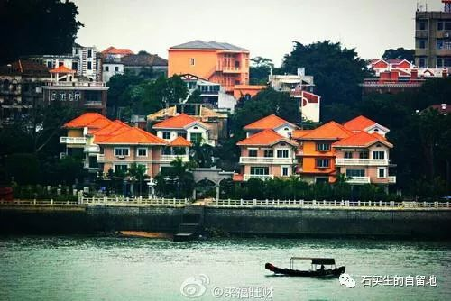
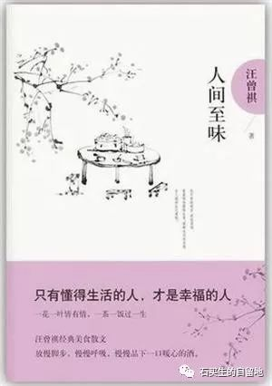
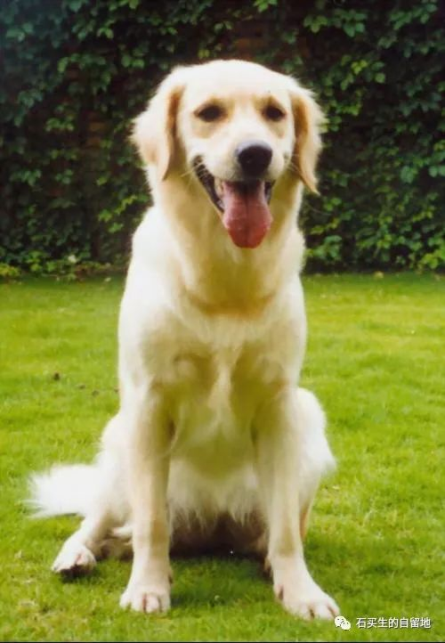

#  1900的琴与海

莫宇辰等  [ 石买生的自留地 ](javascript:void\(0\);)

__ _ _ _ _

1900的琴与海

\-----2019级高一（1）（2）班周记选

《海上钢琴师》剧照

1900的琴与海

\---观《海上钢琴师》有感

高一（1）班 莫宇辰

我知道，如果我不再写下来，我又会后悔好一阵子的。

《海上钢琴师》是一部1992年的电影，而我又在有生之年能在院线上看到它的重映。这是我莫大的荣幸，一回到家后我便奔到电影院，晚上9:09分，我从影院赶回家，10:57分，我洗完澡，坐在15层楼的窗台上，写下这篇小随笔。

第1次看到这部电影，是很久以前的事，当时我看到1900，差几步之遥就能站到陆地上——他从来没有站在过的地方时，我有点揪心和遗憾，但今天坐在影厅里，看到这一幕，我更多的是感动。

1900年生于大海，亡于大海，一架宴会舱里木质的三角琴和一架穷人舱普通的黑色钢琴。已是他的全部家当。他怀着天才的记忆，听过他弹琴的人，都不得不为之震撼。

“可他从来没有存在过。”

他真的从来没有存在过，他说，当他看到那成千上万条街道，他震惊了，他说：“人们怎么知道，这么多纵横交错的道路，到底选择哪一条呢？”至此，他再也没想下过船。最后，弗吉尼亚号沦为废墟，他优雅安静地坐在废舱里，直到炸药顷刻而发，他便再未存在过。

不是大海选择了他，是他选择了大海。

可能是因为身处这种环境之下，才留住了他纯洁的内心，外边的世界对他来说太大，太渺茫，像一个无限的键盘，他要是下去，他都不知道该如何继续演奏乐章了。我先前认为这是幼稚，没有长大的表现，坐在座位上，我才明白了一些：是他选择了大海。、

影片好像一闪而过，沉闷的影厅，使我心里沉甸甸的。我的意志向来脆弱，周围许多的事物，便如同无限的键盘里，而我又身处键盘之中，自然是求不得1900那样的能力了。

不是说社会太残酷，太现实了。人心向善，当自己真正发现了自己的内心时，才能在无限限中找到有限，在有限中演绎无限。“天将降大任于斯人也，必先苦其心志，劳其筋骨，饿其体肤，行拂乱其所为，所以动心忍性，增益其所不能。”大概讲的是这个道理吧。

我特别喜欢这部电影，它不需要给我带来什么启迪，揭示什么事实，让我明了什么是非——但在我心里会一直为它留下一片纯净的土地。

吃面

\-----高一（1）班 郭怡君

周四下午，我有了些空闲的时间，便决定到饭堂二楼吃碗面。

平时吃饭总是太赶了，以至于我常常没法好好品尝，囫囵几口就算吃过、吃饱了，剩下的饭菜自然就被倒掉，真是又浪费食物又没法好好吃饭。

我点了一碗牛腩面加一串海带，撒了一大勺的葱，端着碗选了一个有阳光照着的座位。看了看手表，时间非常早，才刚刚5点，为了避免自己几口就吃完了，我规定自己吃到5点15分才能走。碗里的面有些坨在一起，我拿筷子戳散，淋在上面的汤汁也顺便搅匀了。先喝一口汤，有点辣。学校的面必须就着汤吃，否则一点味道都没有。我挑起几根面条放在勺子上，再舀一些汤，放一小块肉，一口吃进嘴里，这是最满足的一瞬间。

我不禁想起真功夫的紫菜鱼旦粉，真是没有对比就没有伤害，真功夫的粉就算没汤也是挺有味道的。

我又突然想起自己总有些很奇怪的吃法。例如我特别喜欢把学校的白菜蘸着白切鸡的酱油吃，喜欢把炒米粉拌在粥里吃，喜欢沙县小吃的飘香拌面干住了淋汤吃，喜欢米饭拌着酱油吃（这种吃法在我家被禁止了）……每次独特的吃法都会带来特别的惊喜。

吃得差不多了，一抬手看表，居然只过了8分钟，离我规定的时间还长着呢。我又在碗里捞来捞去找找残渣，把汤也喝完了，也没到15分。“算了，下次再吃吧。”我便放好碗筷，打着饱嗝，回教室去了。

高小小的说明书

\----高一（1）班 王诗雅

产品：高小小 产地：湖南 产出日期：2004年7月14日

功能：唱歌，哲学，沉思以及一系列能供人大笑的未知操作

以下是对该产品的详细介绍:

该产品身长160cm，体重50kg，顶着学生齐刘海，梳着马尾辫，该产品最引人注目的是笑起来嘴边陷入一对小酒窝。

该产品在一出产时便被灌输了“音乐是人之信仰所在”的理念，每当音乐声响起，她就随着节奏感变换舞步，轻哼以应和着，踢踏着小皮鞋，在一段段音乐中来回起舞，该产品十分赞同卫慧说的：“我的身体，在音乐中兴奋无比，每粒细胞都以超常千倍的速度分裂，成长，衰老，死亡”。

该产品十分之爱读郭敬明先生的书，奉郭先生为毕生追求，其言语之犀利，更令人深觉世道不公情形时，至此，每月必将其部分维修费“贡献”给郭先生。，以便享受一场文字盛宴

阴天，在不开灯的房间，当所有思维都一点点沉淀。高小小喜欢阴天。乌云万里，秋风划过树隙，听森林演奏出一首交响乐，在清爽的环境下，高小小的浮躁的心终得平静，关上房灯，黑暗里关于自己存在的意义，都可以被答疑。静坐静心，又是一场好修行。

高小小不明白所谓世间，因此更爱逗人发笑。她活泼，爱热闹，或许只有她知道，喜爱热闹是自己孤独的太久了。虽然他时常弄巧成拙。但笨拙可爱的动作，却深得产品设计师的宠爱。高小小总能给人带来不一样的乐趣，一次，生物老师讲到节肢动物和两栖动物。老师问，有人能举几个例子吗？高笑笑不假思索的答;“癞蛤蟆。”全班静下后就爆发出一阵大笑，高小小呢，她还有点茫然，不知发生了何事呢？

高小小，是一个深受青少年喜爱的产品。物以类聚，她身上所展现的也正是青少年的缩影。自由，热爱，不羁勇敢。，是高小小对新时代青年的诠释。还记得朴树所唱的‘那些花儿’吗？她就是其中之一。高小小这类产品将会比以往产品更加开放的，面向世界。

鼓浪屿

岛

\------高一（1）班 黄伯言

船

拖出白色的尾迹

一起一伏

越过灯塔

驶向对岸

那是屿

鼓浪屿

心心念念的屿

在这

有人在歌唱

有人在欣赏

有人在流浪

可以看见灯塔

可以走进小巷

巷中

来自海滩的风

轻轻吹进

驻足在一幢幢建筑门前

感受百年前的美丽

看看里面的人

生活得多么平静

这是屿

鼓浪屿

大理石和各种颜色

勾勒它的美丽

在这里

鼓浪屿

多少人在转角处

宣誓爱情

多少人在楼宇间

发誓永不分离

象征爱情的白色屋顶

聆听着各种语言的

我爱你

鼓浪屿

在这里

转角间总会碰到

不经意间的

浪漫惊喜

多少年来

它静卧着听着声声汽笛

楼与人

已俨然一体

一艘静默着的船

在海上文艺着

它的身后

早已拖出

罗曼蒂克的白色航迹

世界先爱了我，我不能不爱它

\----高一（1）班 赵钰琪

“人生如梦，我投入的却是真情，世界先爱了我，我不能不爱它。”这是书中深刻的句子,我含着细细品味，终只能叹息一声，”活着多好呀……”

梁文道先生曾评价这本散文集“就像一碗白粥，熬的刚刚好。”我认为再贴切不过了，书中无什么大波大折，仿佛只是汪先生的一本随笔，他看出什么门道，章法，涉及知识面却极广：吃喝玩乐、亲朋好友、山川雨露……世间一切的美好，仿佛都浓缩到了这本小书中。说它是白粥，很是贴切，只觉它越品越有味儿；说他是清茶，更是贴切，不凉不烫，入口甘甜，余后，却令人回味无穷。

文字得配上画读。一根大葱，几瓣小蒜，再下一碗阳春面配着吃，这是再合适不过了。汪先生是南方人，他又有些俏皮的笔触吐槽着“家人的大为惊骇。“他曾发出这样的感慨“人的口味要宽一点，杂一点‘南甜北咸东辣西酸’都该去尝尝。”犹记得“手抓肉”一章，汪先生一行人到蒙古去收集素材、体验生活。同行的一名女同事吃不得羊肉，甚至连味儿都闻不得，他曾发出这样的感慨“羚羊肉都吃不得，实在痛苦。”

“去过许多地方，故乡最有意思。”丝丝缕缕的乡愁，若有若无，悄然从字里行间渗出，萦绕在心中，久久不得散去。先生是高邮人，他曾在《炒米和焦屑》一章有些心酸的吐露“炒米和焦屑和我家乡的贫穷和长期的动乱是有关系的。”但即便如此，家的概念浮上心头时，它的颜色仍是深沉的。

我很喜欢先生的家庭观，他曾如此述说过令他向往的家庭关系，我想，这也是现今家庭应该发展的方向“我觉得一个现代化的，充满人情味的家庭，首先必须做到‘没大没小’，父母叫人敬畏，儿女‘笔管条直’最没有意思。”先生是幸运的，他生在一个理想的，他所追求的家庭中。父亲幽默风趣，母亲知书达理，待他也极好，这真是一副家人闲坐，灯火可亲的温馨画面。

先生在书中感叹“和有趣的人在一起，活得很有兴致。“在这儿，他谈到金岳霖先生，敬佩于金先生对知识的求知若渴和与学生融洽的关系，叹息于他对林徽因的痴情；谈到闻一多先生，汪先生曾笑谈其“何妨一下楼主人”的斋名，对于闻先生的课，汪先生每每赞不绝口，甚至说“听这样的课，穿一座城也值得。”;对于恩师沈从文先生，汪先生更是感激不尽，对其授课方法，闲聊谈天，先生都以崇拜的态度，虔诚的挥笔写下。”对生活充满兴趣，不管在什么环境下，永远不消沉，沮丧，无心机，少俗虑。这是先生予以我们最珍贵的祝福。

贾平凹曾说：“汪曾祺是一文狐，修炼成老精。”王先生在文学方面的造诣自然不必多说，可最让人钦佩、最吸引人的，是他如清流般的处事态度，是他不管遇到什么环境，永远不消沉沮丧，少俗虑，兴致盎然的生活。

我不知道在写什么也不想起标题

\-----高一（1）班 林翰辰

《小丑》没能上映中国，我也没看到，说是已经有片源了，我也还没找着。

为什么在国内影院看不到《小丑》？因为它是r级片有限制，因为它血腥，因为他暴力，因为他诱导人，因为它被认为不适合我们。

那，什么又是适合我们的？《流浪地球》，《我和我的祖国》《攀登者》。不可否认，这些电影的确很好看。里面的人类是强大的，国家是强大的，人类是美好的。可你看不到黑暗面，你只会感动，感到伟大，心潮澎湃，心中为人类而自豪。可这真的就够了吗？

不够。《少年的你》这部电影上映前遭到过打压，因为它的内容涉及到了一个敏感的点------
校园霸凌。上映之前我并没有看到什么宣传，可它上映之后还是爆发了。因为它真实，让人感同身受。这是社会的黑暗面，也是真实存在的一面。正如《少年的你》里面的台词一样：“所有人都叫我们长大，可从来没有任何一课，教我们如何长大。”是啊，我们该如何长大？在这种文化环境并不完全，有所缺失的状况下，我们怎么长大？大部分电影都在讲担当与责任成长，可能都是光明一面的啊！超级英雄对抗黑暗势力，对抗反派，打坏人。在这种，人人都想做好人的电影的包围下，我们该如何长大？

有人说，正能量的文艺作品就够了，在光明中成长就够了，社会没有那么多的黑暗面。可人的欲望是无穷无尽的，不加以引导，不加以限制就会有黑暗面。有人说人之初，性本善。小孩子的心灵本身就是纯洁善良的，何须去引导限制。可大连的14岁男童呢，正是因为，没有正确的加以引导限制才造成了那震惊社会的惨案。然而可笑的是，他还有法律保护他。因为她会成年，有法律保护。来自未成年人的恶意才是最可怕的，他们缺乏对是非善恶的认知，他们身上可能会有最可怕的恶。

无关乎年龄，无关乎身体体格，成年人中会有犯罪，未成年中也会有霸凌的，我们不应当只了解阳光面，我们应当全面认识这个世界。这个世界的善恶两面，我们都需要了解。

我们已经不能够只看那些动作片了，那些纯粹的超级英雄的正义的电影朗，我们应该看一些有思想、有深度电影。纯粹的为了盈利而拍的电影，有时候真觉得可笑。

话是这么说，周末回家的时候面对《海上钢琴家》和《霹雳娇娃》两部电影，我还是选了《霹雳娇娃》……

最美丽的年华，遇见最好的你

\-----高一（2）班 廖宝玲

有人生活在阴沟里，但依然有人仰望星空。 ——题记

“was和used to be 都有过去的意思，但used to be
有一种失去的感叹。”电影的开头，由周冬雨所饰演的陈念给同学们上着英语课，谈到“失去”时，她的记忆涌上心头，恍惚间，一个少年郎的模样，在她眼前纷扬而起。

陈念的故事令人唏嘘。她的母亲负债累累，她的同学跳楼自杀。她本以为，只要她安分守己，便能安稳上大学，可是，在她决定告诉警察，她的同学跳楼自杀前曾受到校园欺凌时，她又怎能置身事外？所以，她被报复，被欺辱，被殴打。

她是不幸的，但同时也是幸运的。

她遇见了刘北山。
“陈念欠小北一次。”从写下这个开始，刘北山与陈念注定羁绊一生。受到欺负时，她首先想到的便是刘北山，这个温暖她心扉的大男孩。当她用细若蚊虫的声音说出：“你能不能保护我”时，激发了刘北山内心的保护欲。就这样，刘北山成为了陈念的保护神。

但是，陈念何尝不是刘北山的救世主？

“陈念，你是第一个，问我疼不疼的人”刘北山默默流下了眼泪。自小，刘北山的父母相继抛弃了他，他内心深处，一直渴望着这样一份关怀。陈念实现了，她真正将他当做一个有血有肉、会哭会痛的人，她就似一道光般，照亮了刘北山黑暗的人生，所以，刘北山对陈念说：“你往前走，我一直在你身后。”他想尽他所能，保护这个，干净纯粹的如同一张白纸的女孩。

后来，陈念失手将欺辱过她的人推下楼梯时，她慌了，她将事情告诉了刘北山，而刘北山，意料之内的，选择了替陈念顶罪。他将自己伪装成强奸犯，假装自己是因为强奸未遂而杀了魏莱。他将陈念伪装成一个受害者，在他把陈念摁在地上狠扇耳光，只为洗脱她嫌疑时，我想，他也很痛苦吧。在面对警察逼问时，他们按照约定好的那般，坚持着，互信着，丝毫没有穿帮。

但陈念终究还是输了。她不是输给任何人，只是输给自己的良心。刘北山欺骗了他，他告诉陈念他未成年，即使判刑也不会重。可陈念还是知道了，她无法做到，对于刘北山无动于衷，无法忍受良心的煎熬。她放弃了，放弃了高考632的高分，放弃了去北京念大学的机会，放弃了她向往的生活。但她也拾起了，拾起了她的善良，拾起了她的觉悟，拾起了，她与刘北山那份最纯挚的感情。

最终，陈念进了监狱。我想，做这个举动，也需要莫大的勇气吧，我也坚信，陈念一定是释然的。

影片的结尾，转回开头那一幕，陈念上完课，注意到一个低头沉默不语的小女孩。仿佛看见当初的自己。于是，她牵起了那个小女孩，肩任起保护她的重责。林荫小道上，陈念带着小女孩走过，原以为影片到此结束，却不想，后面缓缓走过一个身影，是那个曾对陈念许下“你保护世界，我保护你”诺言的刘北山。

电影中有一句台词：“喜欢一个人，就要给她最好的结局。”刘北山与陈念之间的感情，不似《还珠格格》中小燕子与永琪那般轰轰烈烈，也没有《香蜜》中锦觅与旭凤在深深误会过后那般苦尽甘来，更没有戏本中梁山伯与祝英台那般凄婉动人，却依然有着治愈人心的魔力。最美的年华，遇见最好的你，我想，这或许就是爱情，最美的模样。

回忆见

\----高一(2)班詹龙昌

远处，

只有一半的橘红色的夕阳

悬挂在天边，

天空是蓝莓奶油冰淇淋的颜色

望着远方，思绪纷飞到那一个下午……

在带着戏台子已有几千年历史的庭院中，

秋日的夕阳穿过古典的砖瓦撒在你的面庞，

一抬头，

便是你带着微笑的侧颜，

身上拂过已经染上了寒意的秋风，

耳旁是湖水嬉闹的声音，

时间宛若静止般，一切就这样静静得好。

你身上有一种我喜欢的，令我怀念的味道，

我努力在脑海中寻找，

或许这个气味属于你，

也许是你们，永远朝着暖阳而生的你们！

但也可能属于过去，

那令人也只能给人怀念的旧时光。

回过神，夕阳已经褪去，天空的颜色开始变幻莫测，

和回忆见一面，你仿佛就在我旁边，

也许和你，只有在想象中才能相见。

俩

\------高一（2）班 隐名

他无声地抽泣着，

他受尽了冷眼与讥讽。

他决定离开，

他决定结束。

当最后一抹阳光消逝时，

他，松开了他。

狗

\-----高一·（2）班 丁鑫

狗是人类最忠诚的朋友，我虽然未养过，却有幸见过两只好狗。

第一条狗时老家一位老奶奶养的，那条狗时农村的看门狗，它的身体由黑黄白三色交织，矫健纤瘦的小腿，锋利的爪子，它如一个久经沙场的将军，终日迈着稳健的步伐在堂前屋后，在老奶奶身旁环绕，也常在我家啄些残余的骨头。

它总是耷拉着头，两只耳朵静静地贴在脑袋两旁，尾巴极少翘起，总是悠然自得，他是多么的与世无争。我也曾见过许多“恶犬”，但凡走近，它们定如那茹毛饮血，饥渴已久的猛兽，蹦跳着，狂吼着，露出那獠牙，那锋利的牙齿在阳光的映射下发出刺刀般的锃亮，浑身披着吓人的黑毛，不像狗，更像凶兽，但这条狗——大黄就显得与众不了，它的眼里总是带着一丝的忧愁和凄凉，总喜欢回头用那寂寞的眼神环顾四周，像一位多情的诗人。

面对熟人，它甚至显得有些畏惧，每当我们从它身边掠过时，他总是惊吓般地闪在一旁，它讨厌被我们亲近。。自我记事三四岁便有这条狗，可这么多年过去，我却想不起曾经抚摸过它柔滑的背部，哪怕是那些刚会走路的小孩，他也会极力避让，常常出现人追狗的现象，真是哭笑不得。

只有面对生人，他才会像样的履行公事，发出“汪汪”的声音并不洪亮，却极为有力，扎带着的不是暴躁的怒意，反倒是一个警卫有力，严肃的规劝。

我痛恨那些可恶的盗狗贼，大黄也饱受这种折难。他却是极为地有血性。盗狗贼的铁绳拴了它的腿很多次，却从未成功过。每次都成果归来。但它却愈发的瘦削，憔悴，喜欢终日趴在地上，如一位阅尽世事的老者，眼神变得刺向了，掐指一算，它也确实是条老狗，它与我们共同相处了这么多年。在冬日里，他总是依偎在老奶奶身旁，共享暖阳。

老奶奶也是极为可怜，丈夫早逝，儿女不才，终日孤苦伶仃，但心地极好，容易相处。大黄也许是出于对老奶奶的眷恋，坚强的活着，它舍得很多，却舍不得忠诚与陪伴，我在未见过如此好的狗，也再难见了。

第二条狗时东莞小区里对门邻居的“洋洋”。

与壮硕的大黄相比，它是那样的娇小，却肉嘟嘟的。蓬松洁白的毛发软软，如丝绸般顺滑的毛发，受人喜欢。

洋洋极为亲民，每见到我，总喜欢凑过来，用舌头舔我的小腿，盛情难支，他在小区里时出了名的，因为它的温驯与修养。

它是狗中绅士，每当邻居叔叔让他坐下等礼仪，它总会一一履行。像乖小孩，使人根本无法产生厌倦之意，它热情，总是保持欢快的样子，无论对谁，都不畏怯。成长在这个区里，他似乎天生就是一个外交官，八面玲珑。

邻居是一个和蔼的50多岁叔叔，他事业有成，却饱经离别之苦，上有80岁老母在故乡颐养天年，下有妻女在北方工作。常年独居，洋洋已成他生命中不可或缺的一部分，过年时，本是家人团聚时，因为洋洋，他不得不亲自驱车昼夜兼程到北方去。

我惊讶与着人狗之间超越主仆之间的友谊，甚至胜于友谊。邻居在这么多年苍老了许多，白发络绎不绝。洋洋不因主人的年老而胡闹，它永远跟在主人的身后，一天天，一年年，谈不起一生，却也是弥久的。

进来回家时已经鲜少听见狗吠了，也许是出去了，也许是力不从心罢了。

忠犬八公的故事离我们并不远。

我想知道的

\----高一（2）班 赵仪芳

我想知道天空为什么是灰的

草为什么是黄的

河流为什么是浊的

空气为什么是脏的

她告诉我们：“因为你们啊，孩子们。

因为你们的废气排放过量

因为你们的浪费水资源

因为你们的乱扔垃圾

因为你们对我的不珍惜。”

我想知道诗人为什么要作诗

歌手为什么要歌唱

舞者为什么要跳舞

人为什么要心怀梦想

你告诉我：“因为这很重要啊，朋友。

因为作诗能丰富想象，抒发情怀

因为歌唱能传达力量，不再悲伤

因为跳舞能用身体来诉说一个个故事

因为没有方向，任何风都会逆风。”

我想知道现在应该不算晚吧

我想知道我从哪儿来？

我要去哪儿？

我想知道人为什么要活着？

我想知道我为什么是我？

遇见

\----高一(2)班 黄俊熙

打一开始

我就准备着遇见你

今天啊

这日子是磨了光的水

眼巴巴的盼着它过

我这个心机深深的人

算计着下次见面的时候

得手捧一朵莲啊

得装着一颗糖

我要把你不在的日子

过的像风

等见了你啊

莲盛开，糖给你

初雪

\---高一（2）班 韦银欣

卓奥友峰的山腰上，

站着一位年青的女孩。

她的头发被雪染成银白，

脸上带了一点倦怠。

三清铃被她的青葱五指握住，

泛出的冷光为她一双星眸嵌上光彩。

亲爱的乔乍林嘎姆呵

我想带你从这场雪离开，

住进深邃的大海

延续只属于我们的未来。

注：照片来自网络

预览时标签不可点

微信扫一扫  
关注该公众号

****

****

×  分析

__

微信扫一扫可打开此内容，  
使用完整服务

：  ，  ，  ，  ，  ，  ，  ，  ，  ，  ，  ，  ，  。  视频  小程序  赞  ，轻点两下取消赞  在看  ，轻点两下取消在看
分享  留言  收藏  听过

