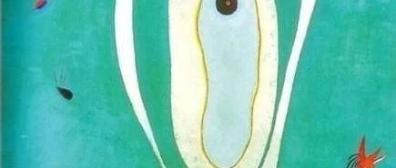
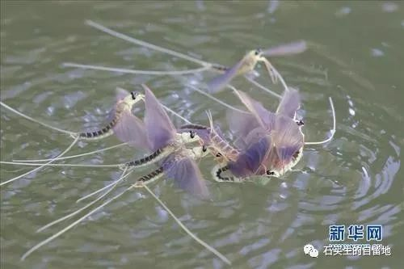
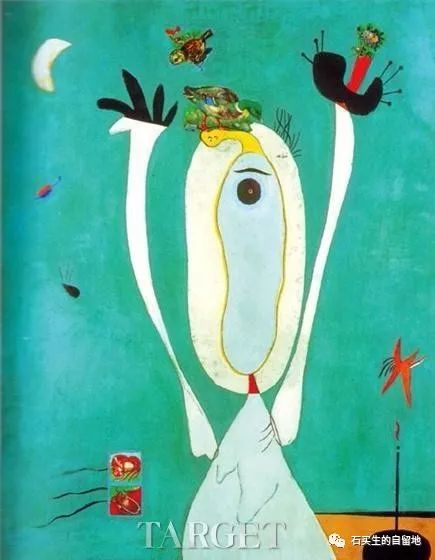

#  认识一种飞虫要花多少年

原创  石买生  [ 石买生的自留地 ](javascript:void\(0\);)

__ _ _ _ _

  
  

认识一种飞虫要花多少年

寿命三小时

以天为房

以地为床

雄的以交配为极乐

然后逐水而亡

雌的以分娩为至善

然后随风而逝

生命只图

凄美与绚烂

童年乡野

乱飞的这种虫啊

它的真名

叫蜉蝣

它为爱而生

卡夫卡谜一样的句子

一只笼子

在寻找一只鸟

卡夫卡谜一样的句子

会繁殖

这个夜晚

我看见那么多笼子

那么多鸟

我无法回答卡夫卡

我是其中一只鸟

还是其中一只笼子

这正是

我痛苦的根源

在高铁上

他靠窗户坐着

旁边站一个少女

她拿一张票左顾右盼

就是不坐下

当一个高个子大叔

也拿一张票寻找座位

她像一只蜜蜂

嘤嘤靠上前

高个子大叔微笑着

坐在了他身边

俩大叔真有缘啊

可他漠然相向

心里憋屈

莫名生出一种仇恨

屋顶种菜

妻子要到江西小住

叮嘱我

记得到楼顶给菜浇水

我提一桶水上楼

看见

一小畦一小畦

上海小芽菜韭菜葱

油油的看着我

好像跟我很熟

  

预览时标签不可点

微信扫一扫  
关注该公众号

****

****

×  分析

__

微信扫一扫可打开此内容，  
使用完整服务

：  ，  ，  ，  ，  ，  ，  ，  ，  ，  ，  ，  ，  。  视频  小程序  赞  ，轻点两下取消赞  在看  ，轻点两下取消在看
分享  留言  收藏  听过

精选留言

